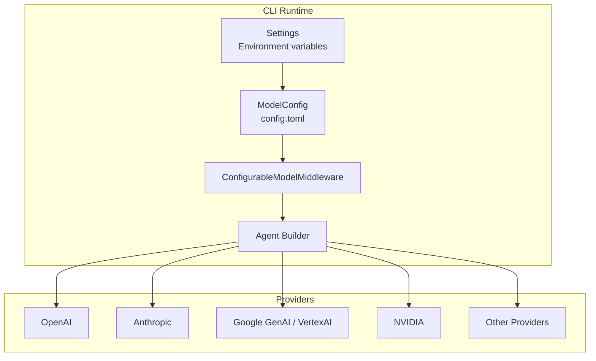
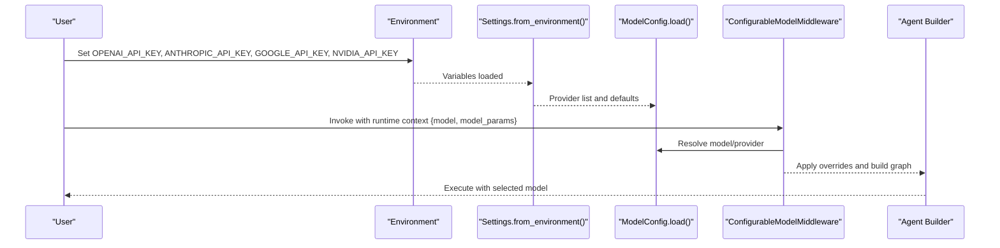
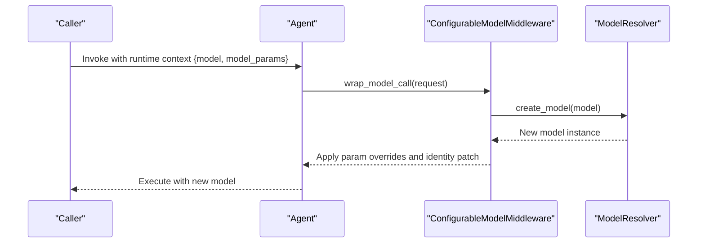
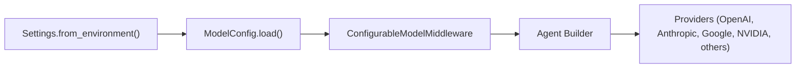

# Model Provider Setup

<cite>
**Referenced Files in This Document**
- [config.py](file://libs/cli/deepagents_cli/config.py)
- [model_config.py](file://libs/cli/deepagents_cli/model_config.py)
- [configurable_model.py](file://libs/cli/deepagents_cli/configurable_model.py)
- [agent.py](file://libs/cli/deepagents_cli/agent.py)
- [project_utils.py](file://libs/cli/deepagents_cli/project_utils.py)
- [action.yml](file://action.yml)
- [subagents.yaml](file://examples/content-builder-agent/subagents.yaml)
</cite>

## Table of Contents
1. [Introduction](#introduction)
2. [Project Structure](#project-structure)
3. [Core Components](#core-components)
4. [Architecture Overview](#architecture-overview)
5. [Detailed Component Analysis](#detailed-component-analysis)
6. [Dependency Analysis](#dependency-analysis)
7. [Performance Considerations](#performance-considerations)
8. [Troubleshooting Guide](#troubleshooting-guide)
9. [Conclusion](#conclusion)

## Introduction
This document explains how to integrate and configure model providers in the CLI. It covers environment-based API key configuration, model selection, runtime parameter tuning, authentication setup, rate limiting considerations, fallback configurations, provider-specific features, and best practices. It also provides examples for multi-provider setups, runtime model swapping, and cost-conscious strategies.

## Project Structure
The CLI organizes provider configuration and model creation around environment variables, a user-level configuration file, and runtime middleware that can adjust models and parameters per invocation.

**Diagram sources**
- [config.py:678-780](file://libs/cli/deepagents_cli/config.py#L678-L780)
- [model_config.py:722-800](file://libs/cli/deepagents_cli/model_config.py#L722-L800)
- [configurable_model.py:144-162](file://libs/cli/deepagents_cli/configurable_model.py#L144-L162)
- [agent.py:665-800](file://libs/cli/deepagents_cli/agent.py#L665-L800)

**Section sources**
- [config.py:678-780](file://libs/cli/deepagents_cli/config.py#L678-L780)
- [model_config.py:722-800](file://libs/cli/deepagents_cli/model_config.py#L722-L800)

## Core Components
- Settings and environment detection: Loads API keys and project context from environment variables and .env files.
- Model configuration: Reads user-provided config.toml to define providers, models, and parameter defaults.
- Runtime model middleware: Allows swapping providers/models and adjusting parameters per invocation without recompiling the agent graph.
- Agent builder: Assembles the agent with middleware, including configurable model selection.

Key responsibilities:
- Authentication: Validates provider credentials via environment variables and config.
- Model selection: Supports explicit provider:model specs and auto-detection.
- Parameter tuning: Applies provider-wide defaults and per-invocation overrides.
- Fallbacks: Gracefully handles missing credentials and unknown providers.

**Section sources**
- [config.py:678-780](file://libs/cli/deepagents_cli/config.py#L678-L780)
- [model_config.py:185-216](file://libs/cli/deepagents_cli/model_config.py#L185-L216)
- [configurable_model.py:144-162](file://libs/cli/deepagents_cli/configurable_model.py#L144-L162)
- [agent.py:665-800](file://libs/cli/deepagents_cli/agent.py#L665-L800)

## Architecture Overview
The CLI resolves credentials, builds the model registry, and applies runtime overrides through middleware.

**Diagram sources**
- [config.py:728-780](file://libs/cli/deepagents_cli/config.py#L728-L780)
- [model_config.py:746-800](file://libs/cli/deepagents_cli/model_config.py#L746-L800)
- [configurable_model.py:52-142](file://libs/cli/deepagents_cli/configurable_model.py#L52-L142)
- [agent.py:665-800](file://libs/cli/deepagents_cli/agent.py#L665-L800)

## Detailed Component Analysis

### Environment and Settings
- API keys are read from environment variables and normalized to None if empty.
- Supported keys include provider-specific variables and project-related settings.
- Dotenv loading is supported and can be anchored to a project root.

Best practices:
- Store secrets in .env files located near the project root.
- Use distinct keys per provider to simplify rotation and auditing.

**Section sources**
- [config.py:728-780](file://libs/cli/deepagents_cli/config.py#L728-L780)
- [project_utils.py:135-156](file://libs/cli/deepagents_cli/project_utils.py#L135-L156)

### Provider Credentials and Discovery
- Credential presence is checked via:
  - Config-file providers with api_key_env (highest priority).
  - Providers with class_path but no api_key_env (assume custom auth).
  - Hardcoded mapping of provider to environment variable.
- Unknown providers defer to the underlying provider for auth failure reporting.

Supported providers include major vendors and common alternatives.

**Section sources**
- [model_config.py:652-720](file://libs/cli/deepagents_cli/model_config.py#L652-L720)
- [model_config.py:185-216](file://libs/cli/deepagents_cli/model_config.py#L185-L216)

### Model Configuration and Profiles
- config.toml supports:
  - default and recent model selection.
  - per-provider configuration including models, api_key_env, base_url, class_path, params, and profile overrides.
- Profiles are merged from upstream provider packages and config overrides, enabling fine-grained control over context limits and capabilities.

Recommendations:
- Use class_path for custom providers requiring bespoke authentication.
- Prefer params for provider-wide defaults; use runtime overrides sparingly.

**Section sources**
- [model_config.py:722-800](file://libs/cli/deepagents_cli/model_config.py#L722-L800)
- [model_config.py:517-650](file://libs/cli/deepagents_cli/model_config.py#L517-L650)

### Runtime Model Swapping and Parameter Tuning
- Middleware inspects runtime context for model and model_params.
- On model swap:
  - Validates spec compatibility.
  - Creates new model instance.
  - Strips provider-specific parameters incompatible with the new provider.
- Updates the system prompt’s model identity section to reflect the runtime model.

Example patterns:
- Multi-provider configuration: Define multiple providers in config.toml and select via provider:model at runtime.
- Parameter tuning: Pass model_params to adjust temperature, max tokens, or provider-specific knobs.

**Section sources**
- [configurable_model.py:52-142](file://libs/cli/deepagents_cli/configurable_model.py#L52-L142)
- [agent.py:275-306](file://libs/cli/deepagents_cli/agent.py#L275-L306)

### Authentication Setup
- OpenAI: Set OPENAI_API_KEY.
- Anthropic: Set ANTHROPIC_API_KEY.
- Google: Set GOOGLE_API_KEY for GenAI; set GOOGLE_CLOUD_PROJECT for VertexAI.
- NVIDIA: Set NVIDIA_API_KEY.
- Others: Use provider-specific env vars as defined in the provider map.

GitHub Actions integration:
- Inputs accept provider keys and forward them to the CLI environment.

**Section sources**
- [model_config.py:185-216](file://libs/cli/deepagents_cli/model_config.py#L185-L216)
- [action.yml:15-23](file://action.yml#L15-L23)

### Rate Limiting and Fallbacks
- The CLI does not implement built-in rate limiting; rely on provider-side throttling and retries.
- Fallback strategies:
  - Define multiple providers in config.toml and use runtime context to switch on failure.
  - Use recent/default model fields to recover from transient issues.
  - Consider provider-specific base_url for regional endpoints or proxies.

**Section sources**
- [model_config.py:149-151](file://libs/cli/deepagents_cli/model_config.py#L149-L151)
- [model_config.py:746-800](file://libs/cli/deepagents_cli/model_config.py#L746-L800)

### Provider-Specific Features and Limitations
- Anthropic-only settings (e.g., cache_control) are stripped when switching to non-Anthropic models to avoid SDK errors.
- Profiles expose provider capabilities (e.g., tool_calling, text inputs/outputs) and context limits.

**Section sources**
- [configurable_model.py:46-50](file://libs/cli/deepagents_cli/configurable_model.py#L46-L50)
- [configurable_model.py:97-111](file://libs/cli/deepagents_cli/configurable_model.py#L97-L111)

### Best Practices
- Centralize configuration in config.toml; keep environment variables minimal and provider-specific.
- Use provider:model specs to ensure deterministic selection.
- Leverage runtime context for A/B experiments and cost optimization.
- Monitor profile overrides and context limits to avoid expensive calls.

**Section sources**
- [model_config.py:517-650](file://libs/cli/deepagents_cli/model_config.py#L517-L650)
- [configurable_model.py:52-142](file://libs/cli/deepagents_cli/configurable_model.py#L52-L142)

### Examples

#### Multi-Provider Configuration
- Define multiple providers in config.toml with distinct models and parameters.
- Select a provider at runtime using provider:model in the agent invocation.

**Section sources**
- [model_config.py:722-800](file://libs/cli/deepagents_cli/model_config.py#L722-L800)
- [agent.py:665-800](file://libs/cli/deepagents_cli/agent.py#L665-L800)

#### Runtime Model Swapping
- Pass a runtime context with model and model_params to the agent.
- Middleware validates and applies changes, updating the system prompt accordingly.

**Diagram sources**
- [configurable_model.py:52-142](file://libs/cli/deepagents_cli/configurable_model.py#L52-L142)
- [agent.py:665-800](file://libs/cli/deepagents_cli/agent.py#L665-L800)

**Section sources**
- [configurable_model.py:52-142](file://libs/cli/deepagents_cli/configurable_model.py#L52-L142)

#### GitHub Actions Integration
- Provide provider keys as inputs; the action forwards them to the CLI environment.
- Configure model and timeout via inputs.

**Section sources**
- [action.yml:8-71](file://action.yml#L8-L71)
- [action.yml:206-263](file://action.yml#L206-L263)

#### Subagent Provider Selection
- Subagents can specify provider:model in their definition for specialized tasks.

**Section sources**
- [subagents.yaml:10-11](file://examples/content-builder-agent/subagents.yaml#L10-L11)

## Dependency Analysis
The CLI composes functionality across modules with clear boundaries:

**Diagram sources**
- [config.py:728-780](file://libs/cli/deepagents_cli/config.py#L728-L780)
- [model_config.py:746-800](file://libs/cli/deepagents_cli/model_config.py#L746-L800)
- [configurable_model.py:144-162](file://libs/cli/deepagents_cli/configurable_model.py#L144-L162)
- [agent.py:665-800](file://libs/cli/deepagents_cli/agent.py#L665-L800)

**Section sources**
- [config.py:728-780](file://libs/cli/deepagents_cli/config.py#L728-L780)
- [model_config.py:746-800](file://libs/cli/deepagents_cli/model_config.py#L746-L800)
- [configurable_model.py:144-162](file://libs/cli/deepagents_cli/configurable_model.py#L144-L162)
- [agent.py:665-800](file://libs/cli/deepagents_cli/agent.py#L665-L800)

## Performance Considerations
- Use provider-wide params to reduce per-invocation overhead.
- Prefer smaller models for routine tasks; reserve larger models for complex reasoning.
- Monitor context limits from profiles to avoid expensive retries.
- Cache frequently used models and parameters where applicable.

## Troubleshooting Guide
Common issues and resolutions:
- Missing API keys:
  - Verify environment variables for the target provider.
  - Confirm .env loading and project root detection.
- Provider not recognized:
  - Ensure the provider is present in the config or supported by the installed LangChain provider package.
- Cross-provider parameter errors:
  - Anthropic-only settings are stripped on non-Anthropic models; remove incompatible keys.
- Runtime model swap failures:
  - Confirm model spec validity and that the new model supports the required capabilities.

**Section sources**
- [config.py:728-780](file://libs/cli/deepagents_cli/config.py#L728-L780)
- [configurable_model.py:97-111](file://libs/cli/deepagents_cli/configurable_model.py#L97-L111)
- [model_config.py:652-720](file://libs/cli/deepagents_cli/model_config.py#L652-L720)

## Conclusion
The CLI provides a robust, extensible framework for integrating multiple model providers. By combining environment-based credentials, a user-level configuration file, and runtime middleware, it enables secure, flexible, and cost-conscious model usage across diverse workloads and environments.