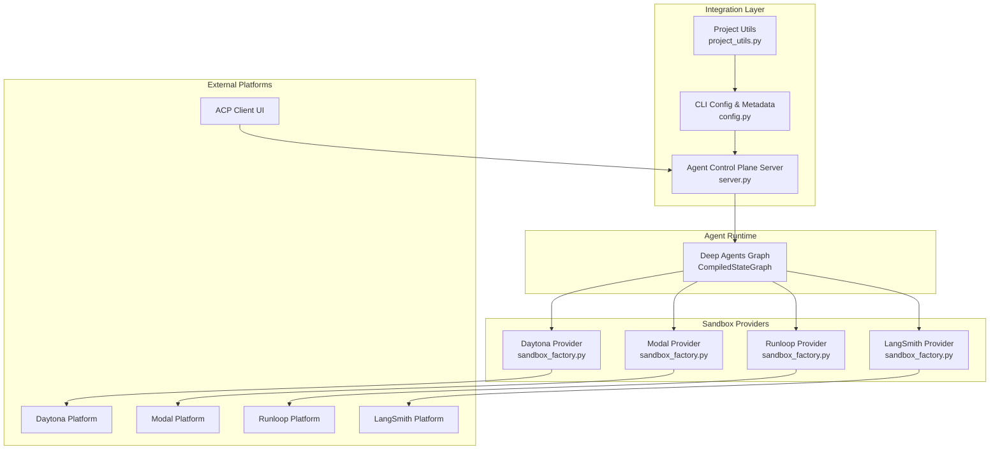
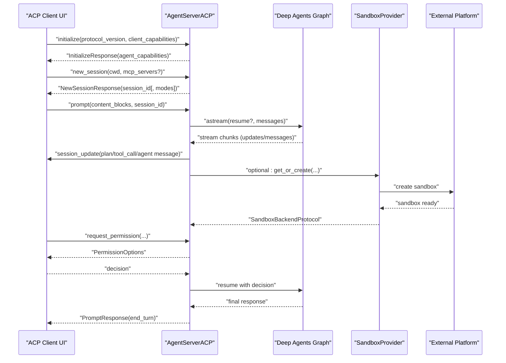
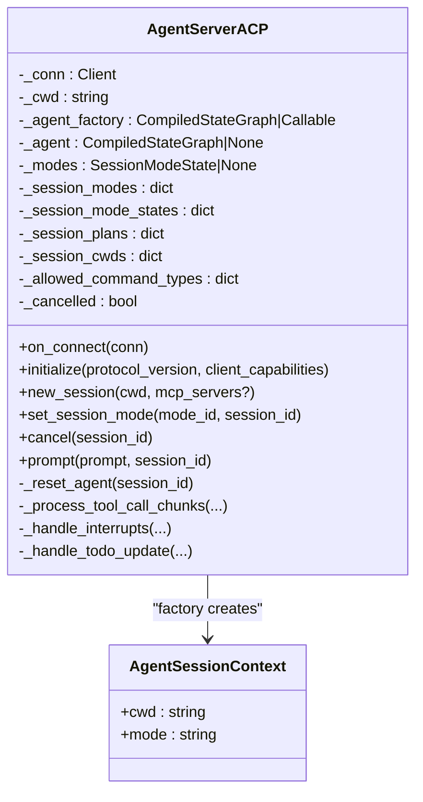
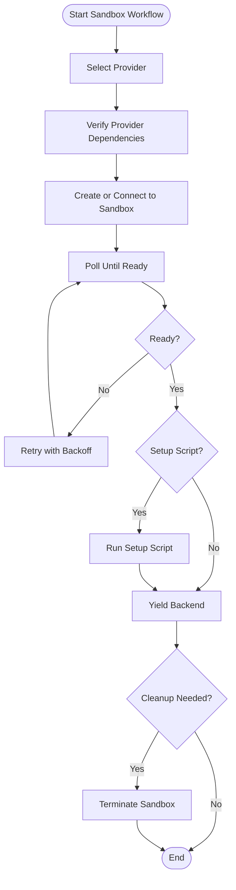
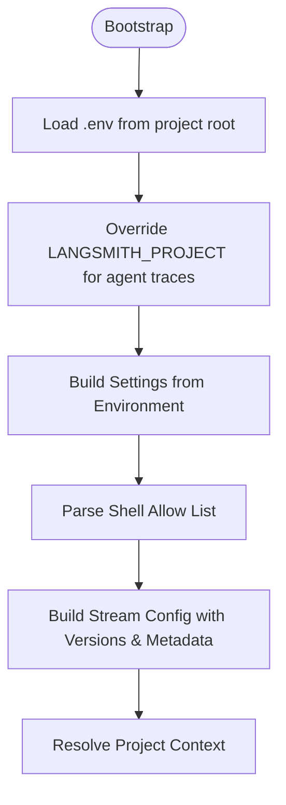
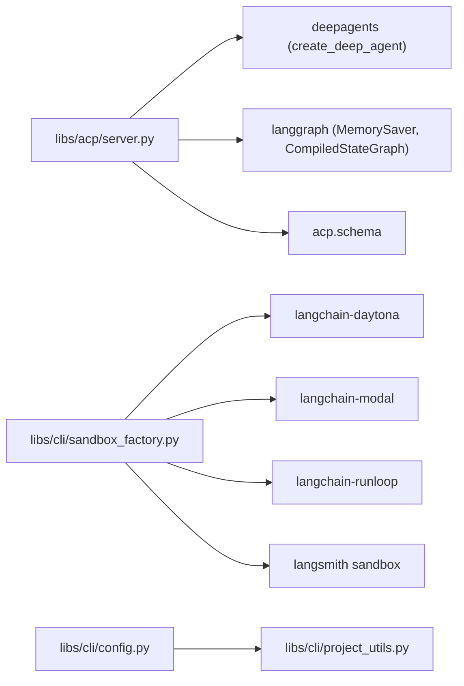

# Partner Integrations

<cite>
**Referenced Files in This Document**
- [README.md](file://README.md)
- [server.py](file://libs/acp/deepagents_acp/server.py)
- [utils.py](file://libs/acp/deepagents_acp/utils.py)
- [sandbox_factory.py](file://libs/cli/deepagents_cli/integrations/sandbox_factory.py)
- [sandbox_provider.py](file://libs/cli/deepagents_cli/integrations/sandbox_provider.py)
- [config.py](file://libs/cli/deepagents_cli/config.py)
- [project_utils.py](file://libs/cli/deepagents_cli/project_utils.py)
- [SKILL.md](file://libs/cli/deepagents_cli/built_in_skills/skill-creator/SKILL.md)
</cite>

## Table of Contents
1. [Introduction](#introduction)
2. [Project Structure](#project-structure)
3. [Core Components](#core-components)
4. [Architecture Overview](#architecture-overview)
5. [Detailed Component Analysis](#detailed-component-analysis)
6. [Dependency Analysis](#dependency-analysis)
7. [Performance Considerations](#performance-considerations)
8. [Troubleshooting Guide](#troubleshooting-guide)
9. [Conclusion](#conclusion)

## Introduction
This document explains how Deep Agents integrates with partner platforms and sandbox providers to enable secure, reproducible development and deployment workflows. It focuses on:
- Agent Control Plane (ACP) integration for UI clients
- Sandbox lifecycle management for Daytona, Modal, Runloop, and LangSmith
- Authentication and environment configuration
- Deployment workflows, resource provisioning, and orchestration
- Billing, monitoring, and scaling considerations
- Troubleshooting and best practices

## Project Structure
The integration surface spans three primary areas:
- ACP server: Bridges Deep Agents with external UI clients via the Agent Client Protocol
- CLI sandbox factory: Provides provider-agnostic sandbox lifecycle management
- Configuration and project utilities: Centralize environment variables, tracing metadata, and project context

**Diagram sources**
- [server.py:81-134](file://libs/acp/deepagents_acp/server.py#L81-L134)
- [config.py:537-602](file://libs/cli/deepagents_cli/config.py#L537-L602)
- [project_utils.py:100-132](file://libs/cli/deepagents_cli/project_utils.py#L100-L132)
- [sandbox_factory.py:372-450](file://libs/cli/deepagents_cli/integrations/sandbox_factory.py#L372-L450)
- [sandbox_factory.py:452-524](file://libs/cli/deepagents_cli/integrations/sandbox_factory.py#L452-L524)
- [sandbox_factory.py:527-598](file://libs/cli/deepagents_cli/integrations/sandbox_factory.py#L527-L598)
- [sandbox_factory.py:214-320](file://libs/cli/deepagents_cli/integrations/sandbox_factory.py#L214-L320)

**Section sources**
- [README.md:1-126](file://README.md#L1-L126)
- [server.py:81-134](file://libs/acp/deepagents_acp/server.py#L81-L134)
- [config.py:537-602](file://libs/cli/deepagents_cli/config.py#L537-L602)
- [project_utils.py:100-132](file://libs/cli/deepagents_cli/project_utils.py#L100-L132)
- [sandbox_factory.py:372-450](file://libs/cli/deepagents_cli/integrations/sandbox_factory.py#L372-L450)
- [sandbox_factory.py:452-524](file://libs/cli/deepagents_cli/integrations/sandbox_factory.py#L452-L524)
- [sandbox_factory.py:527-598](file://libs/cli/deepagents_cli/integrations/sandbox_factory.py#L527-L598)
- [sandbox_factory.py:214-320](file://libs/cli/deepagents_cli/integrations/sandbox_factory.py#L214-L320)

## Core Components
- ACP Server: Implements the Agent Client Protocol to receive prompts, stream responses, and coordinate human-in-the-loop permissions. It translates ACP content blocks to multimodal messages and streams tool call updates to the client.
- Sandbox Factory: Provides a unified interface to create and destroy sandboxes across providers (Daytona, Modal, Runloop, LangSmith). It validates provider dependencies, resolves working directories, and runs optional setup scripts.
- Configuration and Project Utilities: Centralize environment loading, LangSmith project routing, and project context resolution. They inject trace metadata and manage allow-lists for shell commands.

Key responsibilities:
- ACP Server: Multimodal input handling, streaming, tool call chunking, permission gating, and plan updates
- Sandbox Factory: Provider-specific SDK integration, readiness polling, and cleanup
- Config/Project: Environment-driven settings, tracing metadata, and project-aware paths

**Section sources**
- [server.py:435-624](file://libs/acp/deepagents_acp/server.py#L435-L624)
- [utils.py:101-272](file://libs/acp/deepagents_acp/utils.py#L101-L272)
- [sandbox_factory.py:83-143](file://libs/cli/deepagents_cli/integrations/sandbox_factory.py#L83-L143)
- [config.py:688-779](file://libs/cli/deepagents_cli/config.py#L688-L779)
- [project_utils.py:135-156](file://libs/cli/deepagents_cli/project_utils.py#L135-L156)

## Architecture Overview
The integration architecture connects the Deep Agents runtime to external platforms through standardized interfaces:
- ACP enables UI-driven orchestration with permission prompts and plan updates
- Sandbox providers supply isolated compute environments with consistent working directories and lifecycle management
- Configuration utilities ensure consistent tracing and environment behavior

**Diagram sources**
- [server.py:119-156](file://libs/acp/deepagents_acp/server.py#L119-L156)
- [server.py:435-624](file://libs/acp/deepagents_acp/server.py#L435-L624)
- [sandbox_factory.py:372-450](file://libs/cli/deepagents_cli/integrations/sandbox_factory.py#L372-L450)
- [sandbox_factory.py:452-524](file://libs/cli/deepagents_cli/integrations/sandbox_factory.py#L452-L524)
- [sandbox_factory.py:527-598](file://libs/cli/deepagents_cli/integrations/sandbox_factory.py#L527-L598)

## Detailed Component Analysis

### ACP Server Integration
The ACP server exposes:
- Initialization with agent capabilities (e.g., image prompt support)
- Session management with working directory and optional modes
- Streaming prompt handling with multimodal content conversion
- Tool call chunking and permission gating
- Plan updates and human-in-the-loop approvals

**Diagram sources**
- [server.py:81-114](file://libs/acp/deepagents_acp/server.py#L81-L114)
- [server.py:420-434](file://libs/acp/deepagents_acp/server.py#L420-L434)

Key behaviors:
- Converts ACP content blocks to LangChain multimodal content
- Streams text and tool results back to the client
- Handles permission requests for tool calls, including plan updates
- Supports plan auto-approval for in-progress plans and selective allow-lists for commands

**Section sources**
- [server.py:119-156](file://libs/acp/deepagents_acp/server.py#L119-L156)
- [server.py:435-624](file://libs/acp/deepagents_acp/server.py#L435-L624)
- [server.py:625-798](file://libs/acp/deepagents_acp/server.py#L625-L798)
- [utils.py:18-70](file://libs/acp/deepagents_acp/utils.py#L18-L70)
- [utils.py:101-272](file://libs/acp/deepagents_acp/utils.py#L101-L272)

### Sandbox Lifecycle Management
The sandbox factory provides a unified interface across providers:
- Provider selection and dependency verification
- Sandbox creation with readiness polling
- Optional setup script execution
- Cleanup and termination

**Diagram sources**
- [sandbox_factory.py:83-143](file://libs/cli/deepagents_cli/integrations/sandbox_factory.py#L83-L143)
- [sandbox_factory.py:372-450](file://libs/cli/deepagents_cli/integrations/sandbox_factory.py#L372-L450)
- [sandbox_factory.py:452-524](file://libs/cli/deepagents_cli/integrations/sandbox_factory.py#L452-L524)
- [sandbox_factory.py:527-598](file://libs/cli/deepagents_cli/integrations/sandbox_factory.py#L527-L598)

Provider-specific notes:
- Daytona: Requires DAYTONA_API_KEY and optional DAYTONA_API_URL; supports sandbox creation with readiness checks
- Modal: Uses Modal App lookup/creation; supports sandbox creation and termination
- Runloop: Requires RUNLOOP_API_KEY; manages devbox lifecycle with status polling
- LangSmith: Uses LANGSMITH_API_KEY; supports template existence checks and sandbox creation

Environment variables and defaults:
- Daytona: DAYTONA_API_KEY, DAYTONA_API_URL
- Modal: none (uses Modal App context)
- Runloop: RUNLOOP_API_KEY
- LangSmith: LANGSMITH_API_KEY, with default template and image

Working directories:
- Daytona: /home/daytona
- Modal: /workspace
- Runloop: /home/user
- LangSmith: /tmp

**Section sources**
- [sandbox_factory.py:74-79](file://libs/cli/deepagents_cli/integrations/sandbox_factory.py#L74-L79)
- [sandbox_factory.py:372-450](file://libs/cli/deepagents_cli/integrations/sandbox_factory.py#L372-L450)
- [sandbox_factory.py:452-524](file://libs/cli/deepagents_cli/integrations/sandbox_factory.py#L452-L524)
- [sandbox_factory.py:527-598](file://libs/cli/deepagents_cli/integrations/sandbox_factory.py#L527-L598)
- [sandbox_factory.py:214-320](file://libs/cli/deepagents_cli/integrations/sandbox_factory.py#L214-L320)

### Configuration and Project Context
Configuration utilities centralize:
- Environment bootstrap and .env loading
- LangSmith project routing for agent traces
- Shell command allow-lists and safety controls
- Project root detection and agent/skill directories

**Diagram sources**
- [config.py:94-141](file://libs/cli/deepagents_cli/config.py#L94-L141)
- [config.py:688-779](file://libs/cli/deepagents_cli/config.py#L688-L779)
- [config.py:537-602](file://libs/cli/deepagents_cli/config.py#L537-L602)
- [project_utils.py:135-156](file://libs/cli/deepagents_cli/project_utils.py#L135-L156)

**Section sources**
- [config.py:94-141](file://libs/cli/deepagents_cli/config.py#L94-L141)
- [config.py:688-779](file://libs/cli/deepagents_cli/config.py#L688-L779)
- [config.py:537-602](file://libs/cli/deepagents_cli/config.py#L537-L602)
- [project_utils.py:135-156](file://libs/cli/deepagents_cli/project_utils.py#L135-L156)

## Dependency Analysis
The integration relies on:
- ACP server depends on Deep Agents graph, LangGraph checkpointers, and ACP schema
- Sandbox factory depends on provider SDKs (imported conditionally) and backend wrappers
- Configuration utilities depend on environment variables and project utilities

**Diagram sources**
- [server.py:47-51](file://libs/acp/deepagents_acp/server.py#L47-L51)
- [sandbox_factory.py:376-391](file://libs/cli/deepagents_cli/integrations/sandbox_factory.py#L376-L391)
- [sandbox_factory.py:456-465](file://libs/cli/deepagents_cli/integrations/sandbox_factory.py#L456-L465)
- [sandbox_factory.py:531-541](file://libs/cli/deepagents_cli/integrations/sandbox_factory.py#L531-L541)
- [sandbox_factory.py:229-235](file://libs/cli/deepagents_cli/integrations/sandbox_factory.py#L229-L235)
- [config.py:115-121](file://libs/cli/deepagents_cli/config.py#L115-L121)
- [project_utils.py:115-123](file://libs/cli/deepagents_cli/project_utils.py#L115-L123)

**Section sources**
- [server.py:47-51](file://libs/acp/deepagents_acp/server.py#L47-L51)
- [sandbox_factory.py:376-391](file://libs/cli/deepagents_cli/integrations/sandbox_factory.py#L376-L391)
- [sandbox_factory.py:456-465](file://libs/cli/deepagents_cli/integrations/sandbox_factory.py#L456-L465)
- [sandbox_factory.py:531-541](file://libs/cli/deepagents_cli/integrations/sandbox_factory.py#L531-L541)
- [sandbox_factory.py:229-235](file://libs/cli/deepagents_cli/integrations/sandbox_factory.py#L229-L235)
- [config.py:115-121](file://libs/cli/deepagents_cli/config.py#L115-L121)
- [project_utils.py:115-123](file://libs/cli/deepagents_cli/project_utils.py#L115-L123)

## Performance Considerations
- Streaming: ACP server streams both text and tool results incrementally to reduce latency
- Readiness polling: Sandbox providers poll readiness with backoff to minimize wasted attempts
- Memory checkpointing: ACP server initializes a memory saver for stateful sessions
- Shell allow lists: Restricting shell commands reduces risk and improves predictability
- Tracing overhead: Minimal metadata injection avoids stalling flows

[No sources needed since this section provides general guidance]

## Troubleshooting Guide
Common issues and resolutions:
- Missing provider dependencies: Install extras for Daytona, Modal, or Runloop to satisfy backend modules
  - Resolution: Install with pip using the provider extras indicated by the code
- Missing API keys: Providers raise explicit errors when required environment variables are absent
  - Resolution: Set DAYTONA_API_KEY, RUNLOOP_API_KEY, or LANGSMITH_API_KEY as appropriate
- Sandbox startup timeouts: Providers poll readiness and raise descriptive errors on failure
  - Resolution: Increase timeout or check platform quotas and network connectivity
- Permission gating: ACP server requests user decisions for tool calls; plan updates may be auto-approved for in-progress plans
  - Resolution: Review allow-lists and command signatures to streamline approvals
- Environment bootstrap: .env loading and LangSmith project override occur at bootstrap
  - Resolution: Ensure .env is placed at the project root and DEEPAGENTS_LANGSMITH_PROJECT is set if needed

**Section sources**
- [sandbox_factory.py:629-674](file://libs/cli/deepagents_cli/integrations/sandbox_factory.py#L629-L674)
- [sandbox_factory.py:382-385](file://libs/cli/deepagents_cli/integrations/sandbox_factory.py#L382-L385)
- [sandbox_factory.py:537-541](file://libs/cli/deepagents_cli/integrations/sandbox_factory.py#L537-L541)
- [sandbox_factory.py:231-234](file://libs/cli/deepagents_cli/integrations/sandbox_factory.py#L231-L234)
- [server.py:520-536](file://libs/acp/deepagents_acp/server.py#L520-L536)
- [config.py:94-141](file://libs/cli/deepagents_cli/config.py#L94-L141)

## Conclusion
Deep Agents integrates with partner platforms through a robust ACP server and a provider-agnostic sandbox factory. By centralizing configuration, enforcing permission gating, and managing sandbox lifecycles, the system delivers secure, reproducible workflows across Daytona, Modal, Runloop, and LangSmith. Proper environment setup, dependency installation, and understanding of allow-lists and tracing metadata are essential for smooth operation.