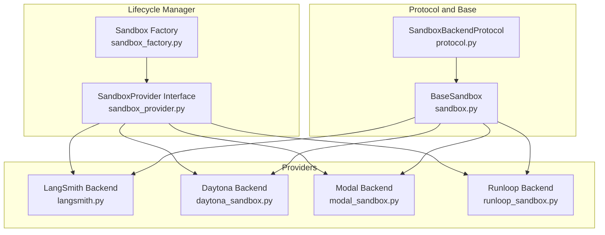
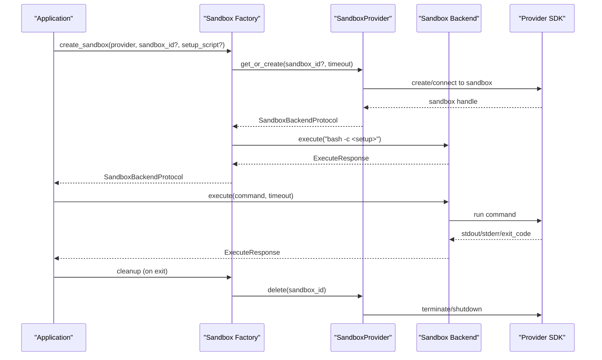
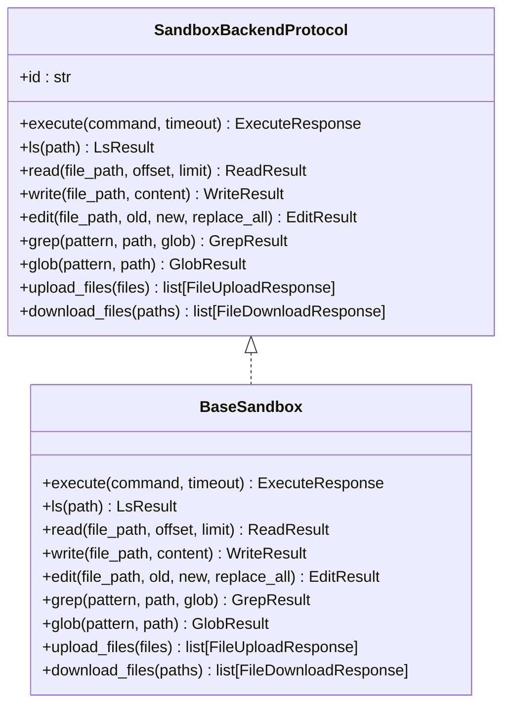
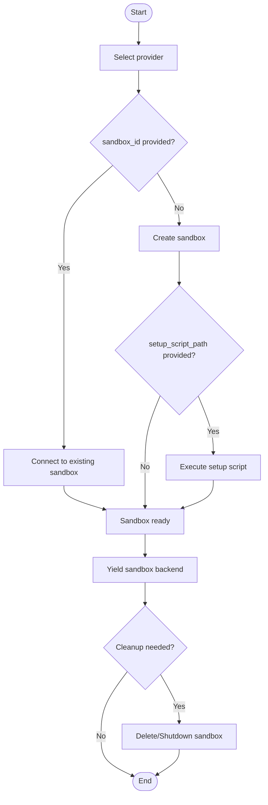
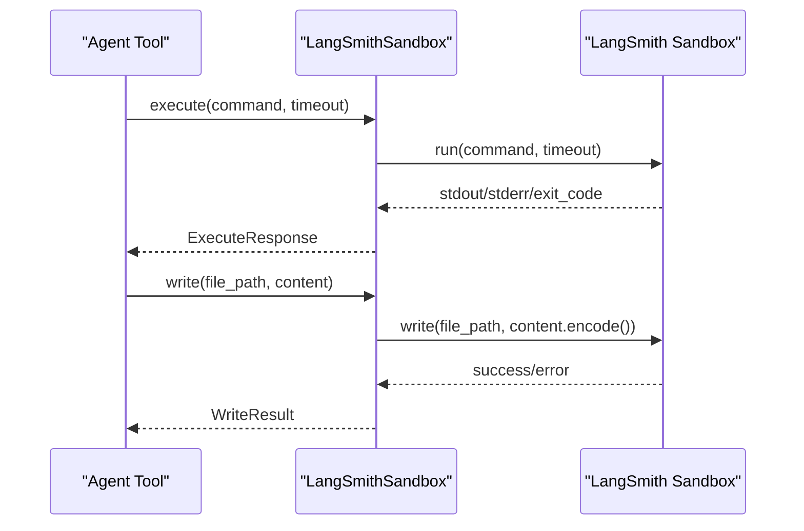
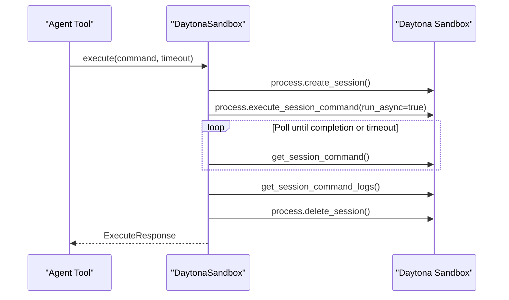
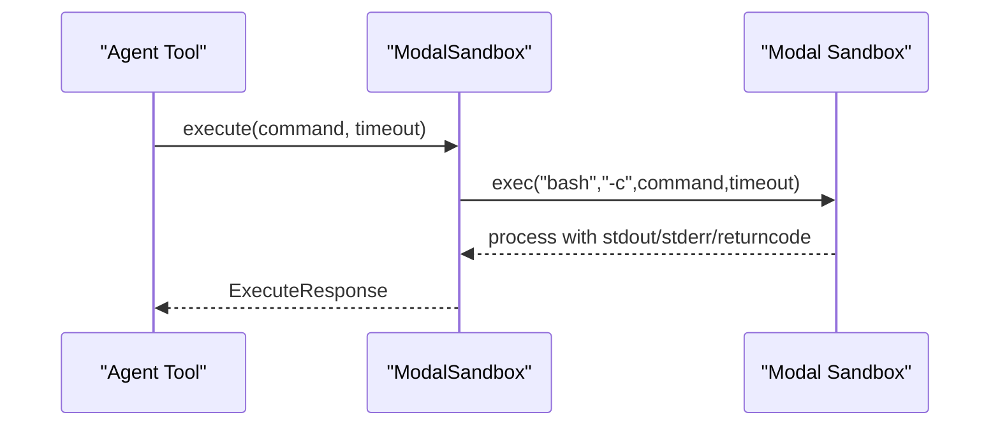
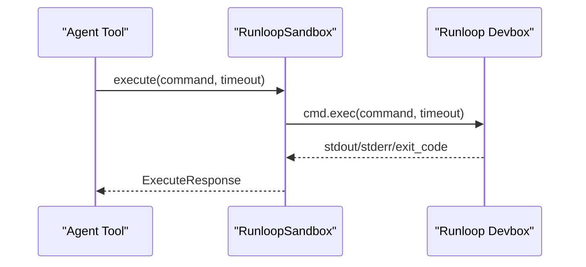
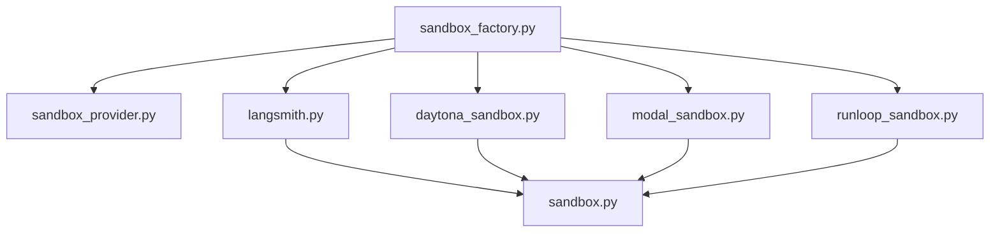

# Sandbox Provider Integration

<cite>
**Referenced Files in This Document**
- [README.md](file://README.md)
- [sandbox.py](file://libs/deepagents/deepagents/backends/sandbox.py)
- [protocol.py](file://libs/deepagents/deepagents/backends/protocol.py)
- [sandbox_factory.py](file://libs/cli/deepagents_cli/integrations/sandbox_factory.py)
- [sandbox_provider.py](file://libs/cli/deepagents_cli/integrations/sandbox_provider.py)
- [langsmith.py](file://libs/deepagents/deepagents/backends/langsmith.py)
- [daytona_sandbox.py](file://libs/partners/daytona/langchain_daytona/sandbox.py)
- [modal_sandbox.py](file://libs/partners/modal/langchain_modal/sandbox.py)
- [runloop_sandbox.py](file://libs/partners/runloop/langchain_runloop/sandbox.py)
- [test_sandbox_factory.py](file://libs/cli/tests/integration_tests/test_sandbox_factory.py)
- [test_sandbox_operations.py](file://libs/cli/tests/integration_tests/test_sandbox_operations.py)
- [test_local_sandbox_operations.py](file://libs/deepagents/tests/unit_tests/test_local_sandbox_operations.py)
</cite>

## Table of Contents
1. [Introduction](#introduction)
2. [Project Structure](#project-structure)
3. [Core Components](#core-components)
4. [Architecture Overview](#architecture-overview)
5. [Detailed Component Analysis](#detailed-component-analysis)
6. [Dependency Analysis](#dependency-analysis)
7. [Performance Considerations](#performance-considerations)
8. [Security and Compliance](#security-and-compliance)
9. [Troubleshooting Guide](#troubleshooting-guide)
10. [Conclusion](#conclusion)

## Introduction
This document explains how the project integrates with multiple sandbox providers to deliver a secure, isolated execution environment for agent tools. It covers the sandbox execution environment setup, security and isolation mechanisms, provider integrations, configuration options, resource allocation, execution limits, lifecycle management, cleanup, monitoring, and troubleshooting guidance. The goal is to help operators deploy and operate sandboxes safely and efficiently across providers such as Daytona, LangSmith, Modal, and Runloop.

## Project Structure
The sandbox integration spans three layers:
- Protocol and base sandbox: Defines the contract and shared behaviors for file operations and command execution.
- Provider factory and lifecycle manager: Creates, connects to, and tears down sandbox instances across providers.
- Provider backends: Implementations that translate the protocol into provider-specific APIs.

**Diagram sources**
- [protocol.py:627-709](file://libs/deepagents/deepagents/backends/protocol.py#L627-L709)
- [sandbox.py:217-465](file://libs/deepagents/deepagents/backends/sandbox.py#L217-L465)
- [sandbox_factory.py:83-143](file://libs/cli/deepagents_cli/integrations/sandbox_factory.py#L83-L143)
- [sandbox_provider.py:26-72](file://libs/cli/deepagents_cli/integrations/sandbox_provider.py#L26-L72)
- [langsmith.py:22-152](file://libs/deepagents/deepagents/backends/langsmith.py#L22-L152)
- [daytona_sandbox.py:23-202](file://libs/partners/daytona/langchain_daytona/sandbox.py#L23-L202)
- [modal_sandbox.py:16-114](file://libs/partners/modal/langchain_modal/sandbox.py#L16-L114)
- [runloop_sandbox.py:18-79](file://libs/partners/runloop/langchain_runloop/sandbox.py#L18-L79)

**Section sources**
- [README.md:24-36](file://README.md#L24-L36)
- [README.md:123-126](file://README.md#L123-L126)

## Core Components
- SandboxBackendProtocol: Defines the unified interface for file operations and command execution, including standardized error codes for file operations and a simplified ExecuteResponse schema.
- BaseSandbox: Implements file operations (list, read, write, edit, grep, glob) by composing shell commands and delegating execution to a concrete execute() implementation. It also provides robust error handling and standardized responses.
- Provider lifecycle manager: Provides a unified interface to create/connect to sandboxes and clean them up, with provider-specific defaults and environment checks.
- Provider backends: Implement execute(), upload_files(), and download_files() using provider SDKs, with timeouts and resource safeguards.

Key capabilities:
- Secure command execution with timeouts and standardized output/error handling.
- File operations with standardized error codes and partial success support.
- Provider-specific working directories and environment configuration.
- Pre-flight dependency verification for optional providers.

**Section sources**
- [protocol.py:33-47](file://libs/deepagents/deepagents/backends/protocol.py#L33-L47)
- [protocol.py:611-625](file://libs/deepagents/deepagents/backends/protocol.py#L611-L625)
- [protocol.py:627-709](file://libs/deepagents/deepagents/backends/protocol.py#L627-L709)
- [sandbox.py:217-465](file://libs/deepagents/deepagents/backends/sandbox.py#L217-L465)
- [sandbox_factory.py:83-143](file://libs/cli/deepagents_cli/integrations/sandbox_factory.py#L83-L143)
- [sandbox_factory.py:629-682](file://libs/cli/deepagents_cli/integrations/sandbox_factory.py#L629-L682)

## Architecture Overview
The architecture separates concerns across protocol, lifecycle management, and provider backends. The lifecycle manager abstracts provider differences and ensures consistent sandbox creation, setup, and teardown. Provider backends encapsulate SDK-specific logic while adhering to the protocol.

**Diagram sources**
- [sandbox_factory.py:83-143](file://libs/cli/deepagents_cli/integrations/sandbox_factory.py#L83-L143)
- [sandbox_provider.py:26-72](file://libs/cli/deepagents_cli/integrations/sandbox_provider.py#L26-L72)
- [langsmith.py:43-68](file://libs/deepagents/deepagents/backends/langsmith.py#L43-L68)
- [daytona_sandbox.py:86-134](file://libs/partners/daytona/langchain_daytona/sandbox.py#L86-L134)
- [modal_sandbox.py:75-105](file://libs/partners/modal/langchain_modal/sandbox.py#L75-L105)
- [runloop_sandbox.py:36-60](file://libs/partners/runloop/langchain_runloop/sandbox.py#L36-L60)

## Detailed Component Analysis

### Protocol and Base Sandbox
- Protocol defines standardized file operation responses and ExecuteResponse, enabling partial success and consistent error reporting.
- BaseSandbox implements file operations using shell commands and heredoc-based transports to avoid ARG_MAX limits and shell injection risks. It translates high-level operations into executable commands and parses structured outputs.

**Diagram sources**
- [protocol.py:627-709](file://libs/deepagents/deepagents/backends/protocol.py#L627-L709)
- [sandbox.py:217-465](file://libs/deepagents/deepagents/backends/sandbox.py#L217-L465)

**Section sources**
- [protocol.py:33-47](file://libs/deepagents/deepagents/backends/protocol.py#L33-L47)
- [protocol.py:611-625](file://libs/deepagents/deepagents/backends/protocol.py#L611-L625)
- [sandbox.py:33-214](file://libs/deepagents/deepagents/backends/sandbox.py#L33-L214)

### Provider Lifecycle Management
- Unified sandbox creation and teardown via a context manager that:
  - Selects provider implementation by name.
  - Determines whether to create or reuse a sandbox.
  - Runs an optional setup script inside the sandbox.
  - Ensures cleanup on exit, with best-effort cleanup on failure.
- Environment-based dependency verification for optional providers.
- Default working directories per provider.

**Diagram sources**
- [sandbox_factory.py:83-143](file://libs/cli/deepagents_cli/integrations/sandbox_factory.py#L83-L143)
- [sandbox_factory.py:629-682](file://libs/cli/deepagents_cli/integrations/sandbox_factory.py#L629-L682)

**Section sources**
- [sandbox_factory.py:83-143](file://libs/cli/deepagents_cli/integrations/sandbox_factory.py#L83-L143)
- [sandbox_factory.py:74-80](file://libs/cli/deepagents_cli/integrations/sandbox_factory.py#L74-L80)
- [sandbox_factory.py:629-682](file://libs/cli/deepagents_cli/integrations/sandbox_factory.py#L629-L682)

### LangSmith Sandbox Backend
- Executes commands via the LangSmith SDK with timeout support.
- Overrides write() to avoid ARG_MAX by sending content in HTTP body.
- Implements upload/download with standardized error codes and partial success.

**Diagram sources**
- [langsmith.py:43-68](file://libs/deepagents/deepagents/backends/langsmith.py#L43-L68)
- [langsmith.py:70-91](file://libs/deepagents/deepagents/backends/langsmith.py#L70-L91)
- [langsmith.py:92-152](file://libs/deepagents/deepagents/backends/langsmith.py#L92-L152)

**Section sources**
- [langsmith.py:22-152](file://libs/deepagents/deepagents/backends/langsmith.py#L22-L152)

### Daytona Sandbox Backend
- Uses sessions to execute commands and polls logs until completion.
- Implements timeouts and cleanup of sessions.
- Validates paths for upload/download and returns standardized errors.

**Diagram sources**
- [daytona_sandbox.py:86-134](file://libs/partners/daytona/langchain_daytona/sandbox.py#L86-L134)
- [daytona_sandbox.py:136-202](file://libs/partners/daytona/langchain_daytona/sandbox.py#L136-L202)

**Section sources**
- [daytona_sandbox.py:23-202](file://libs/partners/daytona/langchain_daytona/sandbox.py#L23-L202)

### Modal Sandbox Backend
- Executes commands via Modal’s sandbox exec and waits for completion.
- Implements upload/download using Modal’s file handle semantics with explicit error mapping.

**Diagram sources**
- [modal_sandbox.py:75-105](file://libs/partners/modal/langchain_modal/sandbox.py#L75-L105)
- [modal_sandbox.py:107-114](file://libs/partners/modal/langchain_modal/sandbox.py#L107-L114)

**Section sources**
- [modal_sandbox.py:16-114](file://libs/partners/modal/langchain_modal/sandbox.py#L16-L114)

### Runloop Sandbox Backend
- Executes commands via Runloop devbox command execution.
- Implements upload/download using devbox file operations.

**Diagram sources**
- [runloop_sandbox.py:36-60](file://libs/partners/runloop/langchain_runloop/sandbox.py#L36-L60)
- [runloop_sandbox.py:62-79](file://libs/partners/runloop/langchain_runloop/sandbox.py#L62-L79)

**Section sources**
- [runloop_sandbox.py:18-79](file://libs/partners/runloop/langchain_runloop/sandbox.py#L18-L79)

## Dependency Analysis
- Provider selection and lifecycle are centralized in the factory, which imports provider-specific modules conditionally and verifies dependencies.
- Provider backends inherit from BaseSandbox to reuse file operation implementations, reducing duplication and ensuring consistent behavior.

**Diagram sources**
- [sandbox_factory.py:601-627](file://libs/cli/deepagents_cli/integrations/sandbox_factory.py#L601-L627)
- [sandbox_provider.py:26-72](file://libs/cli/deepagents_cli/integrations/sandbox_provider.py#L26-L72)
- [langsmith.py:22-152](file://libs/deepagents/deepagents/backends/langsmith.py#L22-L152)
- [daytona_sandbox.py:23-202](file://libs/partners/daytona/langchain_daytona/sandbox.py#L23-L202)
- [modal_sandbox.py:16-114](file://libs/partners/modal/langchain_modal/sandbox.py#L16-L114)
- [runloop_sandbox.py:18-79](file://libs/partners/runloop/langchain_runloop/sandbox.py#L18-L79)
- [sandbox.py:217-465](file://libs/deepagents/deepagents/backends/sandbox.py#L217-L465)

**Section sources**
- [sandbox_factory.py:601-627](file://libs/cli/deepagents_cli/integrations/sandbox_factory.py#L601-L627)
- [sandbox_factory.py:629-682](file://libs/cli/deepagents_cli/integrations/sandbox_factory.py#L629-L682)

## Performance Considerations
- Command execution timeouts: All backends honor a timeout parameter; providers that support zero-timeout semantics interpret it as “no timeout” when applicable.
- ARG_MAX avoidance: BaseSandbox uses heredoc-based transports for write/edit/read operations to bypass shell argument limits for large content.
- Partial success: Upload/download operations return per-item results, allowing resilient batch processing.
- Polling strategies: Daytona backend supports configurable polling intervals to balance responsiveness and overhead.

[No sources needed since this section provides general guidance]

## Security and Compliance
- Trust model: The project follows a “trust the LLM” model; enforce boundaries at the tool/sandbox level, not by expecting the model to self-police.
- Path validation: Providers validate absolute paths for file operations and return standardized errors for invalid paths.
- Error normalization: Standardized error codes (e.g., invalid_path, permission_denied, file_not_found) improve observability and reduce ambiguity.
- Cleanup: Factory ensures sandbox termination on exit; best-effort cleanup prevents resource leaks.
- Network and isolation: Provider backends rely on provider-level isolation and network policies; consult provider documentation for specific controls.

**Section sources**
- [README.md:123-126](file://README.md#L123-L126)
- [protocol.py:33-47](file://libs/deepagents/deepagents/backends/protocol.py#L33-L47)
- [daytona_sandbox.py:142-148](file://libs/partners/daytona/langchain_daytona/sandbox.py#L142-L148)
- [modal_sandbox.py:24-69](file://libs/partners/modal/langchain_modal/sandbox.py#L24-L69)
- [langsmith.py:110-122](file://libs/deepagents/deepagents/backends/langsmith.py#L110-L122)

## Troubleshooting Guide
Common issues and resolutions:
- Provider dependency not installed:
  - Symptom: ImportError when creating a sandbox.
  - Resolution: Install the provider extra as indicated by the factory’s pre-flight check.
- Sandbox startup failures:
  - Symptom: Runtime error indicating sandbox did not become ready within timeout.
  - Resolution: Verify provider credentials and template availability; reduce timeout or retry.
- Setup script failures:
  - Symptom: Setup script exits with non-zero code.
  - Resolution: Inspect the returned output and adjust the script; ensure environment variables are properly expanded.
- Path validation errors:
  - Symptom: invalid_path errors on upload/download.
  - Resolution: Ensure paths are absolute and exist; check permissions.
- Cleanup failures:
  - Symptom: Warning about cleanup failure.
  - Resolution: Confirm provider credentials and permissions; manually terminate sandbox if needed.

**Section sources**
- [sandbox_factory.py:629-682](file://libs/cli/deepagents_cli/integrations/sandbox_factory.py#L629-L682)
- [sandbox_factory.py:120-142](file://libs/cli/deepagents_cli/integrations/sandbox_factory.py#L120-L142)
- [daytona_sandbox.py:142-148](file://libs/partners/daytona/langchain_daytona/sandbox.py#L142-L148)
- [modal_sandbox.py:24-69](file://libs/partners/modal/langchain_modal/sandbox.py#L24-L69)
- [langsmith.py:110-122](file://libs/deepagents/deepagents/backends/langsmith.py#L110-L122)

## Conclusion
The sandbox integration provides a consistent, secure, and provider-agnostic execution environment. By leveraging a shared protocol, lifecycle management, and provider-specific backends, the system supports reliable command execution, robust file operations, and predictable cleanup. Operators should configure provider credentials, templates, and timeouts appropriately, monitor for standardized errors, and follow best practices for isolation and compliance.