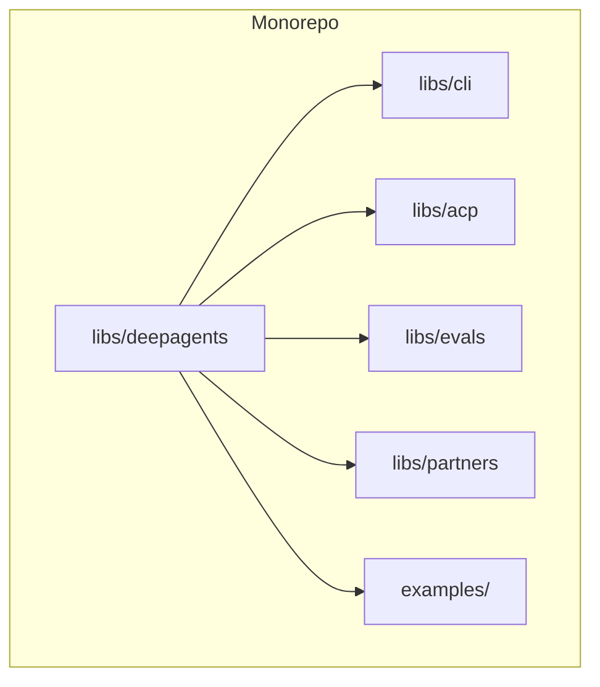
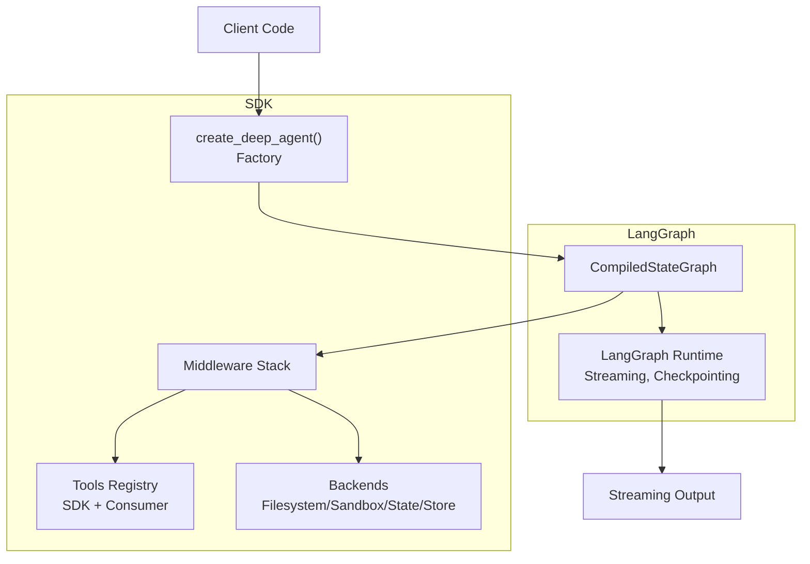
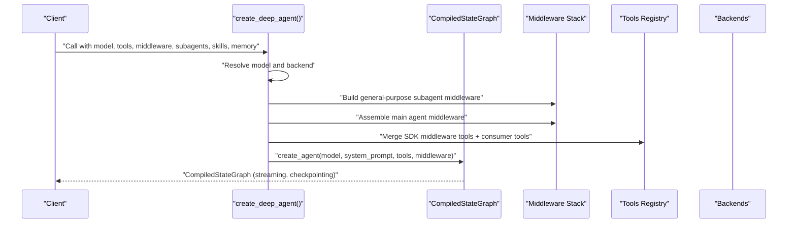
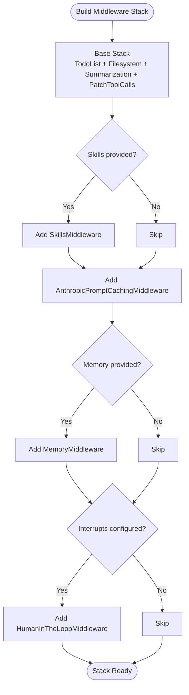
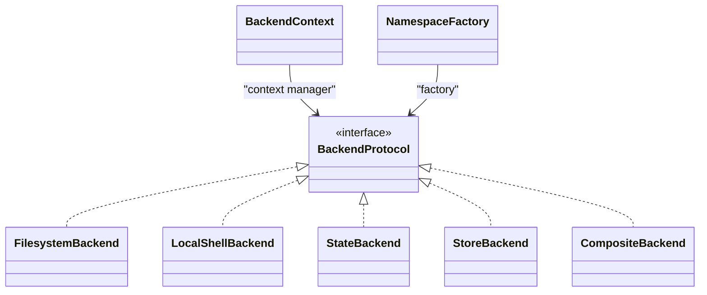
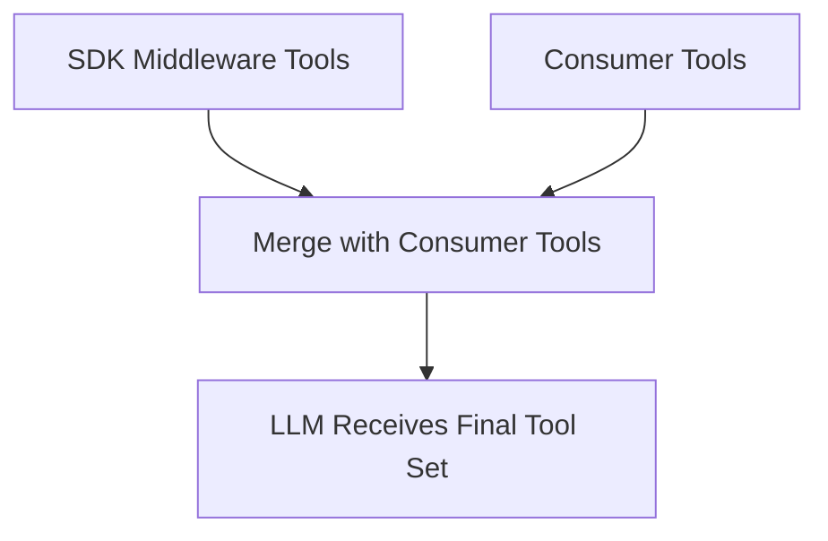
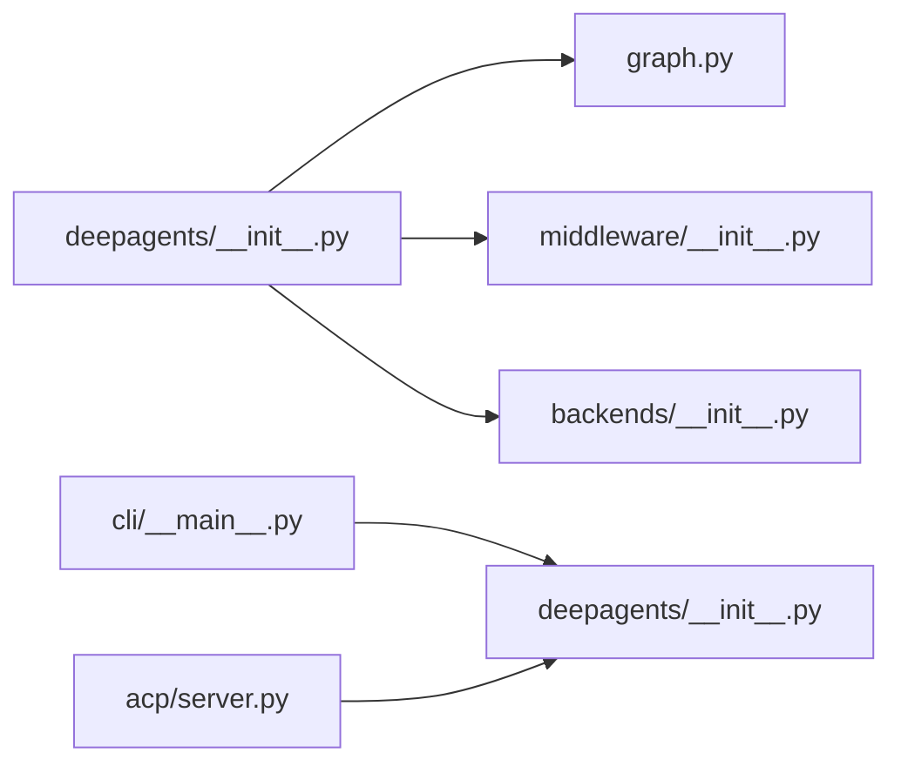
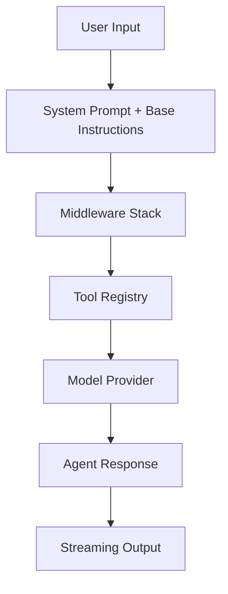

# Architecture & Design

<cite>
**Referenced Files in This Document**
- [README.md](file://README.md)
- [AGENTS.md](file://AGENTS.md)
- [libs/deepagents/deepagents/__init__.py](file://libs/deepagents/deepagents/__init__.py)
- [libs/deepagents/deepagents/graph.py](file://libs/deepagents/deepagents/graph.py)
- [libs/deepagents/deepagents/backends/__init__.py](file://libs/deepagents/deepagents/backends/__init__.py)
- [libs/deepagents/deepagents/middleware/__init__.py](file://libs/deepagents/deepagents/middleware/__init__.py)
- [examples/content-builder-agent/content_writer.py](file://examples/content-builder-agent/content_writer.py)
- [examples/deep_research/agent.py](file://examples/deep_research/agent.py)
- [examples/deep_research/research_agent/__init__.py](file://examples/deep_research/research_agent/__init__.py)
- [examples/deep_research/research_agent/prompts.py](file://examples/deep_research/research_agent/prompts.py)
- [examples/deep_research/research_agent/tools.py](file://examples/deep_research/research_agent/tools.py)
- [examples/deep_research/utils.py](file://examples/deep_research/utils.py)
- [examples/nvidia_deep_agent/src/agent.py](file://examples/nvidia_deep_agent/src/agent.py)
- [examples/nvidia_deep_agent/src/backend.py](file://examples/nvidia_deep_agent/src/backend.py)
- [examples/nvidia_deep_agent/src/prompts.py](file://examples/nvidia_deep_agent/src/prompts.py)
- [examples/nvidia_deep_agent/src/tools.py](file://examples/nvidia_deep_agent/src/tools.py)
- [examples/text-to-sql-agent/agent.py](file://examples/text-to-sql-agent/agent.py)
- [libs/cli/deepagents_cli/__main__.py](file://libs/cli/deepagents_cli/__main__.py)
- [libs/acp/deepagents_acp/server.py](file://libs/acp/deepagents_acp/server.py)
</cite>

## Table of Contents
1. [Introduction](#introduction)
2. [Project Structure](#project-structure)
3. [Core Components](#core-components)
4. [Architecture Overview](#architecture-overview)
5. [Detailed Component Analysis](#detailed-component-analysis)
6. [Dependency Analysis](#dependency-analysis)
7. [Performance Considerations](#performance-considerations)
8. [Troubleshooting Guide](#troubleshooting-guide)
9. [Conclusion](#conclusion)
10. [Appendices](#appendices)

## Introduction
DeepAgents is an agent harness built on top of LangGraph that provides a production-ready, batteries-included foundation for building and running AI agents. It extends LangGraph with a middleware-driven tool registry and a backend abstraction layer, enabling:
- A standardized agent creation factory that assembles a robust middleware stack
- Pluggable backends for filesystem, sandbox execution, and state persistence
- A rich tool system that merges SDK middleware with user-provided tools
- Extensibility via design patterns: Factory for agent creation, Strategy for model providers, Observer for streaming, and Middleware for runtime extensibility

The system is designed to be provider-agnostic, streaming-capable, and compatible with LangSmith Studio, checkpointers, and other LangGraph features.

**Section sources**
- [README.md:1-126](file://README.md#L1-L126)
- [AGENTS.md:1-304](file://AGENTS.md#L1-L304)

## Project Structure
The repository is a Python monorepo organized into libraries and examples:
- libs/deepagents: The SDK that exposes the agent creation factory and middleware/backends
- libs/cli: A terminal UI and CLI tooling around the SDK
- libs/acp: Agent Context Protocol integration
- libs/evals and libs/partners: Evaluations and partner integrations
- examples: End-to-end agent patterns and demonstrations

**Section sources**
- [AGENTS.md:7-304](file://AGENTS.md#L7-L304)

## Core Components
This section documents the primary building blocks that implement the architecture.

- Agent Creation Factory
  - Exposed via create_deep_agent(), which composes a CompiledStateGraph with a carefully ordered middleware stack and default tools.
  - Supports model selection, system prompt customization, subagents, skills, memory, interrupts, and backend configuration.

- Middleware Stack Assembly
  - Middleware intercept LLM requests, dynamically filter tools, inject system prompt context, transform messages, and maintain cross-turn state.
  - Includes TodoList, Filesystem, SubAgent, Summarization, PatchToolCalls, Skills, Anthropic caching, Memory, and Human-in-the-loop middleware.

- Backend Abstraction Layer
  - Provides pluggable backends for filesystem, sandbox execution, state, and store.
  - Backends implement a protocol and can be supplied as instances or factories.

- Tool System
  - Tools originate from two sources:
    - SDK middleware (e.g., filesystem, subagents, summarization) that can adapt availability and behavior per-call
    - Consumer-provided tools passed to create_deep_agent()

- Model Provider Strategy
  - Models are resolved via a provider-agnostic resolution mechanism, enabling switching between providers and models without changing client code.

- Streaming Observer Pattern
  - The returned graph supports streaming and integrates with LangSmith Studio and other LangGraph streaming features.

**Section sources**
- [libs/deepagents/deepagents/graph.py:83-333](file://libs/deepagents/deepagents/graph.py#L83-L333)
- [libs/deepagents/deepagents/middleware/__init__.py:1-74](file://libs/deepagents/deepagents/middleware/__init__.py#L1-L74)
- [libs/deepagents/deepagents/backends/__init__.py:1-27](file://libs/deepagents/deepagents/backends/__init__.py#L1-L27)
- [libs/deepagents/deepagents/__init__.py:1-21](file://libs/deepagents/deepagents/__init__.py#L1-L21)

## Architecture Overview
The system architecture centers on the agent creation factory that assembles a LangGraph graph with a layered middleware stack. The middleware orchestrates tool availability, system prompt augmentation, and runtime behaviors, while the backend abstraction enables sandboxed execution and persistent storage.

**Diagram sources**
- [libs/deepagents/deepagents/graph.py:83-333](file://libs/deepagents/deepagents/graph.py#L83-L333)
- [libs/deepagents/deepagents/middleware/__init__.py:1-74](file://libs/deepagents/deepagents/middleware/__init__.py#L1-L74)
- [libs/deepagents/deepagents/backends/__init__.py:1-27](file://libs/deepagents/deepagents/backends/__init__.py#L1-L27)

## Detailed Component Analysis

### Agent Creation Factory
The create_deep_agent() function is the central factory that:
- Resolves the model provider and constructs a default model when none is provided
- Builds a general-purpose subagent with a base middleware stack
- Processes user-provided subagents (sync, compiled, async) and merges them into the main agent’s toolset
- Assembles the main agent middleware stack with ordering guarantees for caching and memory
- Merges system prompts and returns a CompiledStateGraph configured for streaming and persistence

**Diagram sources**
- [libs/deepagents/deepagents/graph.py:83-333](file://libs/deepagents/deepagents/graph.py#L83-L333)

**Section sources**
- [libs/deepagents/deepagents/graph.py:83-333](file://libs/deepagents/deepagents/graph.py#L83-L333)

### Middleware Stack Assembly
The middleware stack is assembled in a specific order to ensure correct behavior:
- TodoListMiddleware for planning
- FilesystemMiddleware for file operations and sandbox gating
- SummarizationMiddleware for context window management
- PatchToolCallsMiddleware for tool call normalization
- SkillsMiddleware for injecting domain-specific instructions
- AnthropicPromptCachingMiddleware (placed after other middleware to avoid cache invalidation)
- MemoryMiddleware for persistent memory injection
- HumanInTheLoopMiddleware for approvals and interruptions

**Diagram sources**
- [libs/deepagents/deepagents/graph.py:208-301](file://libs/deepagents/deepagents/graph.py#L208-L301)

**Section sources**
- [libs/deepagents/deepagents/graph.py:208-301](file://libs/deepagents/deepagents/graph.py#L208-L301)

### Backend Abstraction Layer
Backends provide a protocol-based abstraction for:
- Filesystem operations
- Sandbox execution with timeouts
- State and store persistence
- Composite backends for layered storage

**Diagram sources**
- [libs/deepagents/deepagents/backends/__init__.py:1-27](file://libs/deepagents/deepagents/backends/__init__.py#L1-L27)

**Section sources**
- [libs/deepagents/deepagents/backends/__init__.py:1-27](file://libs/deepagents/deepagents/backends/__init__.py#L1-L27)

### Tool System and Registry
The tool system merges SDK middleware-provided tools with consumer-provided tools:
- SDK middleware can dynamically adjust tool availability and inject system prompt context per call
- Consumer tools are appended to the final tool set presented to the LLM

**Diagram sources**
- [libs/deepagents/deepagents/middleware/__init__.py:3-48](file://libs/deepagents/deepagents/middleware/__init__.py#L3-L48)
- [libs/deepagents/deepagents/graph.py:312-316](file://libs/deepagents/deepagents/graph.py#L312-L316)

**Section sources**
- [libs/deepagents/deepagents/middleware/__init__.py:3-48](file://libs/deepagents/deepagents/middleware/__init__.py#L3-L48)
- [libs/deepagents/deepagents/graph.py:312-316](file://libs/deepagents/deepagents/graph.py#L312-L316)

### Example Integrations
- Content Builder Agent: Demonstrates agent construction and skills integration
- Deep Research Agent: Shows research-oriented prompts, tools, and agent orchestration
- NVIDIA Deep Agent: Illustrates backend integration and GPU-focused skills
- Text-to-SQL Agent: Highlights structured output and specialized tooling

These examples showcase how to wire models, tools, skills, and backends with the SDK.

**Section sources**
- [examples/content-builder-agent/content_writer.py](file://examples/content-builder-agent/content_writer.py)
- [examples/deep_research/agent.py](file://examples/deep_research/agent.py)
- [examples/deep_research/research_agent/__init__.py](file://examples/deep_research/research_agent/__init__.py)
- [examples/deep_research/research_agent/prompts.py](file://examples/deep_research/research_agent/prompts.py)
- [examples/deep_research/research_agent/tools.py](file://examples/deep_research/research_agent/tools.py)
- [examples/deep_research/utils.py](file://examples/deep_research/utils.py)
- [examples/nvidia_deep_agent/src/agent.py](file://examples/nvidia_deep_agent/src/agent.py)
- [examples/nvidia_deep_agent/src/backend.py](file://examples/nvidia_deep_agent/src/backend.py)
- [examples/nvidia_deep_agent/src/prompts.py](file://examples/nvidia_deep_agent/src/prompts.py)
- [examples/nvidia_deep_agent/src/tools.py](file://examples/nvidia_deep_agent/src/tools.py)
- [examples/text-to-sql-agent/agent.py](file://examples/text-to-sql-agent/agent.py)

## Dependency Analysis
The SDK exports the factory and middleware/backends for public consumption. The CLI and ACP integrate with the SDK to provide UI and protocol support respectively.

**Diagram sources**
- [libs/deepagents/deepagents/__init__.py:1-21](file://libs/deepagents/deepagents/__init__.py#L1-L21)
- [libs/deepagents/deepagents/graph.py:1-333](file://libs/deepagents/deepagents/graph.py#L1-L333)
- [libs/deepagents/deepagents/middleware/__init__.py:1-74](file://libs/deepagents/deepagents/middleware/__init__.py#L1-L74)
- [libs/deepagents/deepagents/backends/__init__.py:1-27](file://libs/deepagents/deepagents/backends/__init__.py#L1-L27)
- [libs/cli/deepagents_cli/__main__.py:1-6](file://libs/cli/deepagents_cli/__main__.py#L1-L6)
- [libs/acp/deepagents_acp/server.py](file://libs/acp/deepagents_acp/server.py)

**Section sources**
- [libs/deepagents/deepagents/__init__.py:1-21](file://libs/deepagents/deepagents/__init__.py#L1-L21)
- [libs/deepagents/deepagents/graph.py:1-333](file://libs/deepagents/deepagents/graph.py#L1-L333)
- [libs/deepagents/deepagents/middleware/__init__.py:1-74](file://libs/deepagents/deepagents/middleware/__init__.py#L1-L74)
- [libs/deepagents/deepagents/backends/__init__.py:1-27](file://libs/deepagents/deepagents/backends/__init__.py#L1-L27)
- [libs/cli/deepagents_cli/__main__.py:1-6](file://libs/cli/deepagents_cli/__main__.py#L1-L6)
- [libs/acp/deepagents_acp/server.py](file://libs/acp/deepagents_acp/server.py)

## Performance Considerations
- Middleware ordering: Place caching middleware after other middleware to avoid cache invalidation and reduce redundant computations.
- Summarization: Use summarization middleware to manage context window growth and reduce token usage for long conversations.
- Backend selection: Choose backends appropriate for the workload (filesystem vs. sandbox vs. state/store) to minimize overhead.
- Streaming: Leverage LangGraph streaming for responsive user experiences and incremental output delivery.
- Checkpointing: Use checkpointers to resume long-running agent sessions efficiently.

[No sources needed since this section provides general guidance]

## Troubleshooting Guide
- Model provider compatibility: Ensure the selected model supports tool calling; the factory warns that deep agents require a tool-calling-capable LLM.
- Tool availability: The filesystem middleware filters tools based on backend capabilities; sandbox backends are required for execution.
- Interrupts and approvals: Configure human-in-the-loop middleware to pause at specific tool calls for review.
- Memory loading: Memory files are injected into the system prompt at startup; verify paths and formats.
- CLI startup performance: Avoid heavy imports at module level in CLI entry points to keep startup snappy.

**Section sources**
- [libs/deepagents/deepagents/graph.py:104-130](file://libs/deepagents/deepagents/graph.py#L104-L130)
- [libs/deepagents/deepagents/graph.py:113-114](file://libs/deepagents/deepagents/graph.py#L113-L114)
- [libs/deepagents/deepagents/graph.py:194-196](file://libs/deepagents/deepagents/graph.py#L194-L196)
- [libs/deepagents/deepagents/graph.py:183-184](file://libs/deepagents/deepagents/graph.py#L183-L184)

## Conclusion
DeepAgents delivers a robust, extensible agent runtime built on LangGraph. Its Factory pattern for agent creation, Strategy pattern for model providers, Observer pattern for streaming, and Middleware pattern for extensibility combine to offer a scalable, customizable platform. The backend abstraction and tool registry further enhance portability and integration with the broader LangChain ecosystem.

[No sources needed since this section summarizes without analyzing specific files]

## Appendices

### System Boundaries
- Internal SDK boundary: The SDK encapsulates agent creation, middleware assembly, and backend protocols.
- External integration boundary: LangGraph runtime, LangSmith Studio, and third-party model providers.

[No sources needed since this section provides general guidance]

### Data Flow Diagram

[No sources needed since this diagram shows conceptual workflow, not actual code structure]