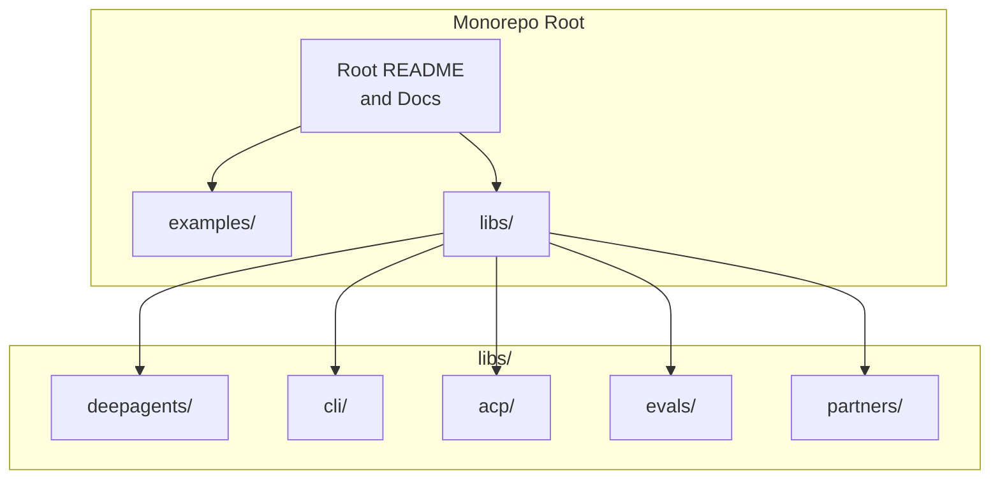
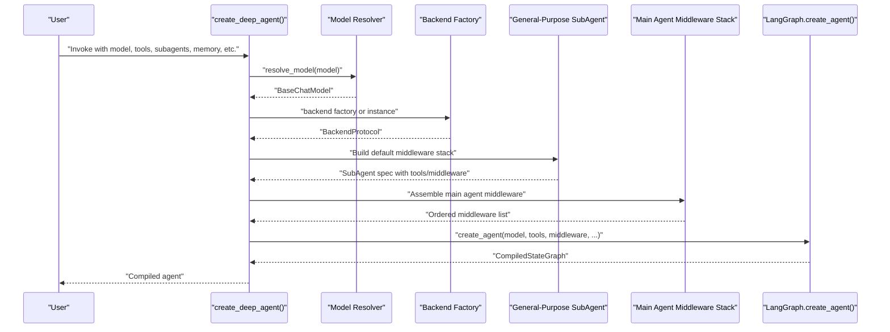
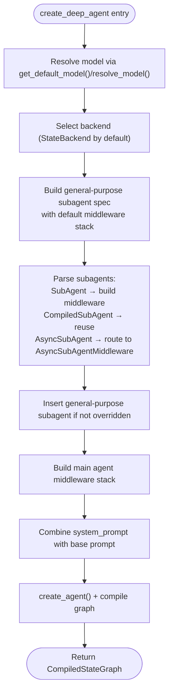
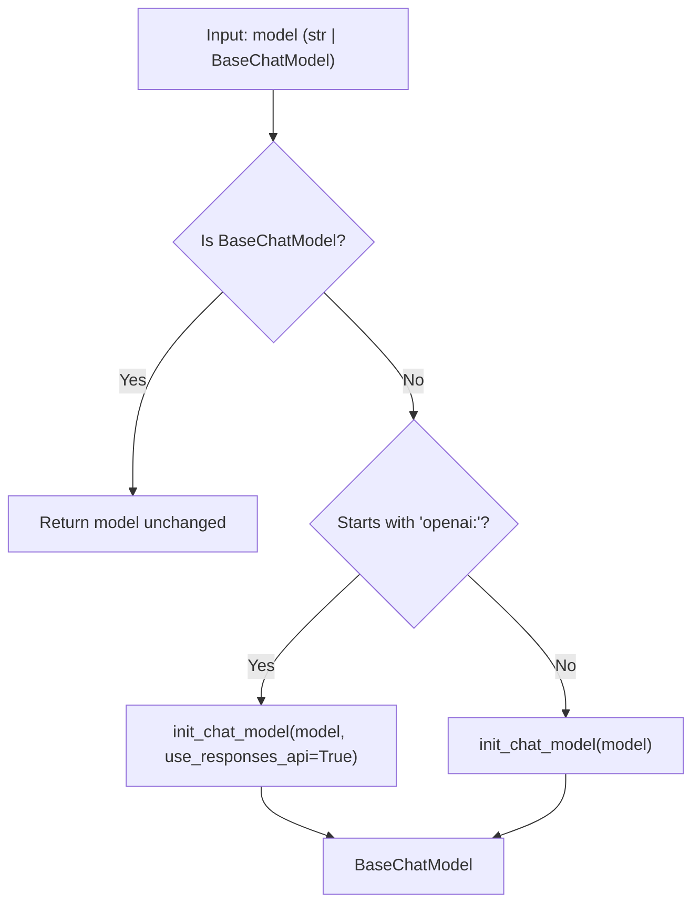
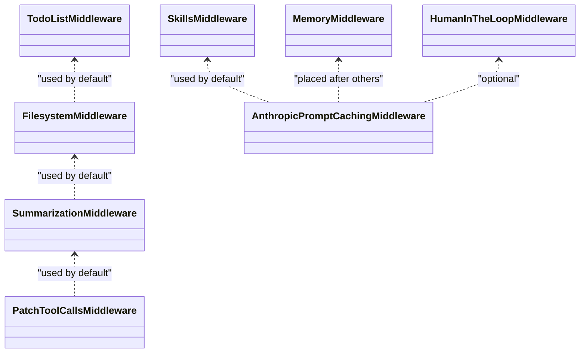
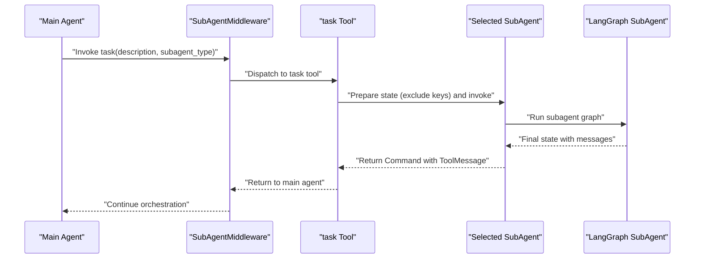
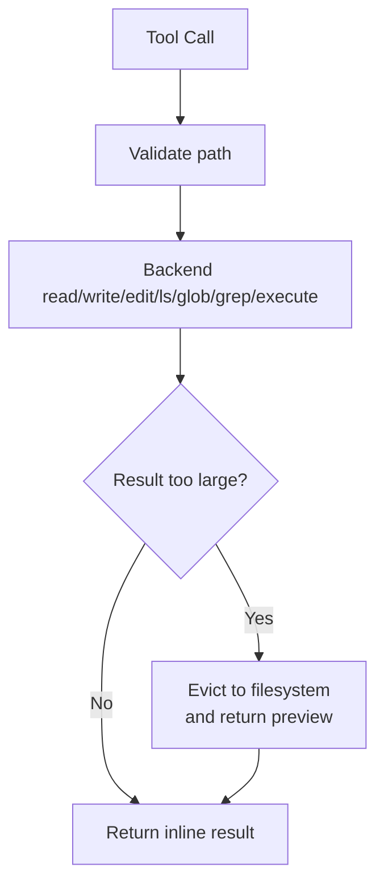
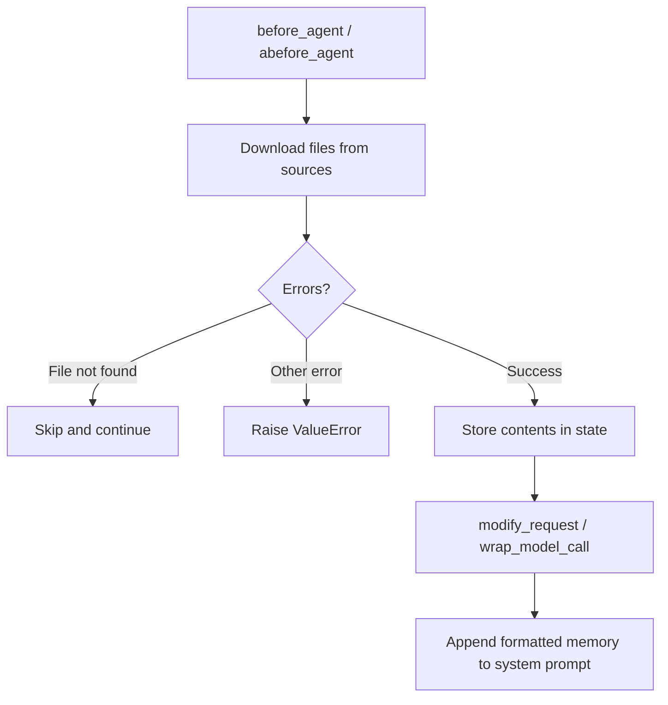
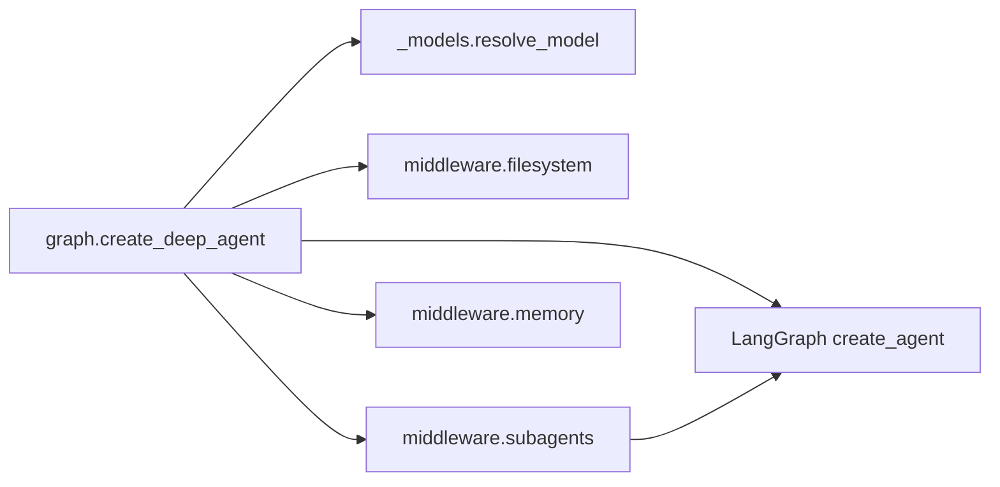

# Agent Architecture & Creation

<cite>
**Referenced Files in This Document**
- [README.md](file://README.md)
- [AGENTS.md](file://AGENTS.md)
- [__init__.py](file://libs/deepagents/deepagents/__init__.py)
- [graph.py](file://libs/deepagents/deepagents/graph.py)
- [_models.py](file://libs/deepagents/deepagents/_models.py)
- [filesystem.py](file://libs/deepagents/deepagents/middleware/filesystem.py)
- [memory.py](file://libs/deepagents/deepagents/middleware/memory.py)
- [subagents.py](file://libs/deepagents/deepagents/middleware/subagents.py)
</cite>

## Table of Contents
1. [Introduction](#introduction)
2. [Project Structure](#project-structure)
3. [Core Components](#core-components)
4. [Architecture Overview](#architecture-overview)
5. [Detailed Component Analysis](#detailed-component-analysis)
6. [Dependency Analysis](#dependency-analysis)
7. [Performance Considerations](#performance-considerations)
8. [Troubleshooting Guide](#troubleshooting-guide)
9. [Conclusion](#conclusion)

## Introduction
This document explains DeepAgents’ agent architecture and the end-to-end creation process centered on create_deep_agent(). It covers how LangGraph integration is leveraged, how the default middleware stack is assembled, and how the provider-agnostic model resolution system works. It also details the general-purpose subagent pattern, the smart defaults that automatically equip agents with planning, filesystem access, summarization, and memory capabilities, and the flow from user input through the middleware pipeline to tool execution.

## Project Structure
DeepAgents is organized as a Python monorepo with multiple packages. The primary SDK resides under libs/deepagents and exposes create_deep_agent() and middleware components. The repository includes examples, CLI, evaluation suites, and protocol integrations.

**Section sources**
- [AGENTS.md:11–23:11-23](file://AGENTS.md#L11-L23)

## Core Components
- create_deep_agent(): Orchestrates model resolution, backend selection, and middleware stack assembly. It returns a compiled LangGraph graph ready for streaming, persistence, and checkpointing.
- Provider-agnostic model resolution: resolve_model() converts provider:model strings to BaseChatModel instances, with OpenAI defaults using the Responses API.
- Default middleware stack: Includes TodoListMiddleware, FilesystemMiddleware, SubAgentMiddleware, summarization, tool call patching, caching, and optional MemoryMiddleware/HumanInTheLoop.
- General-purpose subagent: A default subagent spec with the same middleware stack as the main agent, automatically added unless overridden.
- Smart defaults: Base system prompt, tool descriptions, and behavior guidance are embedded to teach the model how to use tools effectively.

**Section sources**
- [graph.py:83–333:83-333](file://libs/deepagents/deepagents/graph.py#L83-L333)
- [_models.py:11–82:11-82](file://libs/deepagents/deepagents/_models.py#L11-L82)
- [README.md:24–36:24-36](file://README.md#L24-L36)

## Architecture Overview
The agent creation flow resolves the model, selects a backend, builds the general-purpose subagent with a default middleware stack, composes the main agent middleware stack, and finally compiles a LangGraph graph.

**Diagram sources**
- [graph.py:204–333:204-333](file://libs/deepagents/deepagents/graph.py#L204-L333)
- [_models.py:11–29:11-29](file://libs/deepagents/deepagents/_models.py#L11-L29)

**Section sources**
- [graph.py:204–333:204-333](file://libs/deepagents/deepagents/graph.py#L204-L333)

## Detailed Component Analysis

### create_deep_agent() Orchestration
- Model resolution: If model is None, a default provider model is selected; otherwise, resolve_model() converts provider:model strings to BaseChatModel. OpenAI models default to the Responses API.
- Backend selection: If backend is None, StateBackend is used by default; otherwise, a BackendProtocol or factory can be supplied.
- General-purpose subagent: A SubAgent spec is constructed with a default middleware stack (TodoList, Filesystem, Summarization, PatchToolCalls, Skills if provided, Anthropic caching, optional HumanInTheLoop).
- Subagents: Accepts SubAgent, CompiledSubAgent, or AsyncSubAgent specs. For SubAgent specs, the middleware stack is built similarly to the main agent, inheriting tools and applying skills and user middleware. Async subagents are routed to AsyncSubAgentMiddleware.
- Main agent middleware stack: Starts with TodoList, then Skills (if provided), Filesystem, SubAgentMiddleware, Summarization, PatchToolCalls, optional AsyncSubAgentMiddleware, user middleware, Anthropic caching, Memory (if provided), and optional HumanInTheLoop.
- System prompt: Concatenates user-provided system_prompt with the base Deep Agent prompt.
- Compilation: Calls create_agent() and attaches recursion limits and metadata.

**Diagram sources**
- [graph.py:83–333:83-333](file://libs/deepagents/deepagents/graph.py#L83-L333)
- [_models.py:11–29:11-29](file://libs/deepagents/deepagents/_models.py#L11-L29)

**Section sources**
- [graph.py:83–333:83-333](file://libs/deepagents/deepagents/graph.py#L83-L333)

### Provider-Agnostic Model Resolution
- resolve_model() accepts either a BaseChatModel instance or a provider:model string. If the string starts with openai:, it initializes with use_responses_api=True by default; otherwise, it uses init_chat_model().
- get_model_identifier() extracts the provider-native model identifier from a serialized model config for matching and introspection.
- model_matches_spec() checks if a model instance matches a provider:model spec by comparing the identifier or the model-name portion.

**Diagram sources**
- [_models.py:11–82:11-82](file://libs/deepagents/deepagents/_models.py#L11-L82)

**Section sources**
- [_models.py:11–82:11-82](file://libs/deepagents/deepagents/_models.py#L11-L82)

### Default Middleware Stack
The default middleware stack ensures agents are capable out of the box:
- TodoListMiddleware: Enables write_todos for task planning and progress tracking.
- FilesystemMiddleware: Adds ls, read_file, write_file, edit_file, glob, grep, and optional execute (when backend supports sandboxing). Includes large result eviction and pagination guidance.
- SummarizationMiddleware: Automatically summarizes long conversations to manage context.
- PatchToolCallsMiddleware: Normalizes tool call behavior for robustness.
- SkillsMiddleware: Optional middleware to load reusable skills from sources.
- AnthropicPromptCachingMiddleware: Caching middleware appended after other middleware to avoid invalidating caches with memory updates.
- MemoryMiddleware: Loads persistent context from AGENTS.md files and injects into the system prompt.
- HumanInTheLoopMiddleware: Optional middleware to pause execution at specified tool calls for human approval.

**Diagram sources**
- [graph.py:208–301:208-301](file://libs/deepagents/deepagents/graph.py#L208-L301)

**Section sources**
- [graph.py:208–301:208-301](file://libs/deepagents/deepagents/graph.py#L208-L301)

### General-Purpose Subagent Pattern
- A general-purpose subagent is automatically included unless a SubAgent with name “general-purpose” is explicitly provided. It mirrors the main agent’s capabilities and middleware stack.
- SubAgentMiddleware exposes a task tool that launches ephemeral subagents with isolated context windows. It supports:
  - SubAgent: Declarative spec with model, tools, middleware, and optional skills.
  - CompiledSubAgent: Pre-built runnable with a required “messages” key in its state schema.
  - AsyncSubAgent: Remote/background subagents routed via AsyncSubAgentMiddleware.
- The task tool description enumerates available agents and usage guidance, encouraging parallelization and delegation for complex tasks.

**Diagram sources**
- [subagents.py:374–471:374-471](file://libs/deepagents/deepagents/middleware/subagents.py#L374-L471)
- [subagents.py:482–693:482-693](file://libs/deepagents/deepagents/middleware/subagents.py#L482-L693)

**Section sources**
- [graph.py:220–268:220-268](file://libs/deepagents/deepagents/graph.py#L220-L268)
- [subagents.py:22–79:22-79](file://libs/deepagents/deepagents/middleware/subagents.py#L22-L79)
- [subagents.py:482–693:482-693](file://libs/deepagents/deepagents/middleware/subagents.py#L482-L693)

### Filesystem Middleware
- Provides filesystem tools (ls, read_file, write_file, edit_file, glob, grep) and optional execute when backend supports sandboxing.
- Implements large result eviction: when tool results exceed a token threshold, they are offloaded to the filesystem and replaced with previews and file references.
- Includes pagination for read_file, sanitization, and safe path validation.

**Diagram sources**
- [filesystem.py:489–803:489-803](file://libs/deepagents/deepagents/middleware/filesystem.py#L489-L803)

**Section sources**
- [filesystem.py:388–803:388-803](file://libs/deepagents/deepagents/middleware/filesystem.py#L388-L803)

### Memory Middleware
- Loads persistent context from AGENTS.md files and injects them into the system prompt. Supports multiple sources and asynchronous loading.
- Provides guidance on when to update memory and examples of appropriate vs inappropriate memory updates.

**Diagram sources**
- [memory.py:238–355:238-355](file://libs/deepagents/deepagents/middleware/memory.py#L238-L355)

**Section sources**
- [memory.py:159–355:159-355](file://libs/deepagents/deepagents/middleware/memory.py#L159-L355)

## Dependency Analysis
- create_deep_agent() depends on:
  - _models.resolve_model() for provider-agnostic model resolution
  - Backends protocol for filesystem and optional sandbox execution
  - Middleware modules for planning, filesystem, subagents, summarization, caching, and memory
  - LangGraph create_agent() to compile the final graph
- SubAgentMiddleware composes subagents from SubAgent, CompiledSubAgent, and AsyncSubAgent specs, and exposes a task tool that invokes them.

**Diagram sources**
- [graph.py:20–35:20-35](file://libs/deepagents/deepagents/graph.py#L20-L35)
- [graph.py:312–333:312-333](file://libs/deepagents/deepagents/graph.py#L312-L333)

**Section sources**
- [graph.py:20–35:20-35](file://libs/deepagents/deepagents/graph.py#L20-L35)

## Performance Considerations
- Middleware ordering matters: AnthropicPromptCachingMiddleware is appended after other middleware to avoid invalidating caches with memory updates.
- SummarizationMiddleware reduces context length for long conversations, improving throughput and cost efficiency.
- Large result eviction in FilesystemMiddleware prevents context overflow by offloading tool outputs to the filesystem.
- SubAgentMiddleware encourages parallelization and delegation for complex tasks, reducing token usage and latency in the main thread.

[No sources needed since this section provides general guidance]

## Troubleshooting Guide
- Model resolution failures: Ensure provider:model strings are correctly formatted. For OpenAI, use openai:...; for other providers, use their standard naming. Use model_matches_spec() to verify a model instance matches a spec.
- Backend limitations: The execute tool requires a backend implementing SandboxBackendProtocol. Without sandbox support, execute will return an error message.
- Memory loading errors: MemoryMiddleware raises ValueError on non-file-not-found errors when downloading sources. Verify file paths and permissions.
- Subagent invocation errors: CompiledSubAgent must return a state containing a “messages” key; otherwise, a ValueError is raised. Ensure the subagent’s state schema includes “messages”.

**Section sources**
- [_models.py:49–82:49-82](file://libs/deepagents/deepagents/_models.py#L49-L82)
- [filesystem.py:257–275:257-275](file://libs/deepagents/deepagents/middleware/filesystem.py#L257-L275)
- [memory.py:256–266:256-266](file://libs/deepagents/deepagents/middleware/memory.py#L256-L266)
- [subagents.py:402–421:402-421](file://libs/deepagents/deepagents/middleware/subagents.py#L402-L421)

## Conclusion
DeepAgents provides a batteries-inclusive agent harness built on LangGraph. The create_deep_agent() function unifies model resolution, backend selection, and a carefully ordered middleware stack to deliver smart defaults, robust filesystem and subagent capabilities, and seamless integration with provider-specific models. The general-purpose subagent pattern enables scalable delegation and isolation of complex tasks, while MemoryMiddleware and summarization keep context manageable. Together, these components offer a production-ready foundation for building and deploying agents with minimal setup and maximum flexibility.