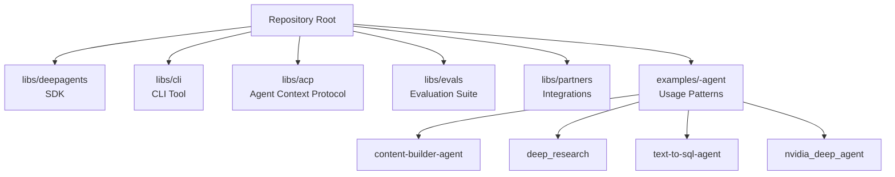
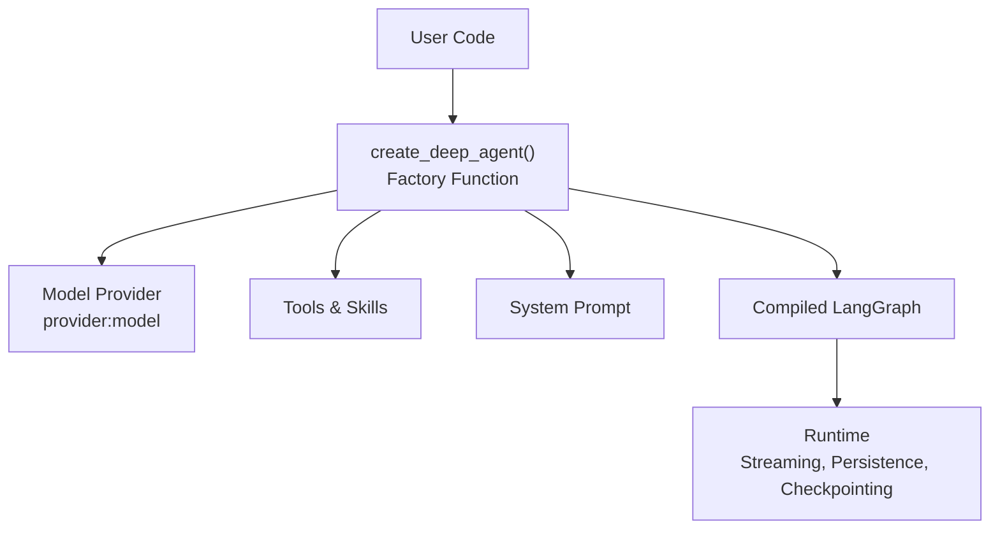
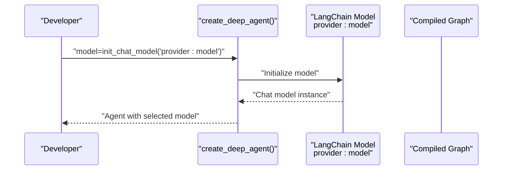
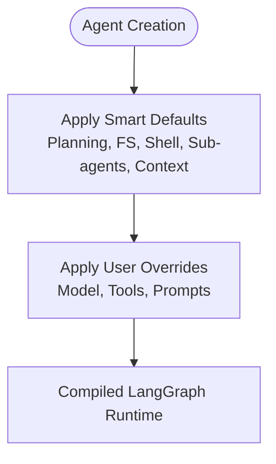
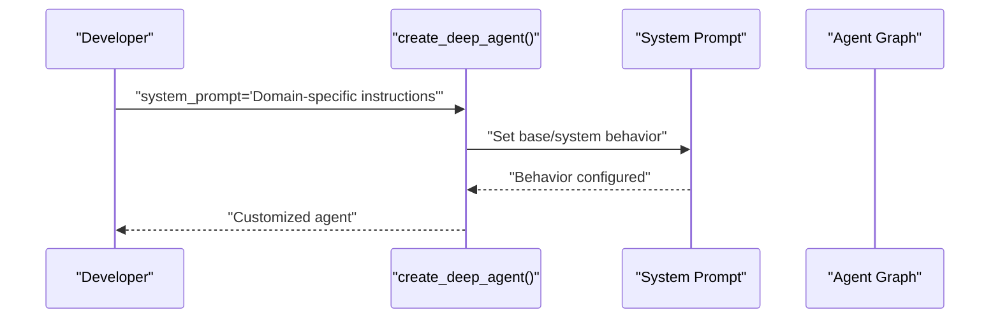
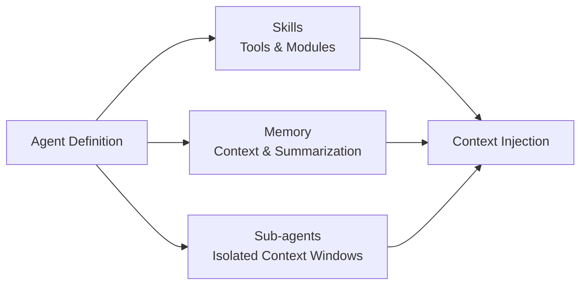
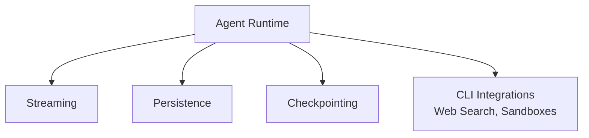
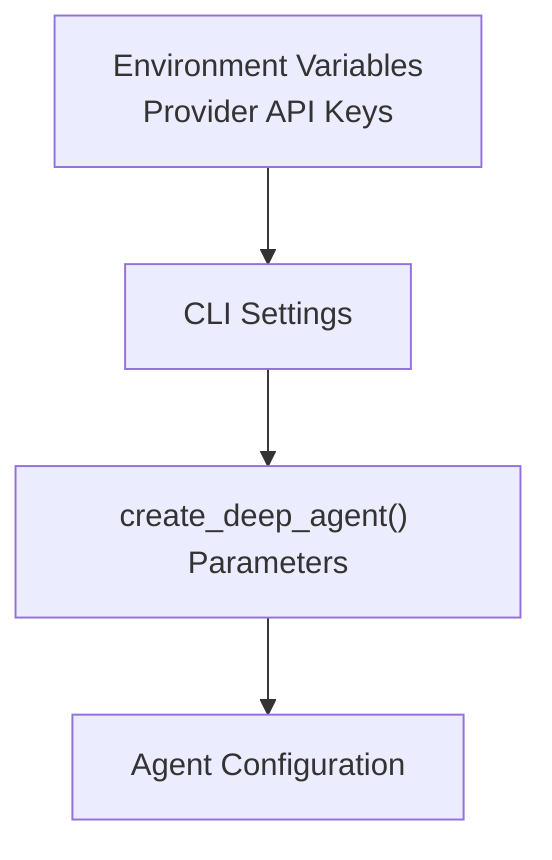
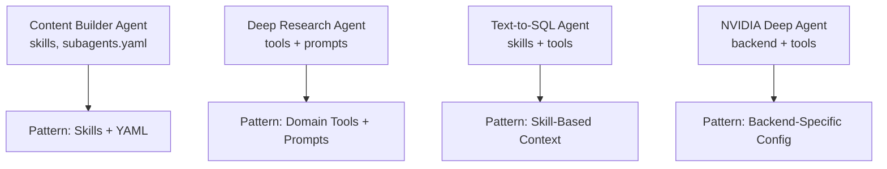
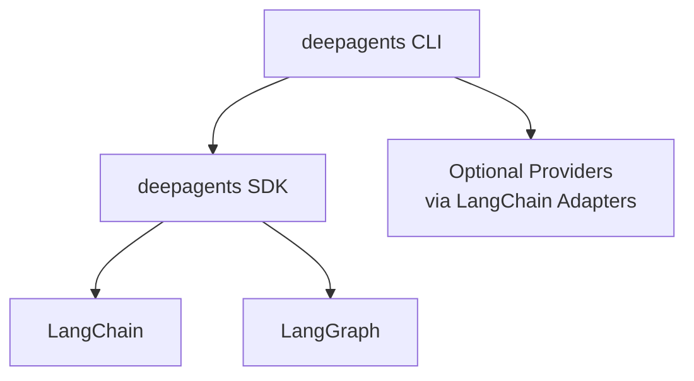

# Configuration & Customization

<cite>
**Referenced Files in This Document**
- [README.md](file://README.md)
- [AGENTS.md](file://AGENTS.md)
- [action.yml](file://action.yml)
- [examples/content-builder-agent/README.md](file://examples/content-builder-agent/README.md)
- [examples/content-builder-agent/AGENTS.md](file://examples/content-builder-agent/AGENTS.md)
- [examples/content-builder-agent/subagents.yaml](file://examples/content-builder-agent/subagents.yaml)
- [examples/deep_research/README.md](file://examples/deep_research/README.md)
- [examples/deep_research/agent.py](file://examples/deep_research/agent.py)
- [examples/text-to-sql-agent/README.md](file://examples/text-to-sql-agent/README.md)
- [examples/text-to-sql-agent/agent.py](file://examples/text-to-sql-agent/agent.py)
- [examples/nvidia_deep_agent/src/agent.py](file://examples/nvidia_deep_agent/src/agent.py)
- [examples/nvidia_deep_agent/src/backend.py](file://examples/nvidia_deep_agent/src/backend.py)
</cite>

## Table of Contents
1. [Introduction](#introduction)
2. [Project Structure](#project-structure)
3. [Core Components](#core-components)
4. [Architecture Overview](#architecture-overview)
5. [Detailed Component Analysis](#detailed-component-analysis)
6. [Dependency Analysis](#dependency-analysis)
7. [Performance Considerations](#performance-considerations)
8. [Troubleshooting Guide](#troubleshooting-guide)
9. [Conclusion](#conclusion)
10. [Appendices](#appendices)

## Introduction
This document explains how to configure and customize DeepAgents, focusing on:
- Provider-agnostic model specification and smart defaults
- System prompt customization and extending base agent behavior
- Middleware customization and skills/memory loading for context injection
- Backend configuration and execution environment support
- Environment variables, configuration precedence, and common patterns
- Troubleshooting configuration issues

DeepAgents is a batteries-included agent harness built on LangGraph, designed to be ready-to-run with sensible defaults while remaining highly customizable.

## Project Structure
The repository is a monorepo with multiple independently versioned packages under libs/. The primary SDK package is deepagents, with supporting libraries for CLI, Agent Context Protocol (ACP), evaluation, and partner integrations. Examples demonstrate practical configuration patterns across domains.

**Section sources**
- [AGENTS.md:11-23](file://AGENTS.md#L11-L23)

## Core Components
- Model configuration: Provider-agnostic model specification using provider:model format and LangChain model initialization utilities.
- Smart defaults: Built-in planning, filesystem, shell, sub-agent delegation, and context management.
- System prompts: Extendable base behavior via system_prompt parameter and domain-specific prompts.
- Middleware and skills: Tools and skills loaded per agent to inject capabilities and context.
- Backends and execution environments: LangGraph native runtime with streaming, persistence, and checkpointing support.

**Section sources**
- [README.md:24-53](file://README.md#L24-L53)
- [README.md:58-70](file://README.md#L58-L70)

## Architecture Overview
DeepAgents exposes a factory function that returns a compiled LangGraph graph. Users can customize model, tools, system prompts, and sub-agents. The system emphasizes provider-agnostic model selection and automatic capability inheritance through defaults.

**Section sources**
- [README.md:46-51](file://README.md#L46-L51)
- [README.md:86-88](file://README.md#L86-L88)

## Detailed Component Analysis

### Model Configuration and Provider-Agnostic Specification
- Provider-agnostic model format: Use provider:model notation to select models from various providers.
- LangChain model initialization: Leverage LangChain’s model initialization utilities to construct chat models.
- Example pattern: Passing a model configured via provider:model to the agent factory.

**Section sources**
- [README.md:63-70](file://README.md#L63-L70)

### Smart Defaults and Capability Inheritance
- Smart defaults include planning, filesystem operations, shell execution, sub-agent delegation, and context management.
- Agents inherit these capabilities automatically, enabling immediate productivity with minimal setup.

**Section sources**
- [README.md:26-34](file://README.md#L26-L34)

### System Prompt Customization and Extending Base Behavior
- Customize the agent’s behavior by supplying a system_prompt parameter.
- Domain-specific prompts can be integrated alongside tools and skills to tailor agent behavior.

**Section sources**
- [README.md:65-70](file://README.md#L65-L70)

### Middleware Customization
- Middleware enables cross-cutting concerns such as logging, tracing, and request/response transformation.
- Add or remove middleware components by configuring the agent’s runtime pipeline or wrapping the underlying LangGraph graph.

[No sources needed since this section provides general guidance]

### Skills and Memory Loading Systems
- Skills: Domain-specific capabilities packaged as tools or modules and loaded per agent.
- Memory: Context management and summarization are part of smart defaults; memory can be extended or customized via tools and prompts.
- Sub-agents: Isolated context windows for delegated tasks, configured via YAML or programmatic definition.

**Section sources**
- [examples/content-builder-agent/README.md](file://examples/content-builder-agent/README.md)
- [examples/content-builder-agent/AGENTS.md](file://examples/content-builder-agent/AGENTS.md)
- [examples/content-builder-agent/subagents.yaml](file://examples/content-builder-agent/subagents.yaml)

### Backend Configuration and Execution Environments
- LangGraph native runtime: The agent is a compiled LangGraph graph, enabling streaming, persistence, and checkpointing.
- Execution environments: Support for web search, remote sandboxes, and human-in-the-loop workflows via CLI and integrations.

**Section sources**
- [README.md:86-88](file://README.md#L86-L88)
- [README.md:74-84](file://README.md#L74-L84)

### Environment Variables and Configuration Precedence
- Provider credentials: Environment variables are used to supply API keys for model providers.
- CLI model configuration: The CLI maintains a mapping of provider names to environment variable names for credential lookup.
- Precedence: Command-line flags and environment variables override defaults; explicit parameters passed to the factory take highest precedence.

**Section sources**
- [AGENTS.md:267-281](file://AGENTS.md#L267-L281)

### Examples of Common Configuration Patterns
- Content Builder Agent: Demonstrates skills, sub-agents, and YAML-based configuration.
- Deep Research Agent: Shows domain-specific tools and prompts.
- Text-to-SQL Agent: Illustrates skill-based context injection and tool usage.
- NVIDIA Deep Agent: Highlights backend-specific agent and tool configuration.

**Section sources**
- [examples/content-builder-agent/README.md](file://examples/content-builder-agent/README.md)
- [examples/content-builder-agent/subagents.yaml](file://examples/content-builder-agent/subagents.yaml)
- [examples/deep_research/agent.py](file://examples/deep_research/agent.py)
- [examples/text-to-sql-agent/agent.py](file://examples/text-to-sql-agent/agent.py)
- [examples/nvidia_deep_agent/src/agent.py](file://examples/nvidia_deep_agent/src/agent.py)
- [examples/nvidia_deep_agent/src/backend.py](file://examples/nvidia_deep_agent/src/backend.py)

## Dependency Analysis
- The SDK depends on LangChain and LangGraph for model abstraction and graph runtime.
- Optional provider integrations are supported via LangChain adapters and environment variables.
- CLI adds convenience wrappers and credential management for model providers.

**Section sources**
- [README.md:72-72](file://README.md#L72)
- [AGENTS.md:267-281](file://AGENTS.md#L267-L281)

## Performance Considerations
- Prefer streaming for responsive user experiences.
- Use persistence and checkpointing to resume long-running sessions.
- Minimize unnecessary tool calls and optimize prompts to reduce latency.

[No sources needed since this section provides general guidance]

## Troubleshooting Guide
- Model initialization failures: Verify provider:model format and ensure the corresponding provider package is installed and environment variables are set.
- Missing tools or skills: Confirm that skills are properly loaded and tools are passed to the factory function.
- Sub-agent configuration errors: Validate YAML structure and paths referenced in subagents configuration.
- Environment variable issues: Check provider API key mappings and ensure environment variables are exported before running the agent.

**Section sources**
- [AGENTS.md:267-281](file://AGENTS.md#L267-L281)
- [examples/content-builder-agent/subagents.yaml](file://examples/content-builder-agent/subagents.yaml)

## Conclusion
DeepAgents offers a robust, provider-agnostic configuration system with smart defaults, flexible customization via system prompts and tools, and seamless integration with LangGraph’s runtime features. By leveraging environment variables, YAML configurations, and programmatic overrides, you can tailor agents to diverse domains and execution environments while maintaining simplicity and reliability.

[No sources needed since this section summarizes without analyzing specific files]

## Appendices
- Action workflow: The repository includes an action workflow for CI/CD automation.

**Section sources**
- [action.yml](file://action.yml)