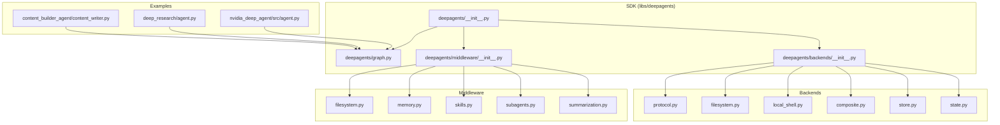
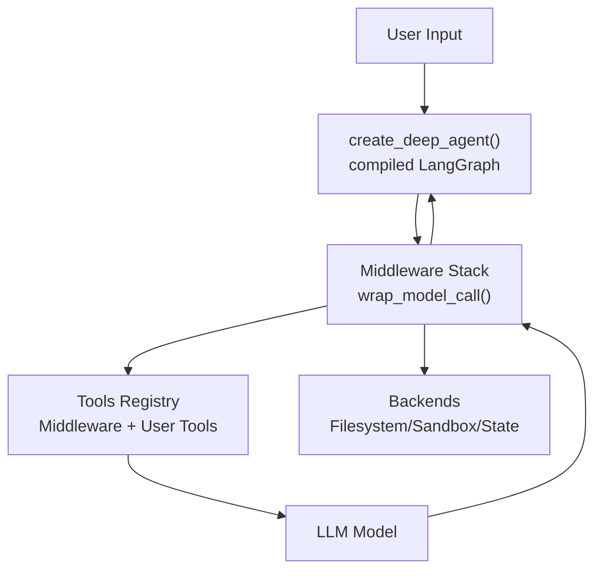
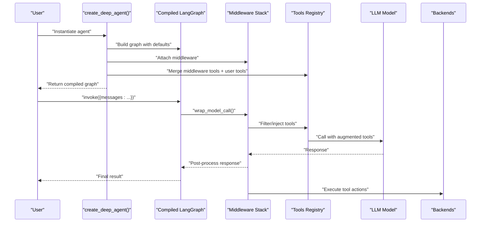
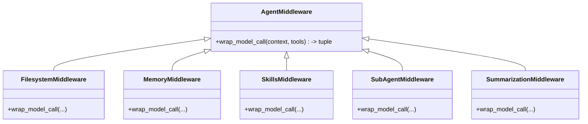
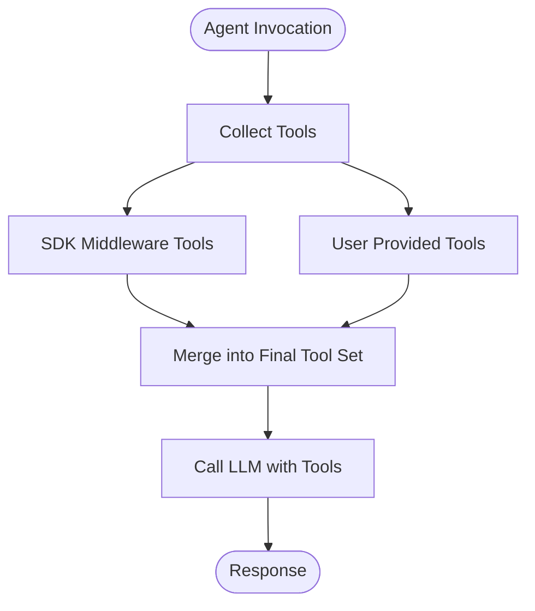
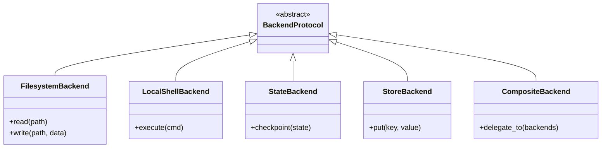
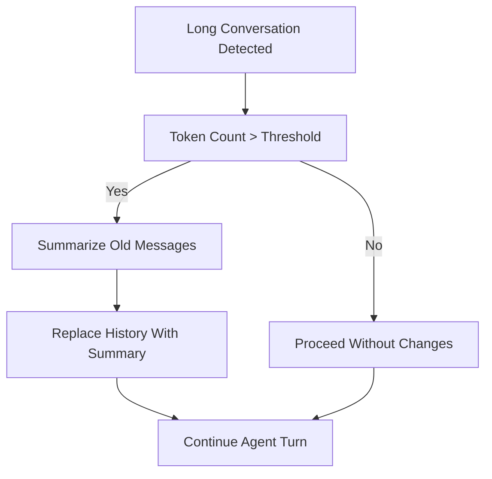
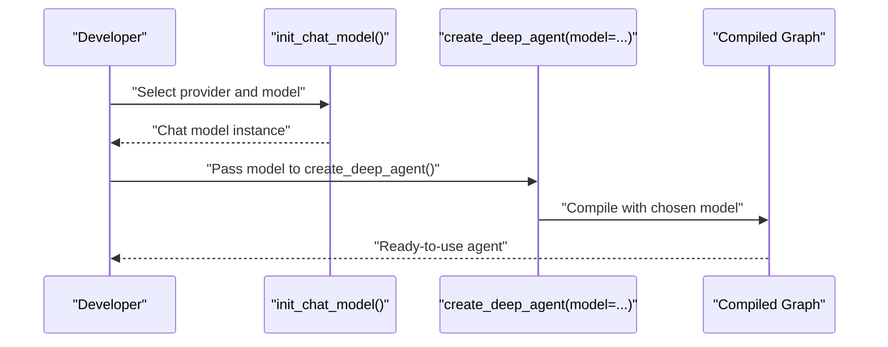
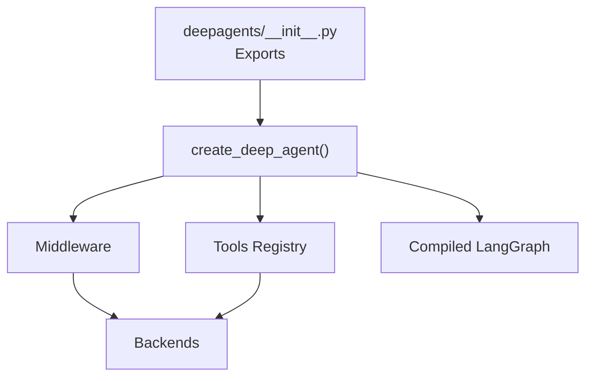

# Core Concepts

<cite>
**Referenced Files in This Document**
- [README.md](file://README.md)
- [AGENTS.md](file://AGENTS.md)
- [__init__.py](file://libs/deepagents/deepagents/__init__.py)
- [graph.py](file://libs/deepagents/deepagents/graph.py)
- [__init__.py](file://libs/deepagents/deepagents/middleware/__init__.py)
- [filesystem.py](file://libs/deepagents/deepagents/middleware/filesystem.py)
- [memory.py](file://libs/deepagents/deepagents/middleware/memory.py)
- [skills.py](file://libs/deepagents/deepagents/middleware/skills.py)
- [subagents.py](file://libs/deepagents/deepagents/middleware/subagents.py)
- [summarization.py](file://libs/deepagents/deepagents/middleware/summarization.py)
- [__init__.py](file://libs/deepagents/deepagents/backends/__init__.py)
- [protocol.py](file://libs/deepagents/deepagents/backends/protocol.py)
- [filesystem.py](file://libs/deepagents/deepagents/backends/filesystem.py)
- [local_shell.py](file://libs/deepagents/deepagents/backends/local_shell.py)
- [composite.py](file://libs/deepagents/deepagents/backends/composite.py)
- [store.py](file://libs/deepagents/deepagents/backends/store.py)
- [state.py](file://libs/deepagents/deepagents/backends/state.py)
- [__init__.py](file://examples/content-builder-agent/content_writer.py)
- [agent.py](file://examples/deep_research/agent.py)
- [__init__.py](file://examples/deep_research/research_agent/__init__.py)
- [tools.py](file://examples/deep_research/research_agent/tools.py)
- [agent.py](file://examples/nvidia_deep_agent/src/agent.py)
- [backend.py](file://examples/nvidia_deep_agent/src/backend.py)
- [tools.py](file://examples/nvidia_deep_agent/src/tools.py)
</cite>

## Table of Contents
1. [Introduction](#introduction)
2. [Project Structure](#project-structure)
3. [Core Components](#core-components)
4. [Architecture Overview](#architecture-overview)
5. [Detailed Component Analysis](#detailed-component-analysis)
6. [Dependency Analysis](#dependency-analysis)
7. [Performance Considerations](#performance-considerations)
8. [Troubleshooting Guide](#troubleshooting-guide)
9. [Conclusion](#conclusion)
10. [Appendices](#appendices)

## Introduction
DeepAgents is a batteries-included agent harness built on top of LangGraph. It provides a ready-to-use agent with planning, filesystem access, shell execution, sub-agent delegation, smart defaults, and context management. Users can quickly instantiate a working agent via a single function call and then customize it by adding tools, swapping models, or configuring sub-agents.

Key characteristics:
- Provider-agnostic design supporting any tool-calling LLM.
- Middleware pattern to intercept and extend model calls.
- Tool registry and tool injection via middleware and direct tool lists.
- Backends for filesystem, sandbox execution, and state persistence.
- Smart defaults and context management for long conversations.

**Section sources**
- [README.md:24-56](file://README.md#L24-L56)
- [README.md:86-98](file://README.md#L86-L98)
- [AGENTS.md:5-30](file://AGENTS.md#L5-L30)

## Project Structure
The repository is a Python monorepo with multiple independently versioned packages. The core SDK resides under libs/deepagents and exposes the primary API surface. Middleware and backends are organized under dedicated subpackages. Examples demonstrate real-world usage patterns across domains.

**Diagram sources**
- [__init__.py:1-21](file://libs/deepagents/deepagents/__init__.py#L1-L21)
- [graph.py:82-200](file://libs/deepagents/deepagents/graph.py#L82-L200)
- [__init__.py:1-74](file://libs/deepagents/deepagents/middleware/__init__.py#L1-L74)
- [__init__.py:1-27](file://libs/deepagents/deepagents/backends/__init__.py#L1-L27)
- [protocol.py:245-300](file://libs/deepagents/deepagents/backends/protocol.py#L245-L300)
- [filesystem.py:1-37](file://libs/deepagents/deepagents/backends/filesystem.py#L1-L37)
- [local_shell.py:1-26](file://libs/deepagents/deepagents/backends/local_shell.py#L1-L26)
- [composite.py:119-160](file://libs/deepagents/deepagents/backends/composite.py#L119-L160)
- [store.py:48-104](file://libs/deepagents/deepagents/backends/store.py#L48-L104)
- [state.py:35-60](file://libs/deepagents/deepagents/backends/state.py#L35-L60)
- [__init__.py:1-50](file://examples/content-builder-agent/content_writer.py#L1-L50)
- [agent.py:1-60](file://examples/deep_research/agent.py#L1-L60)
- [agent.py:1-60](file://examples/nvidia_deep_agent/src/agent.py#L1-L60)

**Section sources**
- [AGENTS.md:7-30](file://AGENTS.md#L7-L30)
- [__init__.py:1-21](file://libs/deepagents/deepagents/__init__.py#L1-L21)
- [__init__.py:1-74](file://libs/deepagents/deepagents/middleware/__init__.py#L1-L74)
- [__init__.py:1-27](file://libs/deepagents/deepagents/backends/__init__.py#L1-L27)

## Core Components
This section introduces the foundational building blocks of DeepAgents: the agent creation function, middleware, tool registry, and backends.

- Agent creation: create_deep_agent() returns a compiled LangGraph graph configured with batteries-included capabilities.
- Middleware: Extends agent capabilities by intercepting model calls, filtering tools, injecting system prompts, transforming messages, and maintaining cross-turn state.
- Tool registry: Tools are provided either via middleware or directly through the tools parameter; both are merged into the final tool set presented to the LLM.
- Backends: Pluggable storage and execution environments (filesystem, sandbox, state, composite) enabling safe and flexible operations.

**Section sources**
- [README.md:46-56](file://README.md#L46-L56)
- [__init__.py:4-20](file://libs/deepagents/deepagents/__init__.py#L4-L20)
- [__init__.py:1-74](file://libs/deepagents/deepagents/middleware/__init__.py#L1-L74)
- [__init__.py:1-27](file://libs/deepagents/deepagents/backends/__init__.py#L1-L27)

## Architecture Overview
The DeepAgents architecture centers on a LangGraph graph produced by create_deep_agent(). The middleware stack intercepts and augments every model call, while tools are injected from both middleware and user-provided lists. Backends supply filesystem, sandbox, and state capabilities.

**Diagram sources**
- [graph.py:82-200](file://libs/deepagents/deepagents/graph.py#L82-L200)
- [__init__.py:15-48](file://libs/deepagents/deepagents/middleware/__init__.py#L15-L48)
- [__init__.py:1-27](file://libs/deepagents/deepagents/backends/__init__.py#L1-L27)

## Detailed Component Analysis

### Agent Creation: create_deep_agent()
- Purpose: Assembles a production-ready agent graph with middleware, tools, and defaults.
- Behavior: Compiles a LangGraph graph that supports streaming, persistence, and checkpointing.
- Customization: Accepts model, tools, system prompt, and other parameters to tailor behavior.

**Diagram sources**
- [graph.py:82-200](file://libs/deepagents/deepagents/graph.py#L82-L200)
- [__init__.py:15-48](file://libs/deepagents/deepagents/middleware/__init__.py#L15-L48)
- [__init__.py:1-27](file://libs/deepagents/deepagents/backends/__init__.py#L1-L27)

**Section sources**
- [README.md:46-56](file://README.md#L46-L56)
- [README.md:86-98](file://README.md#L86-L98)
- [graph.py:82-200](file://libs/deepagents/deepagents/graph.py#L82-L200)

### Middleware Pattern
Middleware subclasses a common base and overrides wrap_model_call() to intercept every LLM request. Benefits include:
- Dynamic tool filtering based on backend capabilities.
- System prompt injection for tool usage guidance.
- Message transformation and cross-turn state maintenance.
- Shared behavior across SDK consumers.

**Diagram sources**
- [__init__.py:15-48](file://libs/deepagents/deepagents/middleware/__init__.py#L15-L48)
- [filesystem.py:387-420](file://libs/deepagents/deepagents/middleware/filesystem.py#L387-L420)
- [memory.py:158-180](file://libs/deepagents/deepagents/middleware/memory.py#L158-L180)
- [skills.py:601-630](file://libs/deepagents/deepagents/middleware/skills.py#L601-L630)
- [subagents.py:481-520](file://libs/deepagents/deepagents/middleware/subagents.py#L481-L520)
- [summarization.py:202-230](file://libs/deepagents/deepagents/middleware/summarization.py#L202-L230)

**Section sources**
- [__init__.py:1-74](file://libs/deepagents/deepagents/middleware/__init__.py#L1-L74)

### Tool Registry and Injection
- SDK middleware provides tools and system prompt augmentation.
- Consumer-provided tools are accepted via the tools parameter and merged into the final tool set.
- Both paths are unified by create_deep_agent().

**Diagram sources**
- [__init__.py:5-14](file://libs/deepagents/deepagents/middleware/__init__.py#L5-L14)
- [graph.py:82-200](file://libs/deepagents/deepagents/graph.py#L82-L200)

**Section sources**
- [__init__.py:1-74](file://libs/deepagents/deepagents/middleware/__init__.py#L1-L74)

### Backends and Execution Environment
Backends define capabilities for filesystem access, sandbox execution, and state persistence. They are composed and selected based on environment and configuration.

**Diagram sources**
- [protocol.py:245-300](file://libs/deepagents/deepagents/backends/protocol.py#L245-L300)
- [filesystem.py:1-37](file://libs/deepagents/deepagents/backends/filesystem.py#L1-L37)
- [local_shell.py:1-26](file://libs/deepagents/deepagents/backends/local_shell.py#L1-L26)
- [composite.py:119-160](file://libs/deepagents/deepagents/backends/composite.py#L119-L160)
- [state.py:35-60](file://libs/deepagents/deepagents/backends/state.py#L35-L60)
- [store.py:48-104](file://libs/deepagents/deepagents/backends/store.py#L48-L104)

**Section sources**
- [__init__.py:1-27](file://libs/deepagents/deepagents/backends/__init__.py#L1-L27)
- [protocol.py:245-300](file://libs/deepagents/deepagents/backends/protocol.py#L245-L300)

### Smart Defaults and Context Management
- Smart defaults: Tools and prompts designed to teach the model how to use tools effectively.
- Context management: Automatic summarization and long-output handling to keep conversations efficient.

**Diagram sources**
- [summarization.py:202-230](file://libs/deepagents/deepagents/middleware/summarization.py#L202-L230)

**Section sources**
- [README.md:26-34](file://README.md#L26-L34)
- [summarization.py:202-230](file://libs/deepagents/deepagents/middleware/summarization.py#L202-L230)

### Provider-Agnostic Design and Model Integration
- DeepAgents works with any LLM that supports tool calling, enabling integration with multiple providers.
- The agent is initialized with a model factory and can be swapped to different providers without changing middleware or tool logic.

**Diagram sources**
- [README.md:63-70](file://README.md#L63-L70)
- [graph.py:82-200](file://libs/deepagents/deepagents/graph.py#L82-L200)

**Section sources**
- [README.md:95-96](file://README.md#L95-L96)
- [README.md:63-70](file://README.md#L63-L70)

### Example Patterns
- Content Builder Agent: Demonstrates tool composition and agent orchestration.
- Deep Research Agent: Shows research workflows and tool usage.
- NVIDIA Deep Agent: Illustrates backend customization and specialized tooling.

**Section sources**
- [__init__.py:1-50](file://examples/content-builder-agent/content_writer.py#L1-L50)
- [agent.py:1-60](file://examples/deep_research/agent.py#L1-L60)
- [__init__.py:1-40](file://examples/deep_research/research_agent/__init__.py#L1-L40)
- [tools.py:1-60](file://examples/deep_research/research_agent/tools.py#L1-L60)
- [agent.py:1-60](file://examples/nvidia_deep_agent/src/agent.py#L1-L60)
- [backend.py:1-60](file://examples/nvidia_deep_agent/src/backend.py#L1-L60)
- [tools.py:1-60](file://examples/nvidia_deep_agent/src/tools.py#L1-L60)

## Dependency Analysis
The SDK’s public API exports create_deep_agent() and middleware/backends for convenience. Internally, create_deep_agent() composes middleware and tools, then compiles a LangGraph graph. Backends are selected and composed based on environment and configuration.

**Diagram sources**
- [__init__.py:4-20](file://libs/deepagents/deepagents/__init__.py#L4-L20)
- [graph.py:82-200](file://libs/deepagents/deepagents/graph.py#L82-L200)
- [__init__.py:1-74](file://libs/deepagents/deepagents/middleware/__init__.py#L1-L74)
- [__init__.py:1-27](file://libs/deepagents/deepagents/backends/__init__.py#L1-L27)

**Section sources**
- [__init__.py:1-21](file://libs/deepagents/deepagents/__init__.py#L1-L21)
- [graph.py:82-200](file://libs/deepagents/deepagents/graph.py#L82-L200)

## Performance Considerations
- Middleware interception adds overhead; keep middleware logic efficient and avoid unnecessary transformations.
- Use summarization middleware to manage long conversations and reduce token usage.
- Select backends appropriate to the workload to minimize latency (e.g., local shell vs. sandbox).
- Leverage LangGraph features (streaming, persistence) for scalable deployments.

[No sources needed since this section provides general guidance]

## Troubleshooting Guide
Common issues and remedies:
- Tool availability: Ensure backend capabilities match tool requirements; middleware can filter tools dynamically.
- Context overflow: Enable summarization middleware to truncate or summarize long histories.
- Model selection: Verify provider compatibility and credentials when swapping models.
- Backends misconfiguration: Confirm backend composition and permissions for filesystem and sandbox operations.

**Section sources**
- [__init__.py:15-48](file://libs/deepagents/deepagents/middleware/__init__.py#L15-L48)
- [summarization.py:202-230](file://libs/deepagents/deepagents/middleware/summarization.py#L202-L230)
- [README.md:95-96](file://README.md#L95-L96)
- [__init__.py:1-27](file://libs/deepagents/deepagents/backends/__init__.py#L1-L27)

## Conclusion
DeepAgents delivers a production-ready, provider-agnostic agent harness built on LangGraph. Its middleware-driven architecture enables dynamic tool injection, context-aware behavior, and extensibility. With batteries-included defaults, smart defaults, and robust backends, developers can rapidly prototype and deploy capable agents while retaining full control over customization.

[No sources needed since this section summarizes without analyzing specific files]

## Appendices
- Quickstart usage and customization examples are documented in the repository’s README and examples.

**Section sources**
- [README.md:38-70](file://README.md#L38-L70)
- [__init__.py:1-50](file://examples/content-builder-agent/content_writer.py#L1-L50)
- [agent.py:1-60](file://examples/deep_research/agent.py#L1-L60)
- [agent.py:1-60](file://examples/nvidia_deep_agent/src/agent.py#L1-L60)