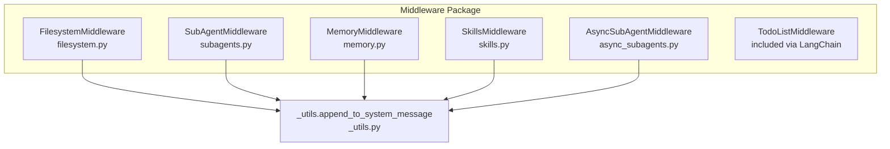
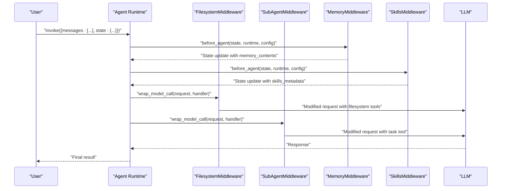
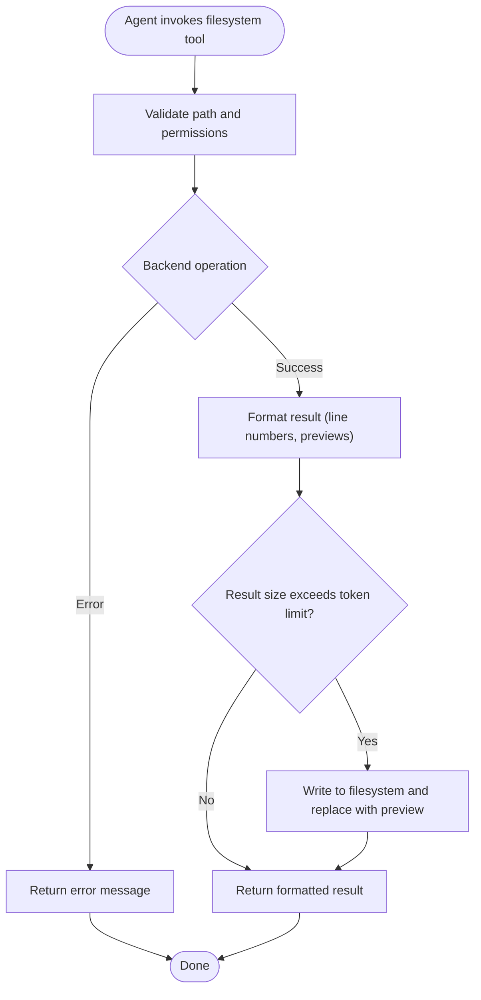
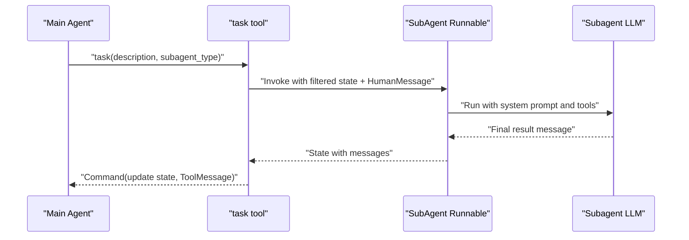
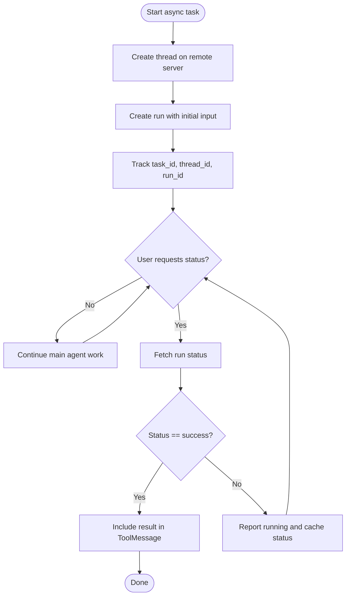
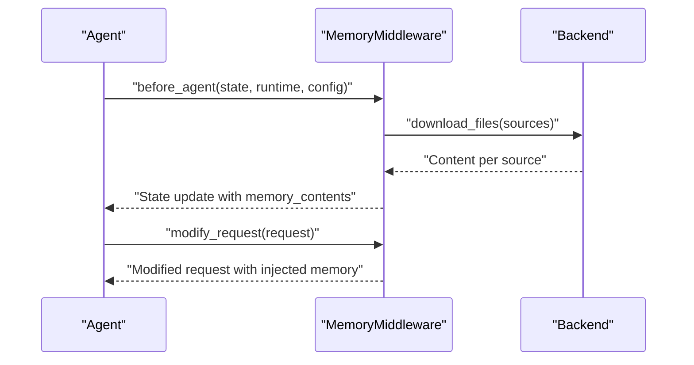
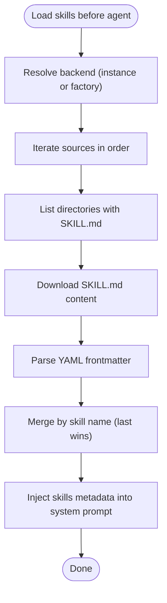
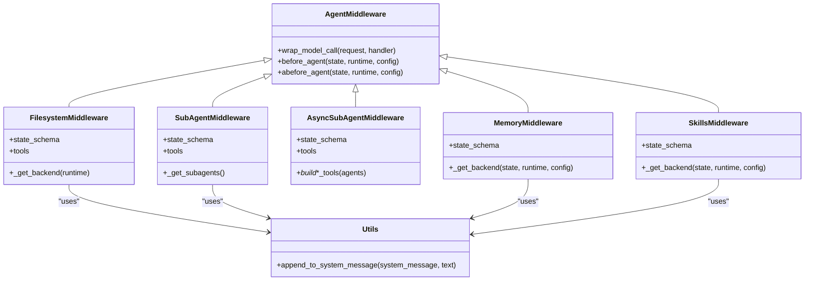

# Core Middleware Components

<cite>
**Referenced Files in This Document**
- [__init__.py](file://libs/deepagents/deepagents/middleware/__init__.py)
- [filesystem.py](file://libs/deepagents/deepagents/middleware/filesystem.py)
- [subagents.py](file://libs/deepagents/deepagents/middleware/subagents.py)
- [async_subagents.py](file://libs/deepagents/deepagents/middleware/async_subagents.py)
- [memory.py](file://libs/deepagents/deepagents/middleware/memory.py)
- [skills.py](file://libs/deepagents/deepagents/middleware/skills.py)
- [_utils.py](file://libs/deepagents/deepagents/middleware/_utils.py)
- [agent.py](file://libs/cli/deepagents_cli/agent.py)
- [README.md](file://README.md)
</cite>

## Table of Contents
1. [Introduction](#introduction)
2. [Project Structure](#project-structure)
3. [Core Components](#core-components)
4. [Architecture Overview](#architecture-overview)
5. [Detailed Component Analysis](#detailed-component-analysis)
6. [Dependency Analysis](#dependency-analysis)
7. [Performance Considerations](#performance-considerations)
8. [Troubleshooting Guide](#troubleshooting-guide)
9. [Conclusion](#conclusion)

## Introduction
This document explains the core middleware components that power DeepAgents: FilesystemMiddleware, SubAgentMiddleware, AsyncSubAgentMiddleware, MemoryMiddleware, SkillsMiddleware, and TodoListMiddleware. Each middleware extends the AgentMiddleware interface to intercept and enhance model requests, manage state, and integrate domain capabilities. The document focuses on functionality, configuration, integration patterns, and practical usage scenarios to help you tailor agents for real-world tasks.

## Project Structure
The middleware package organizes capabilities into cohesive modules:
- Filesystem operations and sandbox execution
- Sub-agent orchestration and delegation
- Async sub-agent management on remote LangGraph servers
- Persistent memory and context injection
- Domain skills discovery and progressive disclosure
- Planning and task tracking

**Diagram sources**
- [filesystem.py:388-478](file://libs/deepagents/deepagents/middleware/filesystem.py#L388-L478)
- [subagents.py:482-620](file://libs/deepagents/deepagents/middleware/subagents.py#L482-L620)
- [async_subagents.py:1-120](file://libs/deepagents/deepagents/middleware/async_subagents.py#L1-L120)
- [memory.py:159-217](file://libs/deepagents/deepagents/middleware/memory.py#L159-L217)
- [skills.py:602-677](file://libs/deepagents/deepagents/middleware/skills.py#L602-L677)
- [_utils.py:6-24](file://libs/deepagents/deepagents/middleware/_utils.py#L6-L24)

**Section sources**
- [__init__.py:1-74](file://libs/deepagents/deepagents/middleware/__init__.py#L1-L74)
- [README.md:24-34](file://README.md#L24-L34)

## Core Components
- FilesystemMiddleware: Adds filesystem tools (list, read, write, edit, glob, grep) and optionally execute for sandboxed command execution. It manages large tool results by offloading them to the filesystem and supports progressive disclosure of tool capabilities.
- SubAgentMiddleware: Provides a task tool to spawn ephemeral subagents with isolated context windows, enabling multi-step and parallel task execution.
- AsyncSubAgentMiddleware: Launches and tracks background tasks on remote LangGraph servers, supporting start, check, update, cancel, and list operations.
- MemoryMiddleware: Loads persistent context from AGENTS.md files and injects them into the system prompt for continuous learning and guidance.
- SkillsMiddleware: Discovers skills from backend sources and progressively exposes metadata and full instructions to the system prompt.
- TodoListMiddleware: Enforces disciplined planning and task tracking, ensuring write_todos is used appropriately and consistently.

Integration highlights:
- All middleware participate in the AgentMiddleware lifecycle hooks (wrap_model_call, before_agent, abefore_agent).
- Utilities like append_to_system_message unify system prompt augmentation across middleware.

**Section sources**
- [filesystem.py:388-478](file://libs/deepagents/deepagents/middleware/filesystem.py#L388-L478)
- [subagents.py:482-620](file://libs/deepagents/deepagents/middleware/subagents.py#L482-L620)
- [async_subagents.py:1-120](file://libs/deepagents/deepagents/middleware/async_subagents.py#L1-L120)
- [memory.py:159-217](file://libs/deepagents/deepagents/middleware/memory.py#L159-L217)
- [skills.py:602-677](file://libs/deepagents/deepagents/middleware/skills.py#L602-L677)
- [_utils.py:6-24](file://libs/deepagents/deepagents/middleware/_utils.py#L6-L24)

## Architecture Overview
The middleware architecture composes multiple capabilities into a single agent pipeline. Each middleware can:
- Intercept model requests to augment system prompts
- Load and cache state across turns
- Expose tools dynamically based on backend capabilities
- Persist or offload large outputs to backends

**Diagram sources**
- [memory.py:238-304](file://libs/deepagents/deepagents/middleware/memory.py#L238-L304)
- [skills.py:730-800](file://libs/deepagents/deepagents/middleware/skills.py#L730-L800)
- [filesystem.py:388-478](file://libs/deepagents/deepagents/middleware/filesystem.py#L388-L478)
- [subagents.py:672-692](file://libs/deepagents/deepagents/middleware/subagents.py#L672-L692)

## Detailed Component Analysis

### FilesystemMiddleware
Purpose:
- Provide filesystem tools (ls, read_file, write_file, edit_file, glob, grep)
- Optionally expose execute for sandboxed command execution
- Automatically offload large tool results to the filesystem to prevent context overflow

Key configuration:
- backend: Backend instance or factory (StateBackend, CompositeBackend, or sandbox backend)
- system_prompt: Optional override for filesystem instructions
- custom_tool_descriptions: Per-tool descriptions override
- tool_token_limit_before_evict: Token threshold to trigger eviction
- max_execute_timeout: Upper bound for per-command timeout overrides

Behavior:
- Dynamically resolves backend (factory or instance)
- Validates paths and sanitizes tool calls
- Formats read_file output with line numbers and handles multimodal content
- Evicts large results to filesystem with previews and references
- Supports both sync and async backends

Practical usage scenarios:
- Codebase exploration: Use ls and glob to discover files, read_file with pagination, and edit_file to refactor
- Data processing: Use execute to run scripts in a sandboxed environment
- Context management: Offloaded results are stored under a dedicated path for later inspection

**Diagram sources**
- [filesystem.py:502-803](file://libs/deepagents/deepagents/middleware/filesystem.py#L502-L803)
- [filesystem.py:319-386](file://libs/deepagents/deepagents/middleware/filesystem.py#L319-L386)

**Section sources**
- [filesystem.py:388-478](file://libs/deepagents/deepagents/middleware/filesystem.py#L388-L478)
- [filesystem.py:502-803](file://libs/deepagents/deepagents/middleware/filesystem.py#L502-L803)
- [filesystem.py:319-386](file://libs/deepagents/deepagents/middleware/filesystem.py#L319-L386)

### SubAgentMiddleware
Purpose:
- Enable delegation of complex tasks to ephemeral subagents with isolated context windows
- Support parallel execution and autonomous completion reporting

Key configuration:
- backend: Backend for subagent creation and tool availability
- subagents: Fully-specified list of subagent configs (name, description, system_prompt, model, tools, middleware, interrupt_on, skills)
- system_prompt: Instructions appended to guide task tool usage
- task_description: Custom description template for the task tool

Behavior:
- Builds a task tool that accepts a detailed task description and subagent type
- Prepares subagent state by filtering excluded keys and injecting a HumanMessage with the task
- Returns a Command with state updates and a ToolMessage containing the final result
- Supports human-in-the-loop via interrupt_on configuration

Practical usage scenarios:
- Parallel research: Launch multiple research subagents concurrently to gather insights independently
- Content synthesis: Delegate multi-step content creation to specialized subagents
- Context isolation: Use general-purpose subagents to focus on heavy token usage without bloating the main thread

**Diagram sources**
- [subagents.py:430-471](file://libs/deepagents/deepagents/middleware/subagents.py#L430-L471)
- [subagents.py:422-446](file://libs/deepagents/deepagents/middleware/subagents.py#L422-L446)

**Section sources**
- [subagents.py:482-620](file://libs/deepagents/deepagents/middleware/subagents.py#L482-L620)
- [subagents.py:430-471](file://libs/deepagents/deepagents/middleware/subagents.py#L430-L471)
- [subagents.py:422-446](file://libs/deepagents/deepagents/middleware/subagents.py#L422-L446)

### AsyncSubAgentMiddleware
Purpose:
- Launch and manage background tasks on remote LangGraph servers
- Provide start, check, update, cancel, and list operations for async subagents

Key configuration:
- agents: List of AsyncSubAgent specs (name, description, graph_id, url, headers)
- Client caching: Lazily created clients keyed by url and headers
- Status tracking: Tracks task_id, thread_id, run_id, status, timestamps

Behavior:
- start_async_task: Creates a thread and run on the remote server, returns immediately with task_id
- check_async_task: Fetches current status and result (if complete), updates cached status
- update_async_task: Sends new instructions to a running task, interrupts current run and starts a new one
- cancel_async_task: Cancels a running task
- list_async_tasks: Lists tracked tasks with live statuses

Practical usage scenarios:
- Long-running computations: Start tasks that run remotely while the main agent continues
- Multi-task coordination: Launch several tasks and check results on demand
- Dynamic updates: Send follow-up instructions to refine ongoing work

**Diagram sources**
- [async_subagents.py:231-323](file://libs/deepagents/deepagents/middleware/async_subagents.py#L231-L323)
- [async_subagents.py:390-450](file://libs/deepagents/deepagents/middleware/async_subagents.py#L390-L450)
- [async_subagents.py:453-552](file://libs/deepagents/deepagents/middleware/async_subagents.py#L453-L552)

**Section sources**
- [async_subagents.py:1-120](file://libs/deepagents/deepagents/middleware/async_subagents.py#L1-L120)
- [async_subagents.py:231-323](file://libs/deepagents/deepagents/middleware/async_subagents.py#L231-L323)
- [async_subagents.py:390-450](file://libs/deepagents/deepagents/middleware/async_subagents.py#L390-L450)
- [async_subagents.py:453-552](file://libs/deepagents/deepagents/middleware/async_subagents.py#L453-L552)

### MemoryMiddleware
Purpose:
- Load persistent context from AGENTS.md files and inject into the system prompt
- Guide learning, information retrieval, and memory updates

Key configuration:
- backend: Backend instance or factory for file operations
- sources: Ordered list of AGENTS.md file paths to combine

Behavior:
- before_agent/abefore_agent: Download files and populate memory_contents once per session
- modify_request/awrap_model_call: Inject formatted memory content into the system message
- Supports PrivateStateAttr to exclude memory_contents from final state

Practical usage scenarios:
- Project-specific instructions: Load project AGENTS.md files to guide agent behavior
- Team context: Combine user and project memory sources for richer context
- Continuous learning: Encourage the agent to update memory via edit_file after interactions

**Diagram sources**
- [memory.py:238-304](file://libs/deepagents/deepagents/middleware/memory.py#L238-L304)
- [memory.py:306-354](file://libs/deepagents/deepagents/middleware/memory.py#L306-L354)

**Section sources**
- [memory.py:159-217](file://libs/deepagents/deepagents/middleware/memory.py#L159-L217)
- [memory.py:238-304](file://libs/deepagents/deepagents/middleware/memory.py#L238-L304)
- [memory.py:306-354](file://libs/deepagents/deepagents/middleware/memory.py#L306-L354)

### SkillsMiddleware
Purpose:
- Discover and expose domain skills progressively to the system prompt
- Enable specialized workflows and best practices for specific tasks

Key configuration:
- backend: Backend instance or factory for skill discovery
- sources: Ordered list of skill directories (later sources override earlier ones)

Behavior:
- before_agent/abefore_agent: Scan sources, parse SKILL.md YAML frontmatter, and deduplicate by name
- modify_request: Inject skills locations and metadata list into the system prompt
- Progressive disclosure: Show metadata first; full instructions revealed on demand

Practical usage scenarios:
- Layered skills: Base -> user -> project -> team skills with last-wins precedence
- Domain expertise: Provide specialized research, coding, or analysis workflows
- Tool recommendations: Include allowed-tools metadata to guide tool selection

**Diagram sources**
- [skills.py:730-800](file://libs/deepagents/deepagents/middleware/skills.py#L730-L800)
- [skills.py:404-479](file://libs/deepagents/deepagents/middleware/skills.py#L404-L479)
- [skills.py:708-728](file://libs/deepagents/deepagents/middleware/skills.py#L708-L728)

**Section sources**
- [skills.py:602-677](file://libs/deepagents/deepagents/middleware/skills.py#L602-L677)
- [skills.py:730-800](file://libs/deepagents/deepagents/middleware/skills.py#L730-L800)
- [skills.py:404-479](file://libs/deepagents/deepagents/middleware/skills.py#L404-L479)
- [skills.py:708-728](file://libs/deepagents/deepagents/middleware/skills.py#L708-L728)

### TodoListMiddleware
Purpose:
- Enforce disciplined planning and task tracking via write_todos
- Prevent misuse by rejecting multiple parallel write_todos calls

Integration pattern:
- Included via LangChain’s TodoListMiddleware
- Works alongside other middleware to ensure structured planning

Practical usage scenarios:
- Multi-step tasks: Break complex work into todos with explicit status transitions
- User alignment: Ask users to approve plans before execution begins
- Progress visibility: Update todo statuses promptly as work completes

**Section sources**
- [README.md:28-29](file://README.md#L28-L29)

## Dependency Analysis
Middleware composition and relationships:
- All middleware extend AgentMiddleware and integrate via wrap_model_call and before_agent hooks
- Utility functions centralize system prompt augmentation
- Backends abstract storage and execution across filesystem, state, and sandbox environments

**Diagram sources**
- [filesystem.py:388-478](file://libs/deepagents/deepagents/middleware/filesystem.py#L388-L478)
- [subagents.py:482-620](file://libs/deepagents/deepagents/middleware/subagents.py#L482-L620)
- [async_subagents.py:788-800](file://libs/deepagents/deepagents/middleware/async_subagents.py#L788-L800)
- [memory.py:159-217](file://libs/deepagents/deepagents/middleware/memory.py#L159-L217)
- [skills.py:602-677](file://libs/deepagents/deepagents/middleware/skills.py#L602-L677)
- [_utils.py:6-24](file://libs/deepagents/deepagents/middleware/_utils.py#L6-L24)

**Section sources**
- [__init__.py:50-74](file://libs/deepagents/deepagents/middleware/__init__.py#L50-L74)
- [_utils.py:6-24](file://libs/deepagents/deepagents/middleware/_utils.py#L6-L24)

## Performance Considerations
- FilesystemMiddleware
  - Token thresholds and eviction prevent context overflow; tune tool_token_limit_before_evict based on model capacity
  - Pagination in read_file reduces token usage for large files
- SubAgentMiddleware
  - Parallel subagent execution maximizes throughput; ensure adequate resources for concurrent runs
  - Isolated context windows reduce main-thread token usage
- AsyncSubAgentMiddleware
  - Remote execution offloads CPU/GPU-intensive tasks; use list_async_tasks to monitor resource utilization
  - Avoid polling; check status only on user request
- MemoryMiddleware
  - Load memory once per session to minimize repeated I/O
- SkillsMiddleware
  - Progressive disclosure reduces system prompt size; load skills once per session
- TodoListMiddleware
  - Discourages parallel write_todos to avoid wasted tokens on rejected calls

[No sources needed since this section provides general guidance]

## Troubleshooting Guide
Common issues and resolutions:
- FilesystemMiddleware
  - Empty or truncated content warnings: Use read_file with pagination and consider format helpers
  - Large results not evicted: Verify tool_token_limit_before_evict and backend write permissions
- SubAgentMiddleware
  - Unknown subagent type: Ensure subagent_type matches available agents in the tool description
  - Missing tool_call_id: Provide a valid tool_call_id when invoking task
- AsyncSubAgentMiddleware
  - Missing url for ASGI transport: Configure url or switch to async invocation
  - Stale status reports: Use list_async_tasks or check_async_task to fetch live status
- MemoryMiddleware
  - File not found errors: Confirm source paths and backend permissions
- SkillsMiddleware
  - Invalid YAML frontmatter: Validate SKILL.md structure and metadata fields
- TodoListMiddleware
  - Parallel write_todos rejected: Ensure only one write_todos call per AIMessage

**Section sources**
- [filesystem.py:502-803](file://libs/deepagents/deepagents/middleware/filesystem.py#L502-L803)
- [subagents.py:430-471](file://libs/deepagents/deepagents/middleware/subagents.py#L430-L471)
- [async_subagents.py:231-323](file://libs/deepagents/deepagents/middleware/async_subagents.py#L231-L323)
- [memory.py:256-304](file://libs/deepagents/deepagents/middleware/memory.py#L256-L304)
- [skills.py:250-352](file://libs/deepagents/deepagents/middleware/skills.py#L250-L352)

## Conclusion
The core middleware components in DeepAgents provide a robust foundation for planning, file operations, sub-agent orchestration, context persistence, skills-based capabilities, and disciplined task tracking. By composing these middleware layers and configuring them appropriately, you can build agents that are capable, reliable, and adaptable to diverse use cases while maintaining strong performance and safety practices.