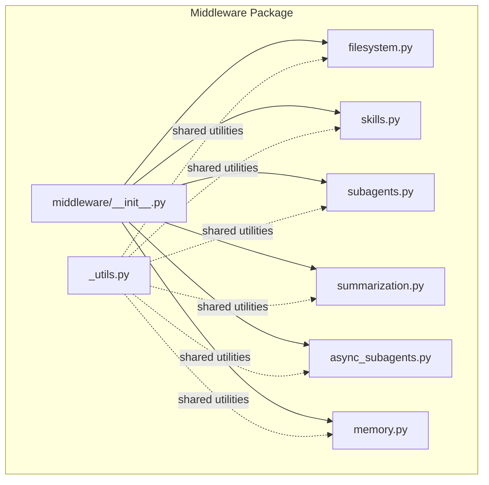
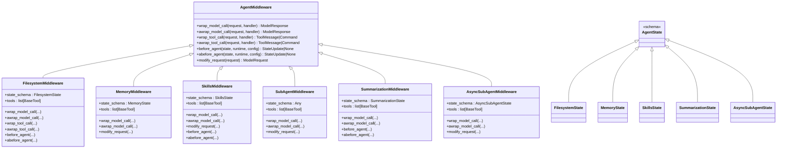
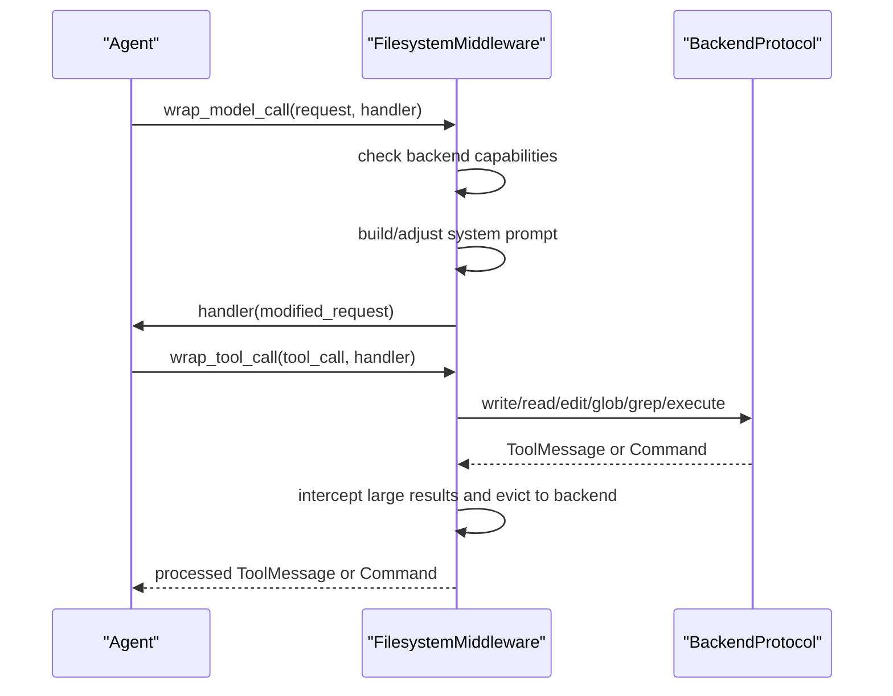
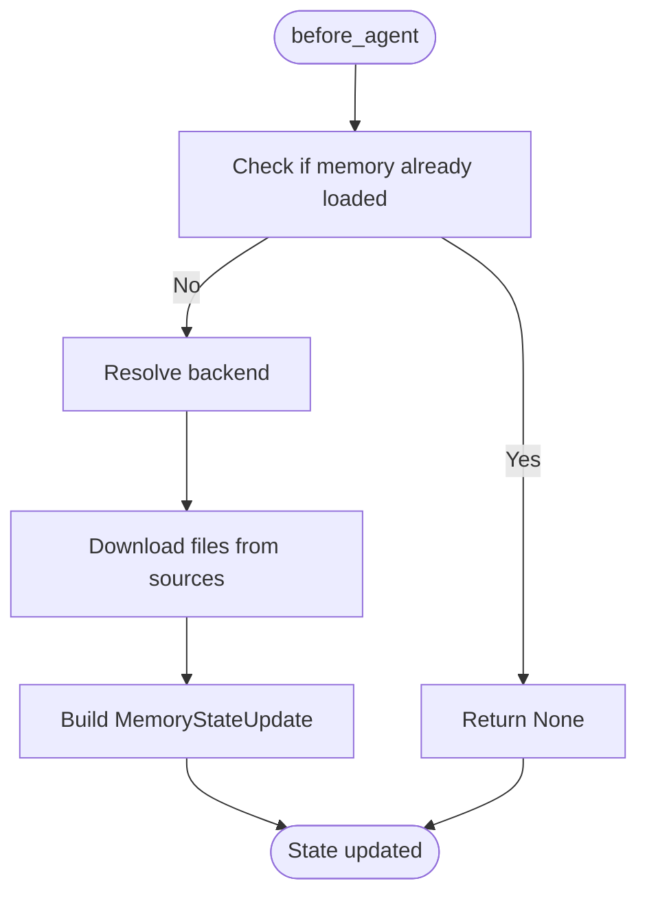
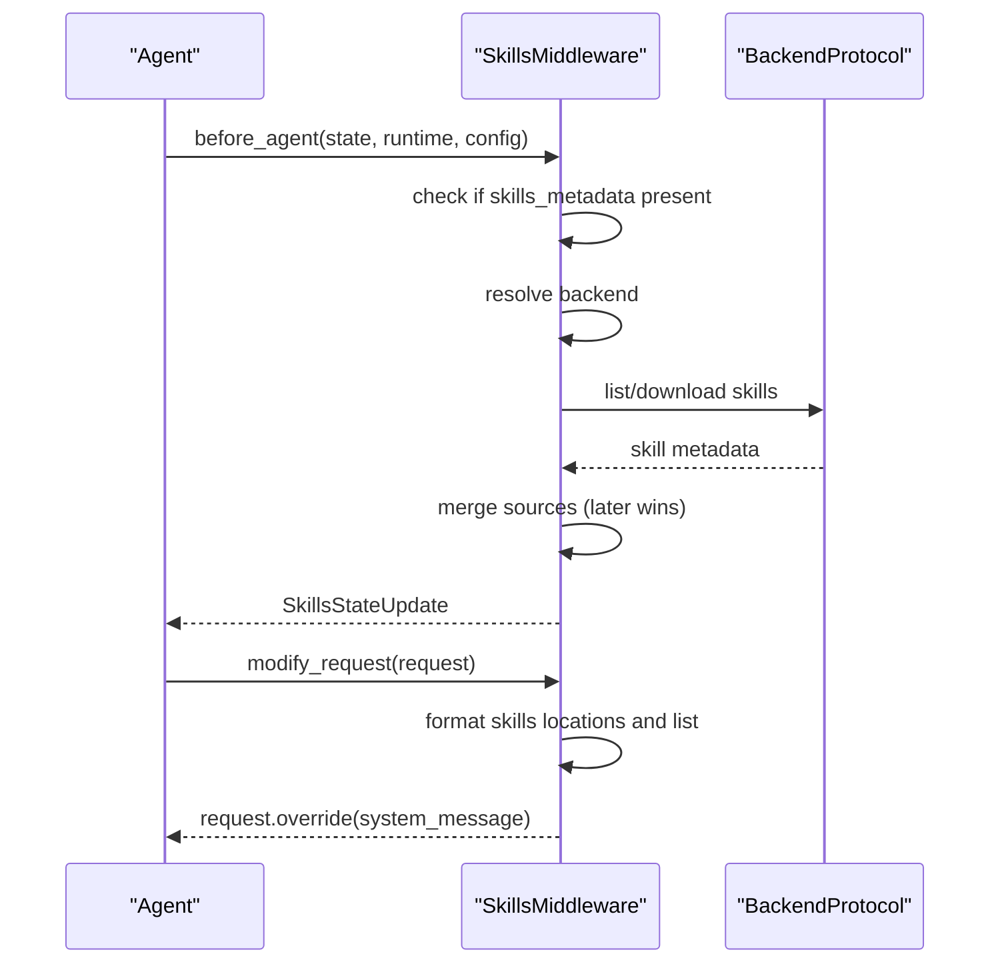
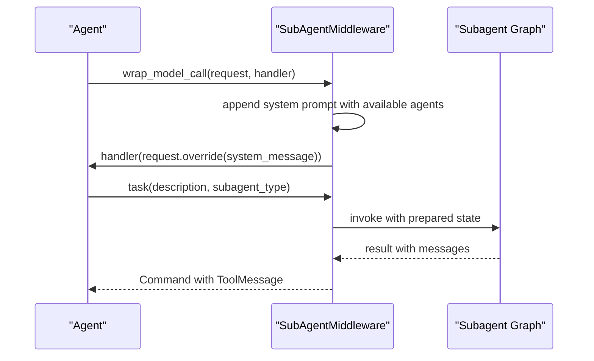
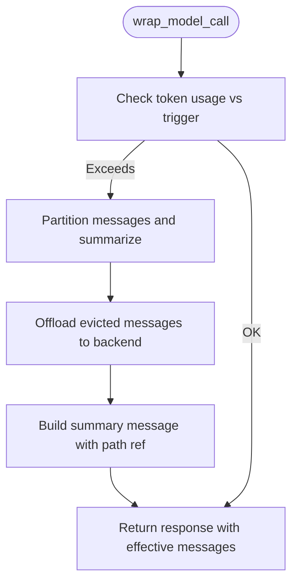
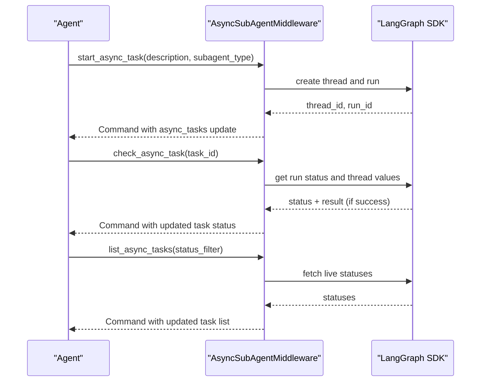
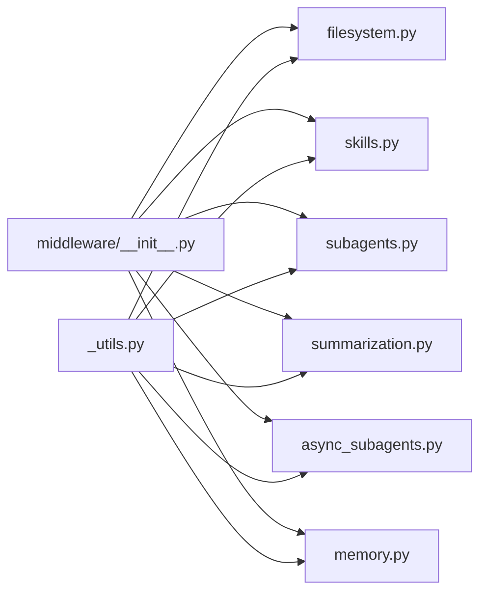

# Custom Middleware Development

<cite>
**Referenced Files in This Document**
- [README.md](file://README.md)
- [middleware/__init__.py](file://libs/deepagents/deepagents/middleware/__init__.py)
- [_utils.py](file://libs/deepagents/deepagents/middleware/_utils.py)
- [filesystem.py](file://libs/deepagents/deepagents/middleware/filesystem.py)
- [memory.py](file://libs/deepagents/deepagents/middleware/memory.py)
- [skills.py](file://libs/deepagents/deepagents/middleware/skills.py)
- [subagents.py](file://libs/deepagents/deepagents/middleware/subagents.py)
- [summarization.py](file://libs/deepagents/deepagents/middleware/summarization.py)
- [async_subagents.py](file://libs/deepagents/deepagents/middleware/async_subagents.py)
- [tests/utils.py](file://libs/deepagents/tests/utils.py)
- [test_end_to_end.py](file://libs/deepagents/tests/unit_tests/test_end_to_end.py)
- [test_subagent_middleware.py](file://libs/deepagents/tests/integration_tests/test_subagent_middleware.py)
</cite>

## Table of Contents
1. [Introduction](#introduction)
2. [Project Structure](#project-structure)
3. [Core Components](#core-components)
4. [Architecture Overview](#architecture-overview)
5. [Detailed Component Analysis](#detailed-component-analysis)
6. [Dependency Analysis](#dependency-analysis)
7. [Performance Considerations](#performance-considerations)
8. [Troubleshooting Guide](#troubleshooting-guide)
9. [Conclusion](#conclusion)
10. [Appendices](#appendices)

## Introduction
This document explains how to develop custom middleware for DeepAgents. It covers the middleware interface contracts, base classes, lifecycle hooks, state management, error handling, and testing strategies. It also demonstrates common patterns and how to extend agent capabilities through custom middleware implementations.

## Project Structure
DeepAgents middleware lives under the middleware package and includes several built-in middleware classes that illustrate the interface and patterns you can follow when implementing your own.

**Diagram sources**
- [middleware/__init__.py:1-74](file://libs/deepagents/deepagents/middleware/__init__.py#L1-L74)
- [_utils.py:1-24](file://libs/deepagents/deepagents/middleware/_utils.py#L1-L24)
- [filesystem.py:388-1446](file://libs/deepagents/deepagents/middleware/filesystem.py#L388-L1446)
- [memory.py:159-355](file://libs/deepagents/deepagents/middleware/memory.py#L159-L355)
- [skills.py:602-800](file://libs/deepagents/deepagents/middleware/skills.py#L602-L800)
- [subagents.py:482-693](file://libs/deepagents/deepagents/middleware/subagents.py#L482-L693)
- [summarization.py:203-800](file://libs/deepagents/deepagents/middleware/summarization.py#L203-L800)
- [async_subagents.py:1-800](file://libs/deepagents/deepagents/middleware/async_subagents.py#L1-L800)

**Section sources**
- [README.md:1-126](file://README.md#L1-L126)
- [middleware/__init__.py:1-74](file://libs/deepagents/deepagents/middleware/__init__.py#L1-L74)

## Core Components
DeepAgents middleware is built around a common interface that you implement in your custom middleware. The built-in middleware classes demonstrate how to intercept model calls, transform requests, manage state, and expose tools.

Key interface elements you will implement:
- Lifecycle hooks: wrap_model_call, awrap_model_call, wrap_tool_call, awrap_tool_call, before_agent, abefore_agent, modify_request
- State management: state_schema and typed state updates
- Tool exposure: tools list
- Request/response interception and transformation
- Async/sync support

Examples of built-in middleware that implement these patterns:
- FilesystemMiddleware: adds filesystem tools, filters tools based on backend capabilities, and manages large tool results
- MemoryMiddleware: loads memory from sources and injects it into the system prompt
- SkillsMiddleware: loads skills metadata and injects progressive disclosure into the system prompt
- SubAgentMiddleware: exposes a task tool to spawn subagents and injects usage instructions
- SummarizationMiddleware: compacts conversation history and offloads to backend storage
- AsyncSubAgentMiddleware: exposes tools to launch and manage remote async subagents

**Section sources**
- [middleware/__init__.py:1-74](file://libs/deepagents/deepagents/middleware/__init__.py#L1-L74)
- [filesystem.py:388-1446](file://libs/deepagents/deepagents/middleware/filesystem.py#L388-L1446)
- [memory.py:159-355](file://libs/deepagents/deepagents/middleware/memory.py#L159-L355)
- [skills.py:602-800](file://libs/deepagents/deepagents/middleware/skills.py#L602-L800)
- [subagents.py:482-693](file://libs/deepagents/deepagents/middleware/subagents.py#L482-L693)
- [summarization.py:203-800](file://libs/deepagents/deepagents/middleware/summarization.py#L203-L800)
- [async_subagents.py:1-800](file://libs/deepagents/deepagents/middleware/async_subagents.py#L1-L800)

## Architecture Overview
The middleware architecture centers on AgentMiddleware and AgentState. Middleware intercepts model calls and tool invocations, can mutate requests and responses, and can maintain cross-turn state.

**Diagram sources**
- [filesystem.py:388-1446](file://libs/deepagents/deepagents/middleware/filesystem.py#L388-L1446)
- [memory.py:159-355](file://libs/deepagents/deepagents/middleware/memory.py#L159-L355)
- [skills.py:602-800](file://libs/deepagents/deepagents/middleware/skills.py#L602-L800)
- [subagents.py:482-693](file://libs/deepagents/deepagents/middleware/subagents.py#L482-L693)
- [summarization.py:203-800](file://libs/deepagents/deepagents/middleware/summarization.py#L203-L800)
- [async_subagents.py:1-800](file://libs/deepagents/deepagents/middleware/async_subagents.py#L1-L800)

## Detailed Component Analysis

### Filesystem Middleware
Purpose: Adds filesystem tools (ls, read_file, write_file, edit_file, glob, grep) and optionally execute. Filters tools based on backend capabilities, injects system prompts, and manages large tool results by offloading to backend storage.

Key implementation patterns:
- Define state_schema and tools list
- Implement wrap_model_call and awrap_model_call to adjust system prompt and filter tools
- Implement wrap_tool_call and awrap_tool_call to intercept tool results and evict large content
- Use backend factories and runtime to resolve backends per call
- Use shared utility to append text to system messages

**Diagram sources**
- [filesystem.py:1100-1194](file://libs/deepagents/deepagents/middleware/filesystem.py#L1100-L1194)
- [filesystem.py:1407-1446](file://libs/deepagents/deepagents/middleware/filesystem.py#L1407-L1446)

**Section sources**
- [filesystem.py:388-1446](file://libs/deepagents/deepagents/middleware/filesystem.py#L388-L1446)
- [_utils.py:6-24](file://libs/deepagents/deepagents/middleware/_utils.py#L6-L24)

### Memory Middleware
Purpose: Loads memory from configured sources and injects it into the system prompt. Demonstrates typed state with private attributes and async/sync loading.

Key implementation patterns:
- Define state_schema with private state attributes
- Implement before_agent and abefore_agent to load memory once per session
- Implement modify_request to append memory to system prompt
- Use backend factories and runtime to resolve backends

**Diagram sources**
- [memory.py:238-304](file://libs/deepagents/deepagents/middleware/memory.py#L238-L304)
- [memory.py:306-355](file://libs/deepagents/deepagents/middleware/memory.py#L306-L355)

**Section sources**
- [memory.py:159-355](file://libs/deepagents/deepagents/middleware/memory.py#L159-L355)
- [_utils.py:6-24](file://libs/deepagents/deepagents/middleware/_utils.py#L6-L24)

### Skills Middleware
Purpose: Loads skills metadata from backend sources and injects progressive disclosure into the system prompt. Supports layered sources and async loading.

Key implementation patterns:
- Define state_schema with private skills_metadata
- Implement before_agent and abefore_agent to load skills once per session
- Implement modify_request to inject skills metadata and locations
- Use backend factories and runtime to resolve backends
- Parse YAML frontmatter and validate metadata

**Diagram sources**
- [skills.py:730-764](file://libs/deepagents/deepagents/middleware/skills.py#L730-L764)
- [skills.py:708-728](file://libs/deepagents/deepagents/middleware/skills.py#L708-L728)

**Section sources**
- [skills.py:602-800](file://libs/deepagents/deepagents/middleware/skills.py#L602-L800)
- [_utils.py:6-24](file://libs/deepagents/deepagents/middleware/_utils.py#L6-L24)

### SubAgent Middleware
Purpose: Exposes a task tool to spawn subagents and injects usage instructions into the system prompt. Supports both synchronous and asynchronous subagents.

Key implementation patterns:
- Define tools list with task tool
- Implement wrap_model_call and awrap_model_call to append usage instructions
- Build system prompt with available subagent types
- Validate and construct subagent graphs

**Diagram sources**
- [subagents.py:672-692](file://libs/deepagents/deepagents/middleware/subagents.py#L672-L692)
- [subagents.py:430-471](file://libs/deepagents/deepagents/middleware/subagents.py#L430-L471)

**Section sources**
- [subagents.py:482-693](file://libs/deepagents/deepagents/middleware/subagents.py#L482-L693)

### Summarization Middleware
Purpose: Automatically compacts conversation history when token usage exceeds thresholds and offloads older messages to backend storage. Also provides a tool to manually compact.

Key implementation patterns:
- Define state_schema with private summarization event tracking
- Implement before_agent and abefore_agent to compute defaults and manage retention
- Intercept messages and generate summaries
- Offload evicted messages to backend and reconstruct effective message list

**Diagram sources**
- [summarization.py:307-330](file://libs/deepagents/deepagents/middleware/summarization.py#L307-L330)
- [summarization.py:714-787](file://libs/deepagents/deepagents/middleware/summarization.py#L714-L787)

**Section sources**
- [summarization.py:203-800](file://libs/deepagents/deepagents/middleware/summarization.py#L203-L800)

### Async SubAgent Middleware
Purpose: Exposes tools to launch and manage remote async subagents via the LangGraph SDK. Tracks tasks in state and provides status queries and updates.

Key implementation patterns:
- Define state_schema with async_tasks reducer
- Build tools: start_async_task, check_async_task, update_async_task, cancel_async_task, list_async_tasks
- Use client cache keyed by url and headers
- Persist task state and update statuses

**Diagram sources**
- [async_subagents.py:231-323](file://libs/deepagents/deepagents/middleware/async_subagents.py#L231-L323)
- [async_subagents.py:390-450](file://libs/deepagents/deepagents/middleware/async_subagents.py#L390-L450)
- [async_subagents.py:702-785](file://libs/deepagents/deepagents/middleware/async_subagents.py#L702-L785)

**Section sources**
- [async_subagents.py:1-800](file://libs/deepagents/deepagents/middleware/async_subagents.py#L1-L800)

## Dependency Analysis
Middleware components depend on shared utilities and backend protocols. The middleware package exports public middleware classes and utilities.

**Diagram sources**
- [middleware/__init__.py:1-74](file://libs/deepagents/deepagents/middleware/__init__.py#L1-L74)
- [_utils.py:1-24](file://libs/deepagents/deepagents/middleware/_utils.py#L1-L24)

**Section sources**
- [middleware/__init__.py:1-74](file://libs/deepagents/deepagents/middleware/__init__.py#L1-L74)

## Performance Considerations
- Token budgeting: Use summarization middleware to cap context growth and offload older messages to backend storage.
- Large result eviction: Filesystem middleware can evict large tool results to backend storage to prevent context overflow.
- Backend I/O: Prefer async backend methods in async contexts to avoid blocking.
- Tool call argument truncation: Summarization middleware can truncate large tool-call arguments in older messages to reduce token usage.
- Backend factories: Use backend factories to lazily initialize backends only when needed.

[No sources needed since this section provides general guidance]

## Troubleshooting Guide
Common issues and strategies:
- Tool availability mismatch: Filesystem middleware filters execute tool if backend does not support sandbox execution. Ensure backend implements the required protocol.
- Memory loading failures: Memory middleware raises on non-file-not-found errors when downloading memory sources. Verify backend permissions and paths.
- Skills metadata parsing: Skills middleware logs warnings for invalid YAML or oversized skill files. Validate SKILL.md format and size.
- Subagent invocation errors: SubAgentMiddleware validates agent types and tool call IDs. Ensure subagent specifications are complete and tool call IDs are present.
- Async subagent SDK errors: AsyncSubAgentMiddleware logs warnings on SDK exceptions. Verify SDK credentials and server URLs.
- Testing middleware: Use unit tests and integration tests to validate middleware behavior, including tool injection and state updates.

**Section sources**
- [filesystem.py:1114-1146](file://libs/deepagents/deepagents/middleware/filesystem.py#L1114-L1146)
- [memory.py:262-265](file://libs/deepagents/deepagents/middleware/memory.py#L262-L265)
- [skills.py:269-271](file://libs/deepagents/deepagents/middleware/skills.py#L269-L271)
- [subagents.py:438-443](file://libs/deepagents/deepagents/middleware/subagents.py#L438-L443)
- [async_subagents.py:255-257](file://libs/deepagents/deepagents/middleware/async_subagents.py#L255-L257)

## Conclusion
Custom middleware in DeepAgents extends the agent’s capabilities by intercepting model calls, transforming requests, managing state, and exposing tools. By following the patterns demonstrated by built-in middleware—implementing lifecycle hooks, defining state schemas, handling async/sync paths, and leveraging backend protocols—you can create robust, reusable middleware that integrates seamlessly into the agent runtime.

[No sources needed since this section summarizes without analyzing specific files]

## Appendices

### Step-by-Step: Creating Custom Middleware
1. Define a state schema extending AgentState with typed state updates and private attributes when needed.
2. Implement AgentMiddleware subclass with lifecycle hooks:
   - wrap_model_call and awrap_model_call to intercept and modify model requests
   - wrap_tool_call and awrap_tool_call to intercept tool results and evict large content
   - before_agent and abefore_agent to load or compute state once per session
   - modify_request to inject context into the system prompt
3. Expose tools by setting the tools list with StructuredTool instances.
4. Use backend factories and runtime to resolve backends per call.
5. Test with unit and integration tests mirroring the patterns in the repository.

**Section sources**
- [filesystem.py:388-1446](file://libs/deepagents/deepagents/middleware/filesystem.py#L388-L1446)
- [memory.py:159-355](file://libs/deepagents/deepagents/middleware/memory.py#L159-L355)
- [skills.py:602-800](file://libs/deepagents/deepagents/middleware/skills.py#L602-L800)
- [subagents.py:482-693](file://libs/deepagents/deepagents/middleware/subagents.py#L482-L693)
- [summarization.py:203-800](file://libs/deepagents/deepagents/middleware/summarization.py#L203-L800)
- [async_subagents.py:1-800](file://libs/deepagents/deepagents/middleware/async_subagents.py#L1-L800)

### Best Practices
- Keep middleware focused: Each middleware should address a single concern (e.g., memory, skills, filesystem).
- Use private state attributes for internal-only state that should not leak to parent agents.
- Provide async support alongside sync implementations for performance and consistency.
- Validate inputs and handle errors gracefully, raising clear errors for misconfiguration.
- Use backend factories to defer initialization and enable flexible backend selection.

**Section sources**
- [memory.py:80-95](file://libs/deepagents/deepagents/middleware/memory.py#L80-L95)
- [filesystem.py:441-478](file://libs/deepagents/deepagents/middleware/filesystem.py#L441-L478)

### Integration with Existing Middleware Chains
- Middleware order matters: Earlier middleware can influence later middleware via state and system prompts.
- Tools from multiple middleware are merged into the final tool set the LLM sees.
- Use middleware composition to layer capabilities (e.g., skills + filesystem + summarization).

**Section sources**
- [middleware/__init__.py:1-48](file://libs/deepagents/deepagents/middleware/__init__.py#L1-L48)
- [test_end_to_end.py:1237-1252](file://libs/deepagents/tests/unit_tests/test_end_to_end.py#L1237-L1252)
- [test_subagent_middleware.py:133-168](file://libs/deepagents/tests/integration_tests/test_subagent_middleware.py#L133-L168)