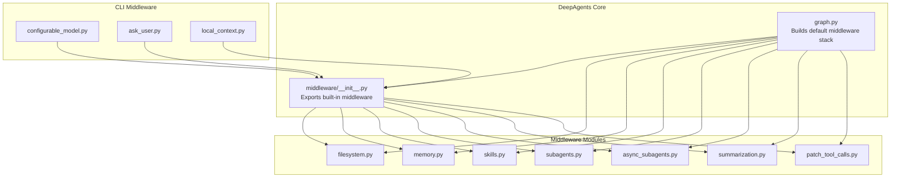
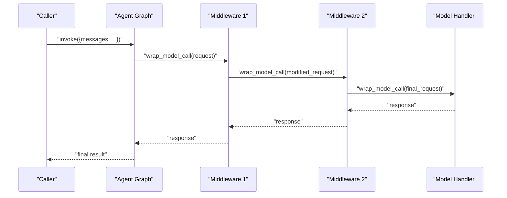
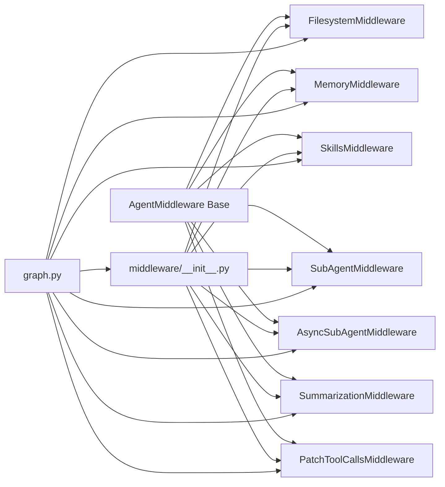

# Middleware Overview

<cite>
**Referenced Files in This Document**
- [README.md](file://README.md)
- [middleware/__init__.py](file://libs/deepagents/deepagents/middleware/__init__.py)
- [graph.py](file://libs/deepagents/deepagents/graph.py)
- [filesystem.py](file://libs/deepagents/deepagents/middleware/filesystem.py)
- [memory.py](file://libs/deepagents/deepagents/middleware/memory.py)
- [skills.py](file://libs/deepagents/deepagents/middleware/skills.py)
- [subagents.py](file://libs/deepagents/deepagents/middleware/subagents.py)
- [async_subagents.py](file://libs/deepagents/deepagents/middleware/async_subagents.py)
- [summarization.py](file://libs/deepagents/deepagents/middleware/summarization.py)
- [patch_tool_calls.py](file://libs/deepagents/deepagents/middleware/patch_tool_calls.py)
- [configurable_model.py](file://libs/cli/deepagents_cli/configurable_model.py)
- [ask_user.py](file://libs/cli/deepagents_cli/ask_user.py)
- [local_context.py](file://libs/cli/deepagents_cli/local_context.py)
- [test_subagent_middleware.py](file://libs/deepagents/tests/integration_tests/test_subagent_middleware.py)
- [test_end_to_end.py](file://libs/deepagents/tests/unit_tests/test_end_to_end.py)
- [test_async_subagents.py](file://libs/deepagents/tests/unit_tests/test_async_subagents.py)
</cite>

## Table of Contents
1. [Introduction](#introduction)
2. [Project Structure](#project-structure)
3. [Core Components](#core-components)
4. [Architecture Overview](#architecture-overview)
5. [Detailed Component Analysis](#detailed-component-analysis)
6. [Dependency Analysis](#dependency-analysis)
7. [Performance Considerations](#performance-considerations)
8. [Troubleshooting Guide](#troubleshooting-guide)
9. [Conclusion](#conclusion)

## Introduction
This document explains the DeepAgents middleware system: how middleware extends agent capabilities through a chain-of-responsibility approach, how middleware is registered and configured, and how middleware components interact. It covers the base middleware interfaces, common patterns, lifecycle management, error handling strategies, and practical examples of middleware chaining and transformations.

## Project Structure
The middleware system lives under the DeepAgents package and is composed of:
- A central middleware registry that exposes built-in middleware types
- A graph builder that composes a default middleware stack for agents
- Individual middleware modules implementing specific capabilities (filesystem, memory, skills, subagents, async subagents, summarization, tool call patching)
- CLI middleware extensions for runtime model selection, user prompts, and local context

**Diagram sources**
- [middleware/__init__.py:50-73](file://libs/deepagents/deepagents/middleware/__init__.py#L50-L73)
- [graph.py:270-294](file://libs/deepagents/deepagents/graph.py#L270-L294)

**Section sources**
- [README.md:24-56](file://README.md#L24-L56)
- [middleware/__init__.py:1-74](file://libs/deepagents/deepagents/middleware/__init__.py#L1-L74)
- [graph.py:262-294](file://libs/deepagents/deepagents/graph.py#L262-L294)

## Core Components
- Middleware base concept: Middleware subclasses a shared base interface and override hooks to intercept and transform model requests, augment tools, inject system prompts, maintain cross-turn state, and coordinate with backends.
- Built-in middleware types exposed by the registry include filesystem, memory, skills, subagents, async subagents, summarization, and tool call patching.
- Registration and composition: The graph builder constructs a default middleware stack and allows appending additional middleware provided by the caller.

Key responsibilities:
- Intercept model calls and optionally mutate requests/responses
- Dynamically filter or inject tools per call
- Inject system prompt context
- Transform messages (e.g., summarization)
- Persist and read typed state across turns

**Section sources**
- [middleware/__init__.py:1-74](file://libs/deepagents/deepagents/middleware/__init__.py#L1-L74)
- [graph.py:270-294](file://libs/deepagents/deepagents/graph.py#L270-L294)

## Architecture Overview
The middleware system implements a chain-of-responsibility pipeline around the agent’s model invocation. Each middleware wraps the next handler, forming a stack. Requests traverse the stack in order, and responses propagate back in reverse order.

**Diagram sources**
- [middleware/__init__.py:15-48](file://libs/deepagents/deepagents/middleware/__init__.py#L15-L48)
- [graph.py:270-294](file://libs/deepagents/deepagents/graph.py#L270-L294)

## Detailed Component Analysis

### Base Middleware Interfaces and Patterns
Common patterns across middleware:
- Hook-based interception: Override a primary hook to intercept model calls and delegate to the next handler.
- Tool augmentation: Provide tools via class-level lists or dynamic computation per call.
- State extension: Define a typed state schema to persist cross-turn data.
- System prompt injection: Append contextual instructions to the system message.
- Async/sync variants: Support both sync and async model call wrappers.

Representative implementations:
- Configurable model middleware applies runtime overrides before delegating to the next handler.
- Ask user middleware conditionally prompts for user input before proceeding.
- Local context middleware augments context for local execution environments.

**Section sources**
- [configurable_model.py:144-161](file://libs/cli/deepagents_cli/configurable_model.py#L144-L161)
- [ask_user.py](file://libs/cli/deepagents_cli/ask_user.py#L204)
- [local_context.py](file://libs/cli/deepagents_cli/local_context.py#L411)

### Filesystem Middleware
Purpose:
- Dynamically filters tools based on backend capabilities
- Provides filesystem operations with sandboxing awareness

Lifecycle:
- Initialization with a backend resolves capabilities
- On each model call, filters tools (e.g., removing execute when unsupported)
- Augments system prompt with filesystem context

**Section sources**
- [filesystem.py](file://libs/deepagents/deepagents/middleware/filesystem.py#L387)

### Memory Middleware
Purpose:
- Maintains cross-turn state for memory-backed operations
- Injects memory-aware instructions into the system prompt

Patterns:
- Typed state schema for memory events
- Reads/writes memory entries across turns

**Section sources**
- [memory.py](file://libs/deepagents/deepagents/middleware/memory.py#L158)

### Skills Middleware
Purpose:
- Loads reusable skills and injects skill-specific instructions into the system prompt
- Exposes tools defined by skills

Patterns:
- Backend-driven discovery of skill sources
- Dynamic tool injection per call

**Section sources**
- [skills.py](file://libs/deepagents/deepagents/middleware/skills.py#L601)

### SubAgent Middleware
Purpose:
- Enables delegation to subagents via a dedicated task tool
- Composes subagent specs and injects descriptions into the system prompt

Patterns:
- Tool generation for task orchestration
- System prompt augmentation with subagent capabilities

**Section sources**
- [subagents.py](file://libs/deepagents/deepagents/middleware/subagents.py#L481)

### Async SubAgent Middleware
Purpose:
- Non-blocking subagent execution for external deployments
- Generates tools for async task lifecycle management

Patterns:
- Validates presence of at least one async subagent
- Prevents duplicate names
- Builds system prompt from subagent descriptions

**Section sources**
- [async_subagents.py](file://libs/deepagents/deepagents/middleware/async_subagents.py#L812)
- [test_async_subagents.py:87-119](file://libs/deepagents/tests/unit_tests/test_async_subagents.py#L87-L119)

### Summarization Middleware
Purpose:
- Offloads conversation history and replaces older messages with a summary when context thresholds are exceeded
- Supports configurable triggers and retention policies
- Optionally truncates large tool arguments in older messages

Patterns:
- Computes defaults from model profile
- Persists conversation history to a backend
- Reconstructs effective messages for model calls using the latest summarization event

**Section sources**
- [summarization.py](file://libs/deepagents/deepagents/middleware/summarization.py#L1175)
- [summarization.py:159-500](file://libs/deepagents/deepagents/middleware/summarization.py#L159-L500)

### Tool Call Patching Middleware
Purpose:
- Normalizes or patches tool call structures to ensure compatibility with downstream components

**Section sources**
- [patch_tool_calls.py](file://libs/deepagents/deepagents/middleware/patch_tool_calls.py#L10)

### Middleware Registration and Composition
Default stack construction:
- The graph builder assembles a default middleware stack and allows appending additional middleware provided by the caller.

Registration examples:
- Middleware can be provided as a list to the agent creation function; tests demonstrate injecting tools and state via middleware.

**Section sources**
- [graph.py:270-294](file://libs/deepagents/deepagents/graph.py#L270-L294)
- [test_end_to_end.py:1241-1252](file://libs/deepagents/tests/unit_tests/test_end_to_end.py#L1241-L1252)

### Middleware Chaining Examples
- Subagent with custom middleware: Demonstrates composing a parent agent with a subagent that itself uses middleware, resulting in coordinated tool calls across the subgraph.
- Defined subagent with custom middleware: Shows how a subagent’s middleware contributes tools and system prompt context to the parent agent’s model call.

**Section sources**
- [test_subagent_middleware.py:135-168](file://libs/deepagents/tests/integration_tests/test_subagent_middleware.py#L135-L168)

## Dependency Analysis
The middleware ecosystem depends on:
- A shared base interface for all middleware implementations
- A registry that exports built-in middleware types
- A graph builder that composes the middleware stack
- Backends for persistence and capability resolution
- Optional CLI middleware extending runtime behavior

**Diagram sources**
- [middleware/__init__.py:50-73](file://libs/deepagents/deepagents/middleware/__init__.py#L50-L73)
- [graph.py:270-294](file://libs/deepagents/deepagents/graph.py#L270-L294)

**Section sources**
- [middleware/__init__.py:50-73](file://libs/deepagents/deepagents/middleware/__init__.py#L50-L73)
- [graph.py:270-294](file://libs/deepagents/deepagents/graph.py#L270-L294)

## Performance Considerations
- Minimize heavy operations inside middleware hooks; prefer lazy evaluation and caching where appropriate.
- Use targeted truncation and summarization to control context size and reduce token usage.
- Avoid unnecessary tool recomputation per call; cache derived tool sets when inputs are stable.
- Prefer async variants for I/O-bound operations (e.g., backend writes) to prevent blocking the model call.

## Troubleshooting Guide
Common issues and strategies:
- Duplicate subagent names: Validation prevents duplicate names in async subagent middleware; ensure unique identifiers.
- Missing thread_id: Summarization middleware falls back to a generated session ID if no thread is present; ensure proper configuration when relying on persisted history.
- Tool availability: Filesystem middleware filters tools based on backend capabilities; verify backend configuration to ensure desired tools are present.
- State conflicts: When extending state via middleware, ensure schema compatibility and avoid overwriting reserved keys.

**Section sources**
- [test_async_subagents.py:118-119](file://libs/deepagents/tests/unit_tests/test_async_subagents.py#L118-L119)
- [summarization.py:319-341](file://libs/deepagents/deepagents/middleware/summarization.py#L319-L341)
- [filesystem.py](file://libs/deepagents/deepagents/middleware/filesystem.py#L387)

## Conclusion
The DeepAgents middleware system provides a robust, extensible foundation for agent customization. Through a chain-of-responsibility design, middleware intercepts and transforms model requests, augments tools and system prompts, maintains cross-turn state, and integrates with backends. The default stack balances common capabilities, while the registration mechanism enables tailored compositions. By following the documented patterns and leveraging the provided middleware types, developers can reliably extend agent behavior with predictable lifecycle and error-handling characteristics.