# Middleware System

<cite>
**Referenced Files in This Document**
- [middleware/__init__.py](file://libs/deepagents/deepagents/middleware/__init__.py)
- [middleware/_utils.py](file://libs/deepagents/deepagents/middleware/_utils.py)
- [middleware/patch_tool_calls.py](file://libs/deepagents/deepagents/middleware/patch_tool_calls.py)
- [middleware/summarization.py](file://libs/deepagents/deepagents/middleware/summarization.py)
- [middleware/filesystem.py](file://libs/deepagents/deepagents/middleware/filesystem.py)
- [middleware/memory.py](file://libs/deepagents/deepagents/middleware/memory.py)
- [middleware/skills.py](file://libs/deepagents/deepagents/middleware/skills.py)
- [middleware/subagents.py](file://libs/deepagents/deepagents/middleware/subagents.py)
- [middleware/async_subagents.py](file://libs/deepagents/deepagents/middleware/async_subagents.py)
</cite>

## Table of Contents
1. [Introduction](#introduction)
2. [Project Structure](#project-structure)
3. [Core Components](#core-components)
4. [Architecture Overview](#architecture-overview)
5. [Detailed Component Analysis](#detailed-component-analysis)
6. [Dependency Analysis](#dependency-analysis)
7. [Performance Considerations](#performance-considerations)
8. [Troubleshooting Guide](#troubleshooting-guide)
9. [Conclusion](#conclusion)

## Introduction
This document explains the DeepAgents middleware system and how middleware extends agent capabilities. Middleware intercepts every LLM request, enabling dynamic tool filtering, system prompt augmentation, message transformation, and cross-turn state persistence. The middleware pattern complements consumer-provided tools by offering a reusable, composable mechanism for cross-cutting concerns such as planning, file operations, sub-agent orchestration, memory/context persistence, skills-based guidance, summarization, and tool call normalization.

## Project Structure
The middleware package organizes functionality into cohesive modules, each implementing a distinct capability:
- Planning and orchestration: TodoListMiddleware (external LangChain middleware referenced in tests)
- Filesystem operations: FilesystemMiddleware
- Sub-agent orchestration: SubAgentMiddleware and AsyncSubAgentMiddleware
- Context persistence: MemoryMiddleware
- Domain-specific skills: SkillsMiddleware
- Conversation summarization: SummarizationMiddleware and SummarizationToolMiddleware
- Request normalization: PatchToolCallsMiddleware

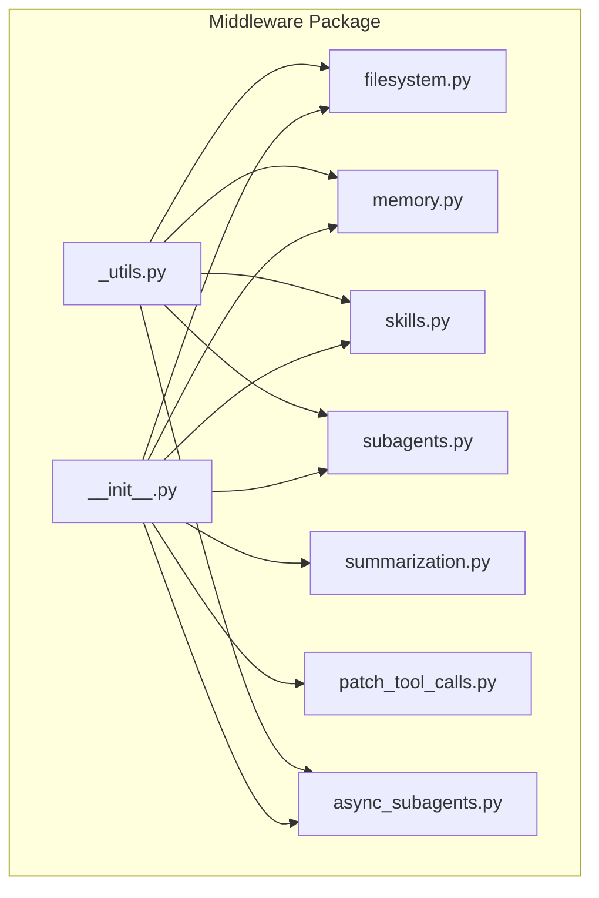

**Diagram sources**
- [middleware/__init__.py:50-73](file://libs/deepagents/deepagents/middleware/__init__.py#L50-L73)
- [middleware/_utils.py:1-24](file://libs/deepagents/deepagents/middleware/_utils.py#L1-L24)

**Section sources**
- [middleware/__init__.py:1-74](file://libs/deepagents/deepagents/middleware/__init__.py#L1-L74)

## Core Components
This section outlines the middleware pattern and the primary middleware components that ship with DeepAgents.

- Middleware pattern: Middleware subclasses AgentMiddleware and overrides hooks such as wrap_model_call, before_agent, and modify_request to intercept and transform LLM requests and state.
- Tool injection and filtering: Middleware can augment the system prompt and dynamically filter tools based on runtime conditions (e.g., backend capabilities).
- Cross-turn state: Middleware maintains typed state that persists across agent turns, enabling capabilities like summarization event tracking and async task monitoring.

Key middleware components:
- FilesystemMiddleware: Adds filesystem and optional execution tools, with eviction of large tool results to the filesystem.
- MemoryMiddleware: Loads persistent context from AGENTS.md files and injects it into the system prompt.
- SkillsMiddleware: Loads skills from backend sources and injects progressive disclosure guidance into the system prompt.
- SubAgentMiddleware: Exposes a task tool to spawn ephemeral subagents with isolated context windows.
- AsyncSubAgentMiddleware: Launches and manages background tasks on remote LangGraph servers.
- SummarizationMiddleware: Automatically compacts conversation history and offloads evicted messages to a backend.
- PatchToolCallsMiddleware: Normalizes dangling tool calls in the message history.

**Section sources**
- [middleware/__init__.py:15-48](file://libs/deepagents/deepagents/middleware/__init__.py#L15-L48)
- [middleware/_utils.py:6-23](file://libs/deepagents/deepagents/middleware/_utils.py#L6-L23)

## Architecture Overview
The middleware system composes multiple middleware layers around the agent. Each middleware can:
- Intercept the model request before sending it to the LLM
- Modify the system prompt and tool list
- Persist or read cross-turn state
- Transform messages and tool arguments

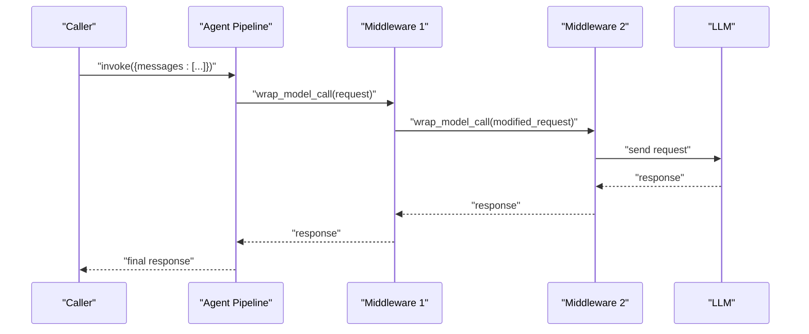

[No sources needed since this diagram shows conceptual workflow, not actual code structure]

## Detailed Component Analysis

### FilesystemMiddleware
Purpose:
- Provides filesystem tools (list, read, write, edit, glob, grep) and optionally execute in a sandboxed environment.
- Evicts large tool results to the filesystem to prevent context overflow.

Key behaviors:
- Dynamically includes the execute tool only when the backend supports sandbox execution.
- Computes token thresholds to truncate or evict large tool results.
- Formats content previews and preserves multimodal content blocks when applicable.

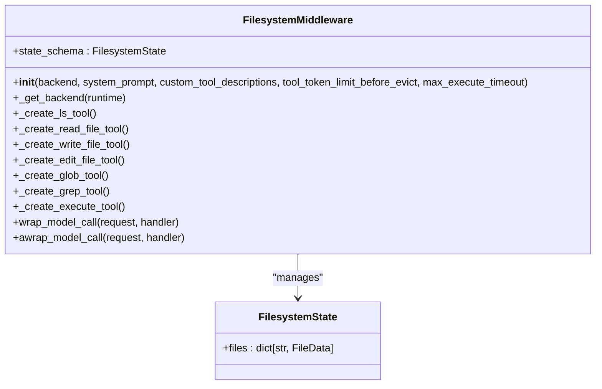

**Diagram sources**
- [middleware/filesystem.py:388-478](file://libs/deepagents/deepagents/middleware/filesystem.py#L388-L478)
- [middleware/filesystem.py:110-116](file://libs/deepagents/deepagents/middleware/filesystem.py#L110-L116)

**Section sources**
- [middleware/filesystem.py:388-478](file://libs/deepagents/deepagents/middleware/filesystem.py#L388-L478)
- [middleware/filesystem.py:489-501](file://libs/deepagents/deepagents/middleware/filesystem.py#L489-L501)

### MemoryMiddleware
Purpose:
- Loads persistent context from AGENTS.md files and injects it into the system prompt.
- Supports multiple sources and asynchronous loading.

Key behaviors:
- Loads memory content once per session and stores it in state.
- Formats memory content with location and content pairs.
- Injects memory into the system prompt via append_to_system_message.

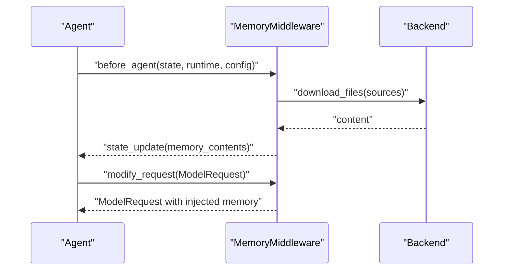

**Diagram sources**
- [middleware/memory.py:238-271](file://libs/deepagents/deepagents/middleware/memory.py#L238-L271)
- [middleware/memory.py:306-321](file://libs/deepagents/deepagents/middleware/memory.py#L306-L321)

**Section sources**
- [middleware/memory.py:159-171](file://libs/deepagents/deepagents/middleware/memory.py#L159-L171)
- [middleware/memory.py:238-321](file://libs/deepagents/deepagents/middleware/memory.py#L238-L321)

### SkillsMiddleware
Purpose:
- Loads skills from backend sources and injects progressive disclosure guidance into the system prompt.
- Supports layered sources with later sources overriding earlier ones.

Key behaviors:
- Lists skills from backend sources, parses YAML frontmatter, and validates metadata.
- Builds a formatted skills section with locations, list, and usage guidance.
- Injects skills into the system prompt via append_to_system_message.

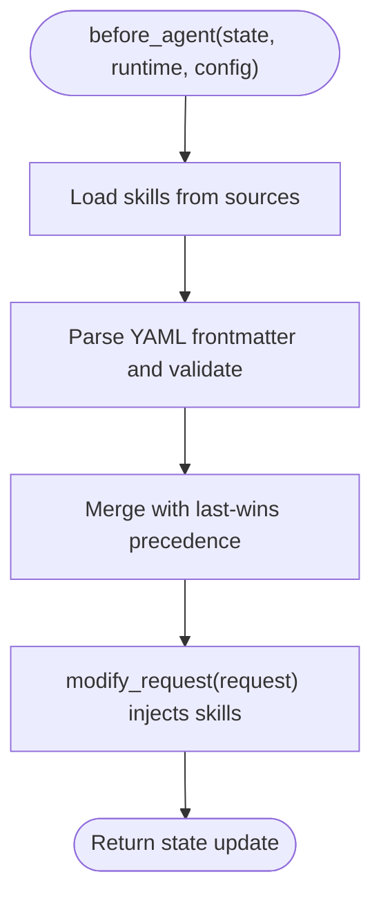

**Diagram sources**
- [middleware/skills.py:730-764](file://libs/deepagents/deepagents/middleware/skills.py#L730-L764)
- [middleware/skills.py:708-728](file://libs/deepagents/deepagents/middleware/skills.py#L708-L728)

**Section sources**
- [middleware/skills.py:602-631](file://libs/deepagents/deepagents/middleware/skills.py#L602-L631)
- [middleware/skills.py:708-764](file://libs/deepagents/deepagents/middleware/skills.py#L708-L764)

### SubAgentMiddleware
Purpose:
- Exposes a task tool to spawn ephemeral subagents with isolated context windows.
- Supports both legacy and new APIs for configuring subagents.

Key behaviors:
- Builds a task tool with descriptions of available subagents.
- Prepares subagent state by filtering excluded keys and injecting a HumanMessage.
- Returns results as a ToolMessage to the parent agent.

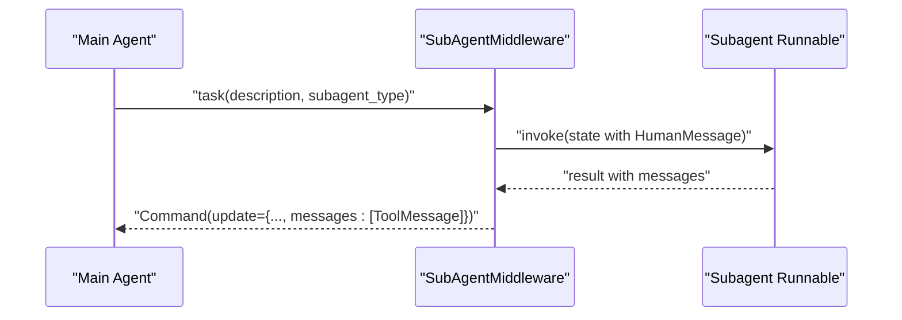

**Diagram sources**
- [middleware/subagents.py:430-447](file://libs/deepagents/deepagents/middleware/subagents.py#L430-L447)
- [middleware/subagents.py:402-421](file://libs/deepagents/deepagents/middleware/subagents.py#L402-L421)

**Section sources**
- [middleware/subagents.py:482-532](file://libs/deepagents/deepagents/middleware/subagents.py#L482-L532)
- [middleware/subagents.py:672-692](file://libs/deepagents/deepagents/middleware/subagents.py#L672-L692)

### AsyncSubAgentMiddleware
Purpose:
- Launches and manages background tasks on remote LangGraph servers.
- Provides tools to start, check, update, cancel, and list async tasks.

Key behaviors:
- Creates LangGraph SDK clients lazily and caches them by URL and headers.
- Tracks tasks in state with timestamps and statuses.
- Fetches live statuses and updates state accordingly.

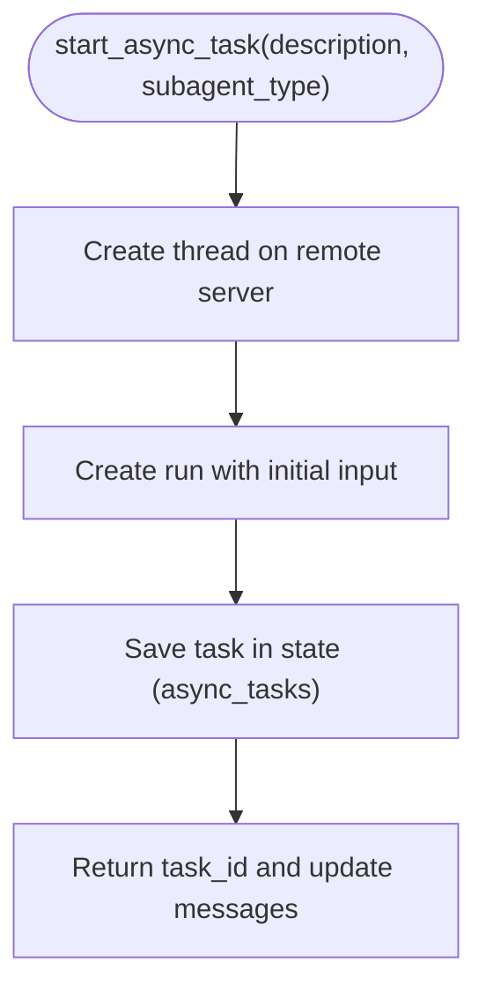

**Diagram sources**
- [middleware/async_subagents.py:238-277](file://libs/deepagents/deepagents/middleware/async_subagents.py#L238-L277)
- [middleware/async_subagents.py:121-126](file://libs/deepagents/deepagents/middleware/async_subagents.py#L121-L126)

**Section sources**
- [middleware/async_subagents.py:36-68](file://libs/deepagents/deepagents/middleware/async_subagents.py#L36-L68)
- [middleware/async_subagents.py:231-277](file://libs/deepagents/deepagents/middleware/async_subagents.py#L231-L277)

### SummarizationMiddleware
Purpose:
- Automatically compacts conversation history when token usage exceeds a threshold.
- Offloads evicted messages to a backend for later retrieval.

Key behaviors:
- Computes defaults based on model profile and triggers compaction when thresholds are met.
- Truncates large tool-call arguments in older messages before summarization.
- Stores evicted messages to a markdown file per thread and injects a summary message into the effective message list.

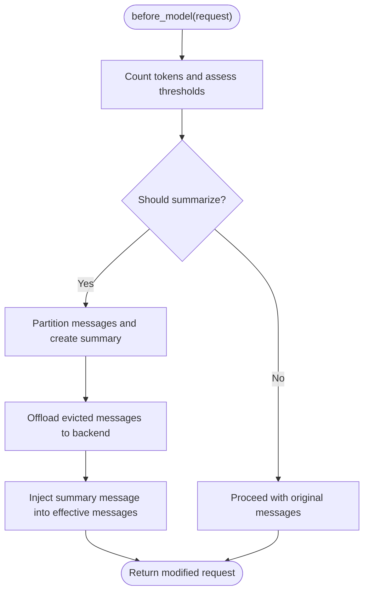

**Diagram sources**
- [middleware/summarization.py:307-314](file://libs/deepagents/deepagents/middleware/summarization.py#L307-L314)
- [middleware/summarization.py:463-478](file://libs/deepagents/deepagents/middleware/summarization.py#L463-L478)

**Section sources**
- [middleware/summarization.py:203-221](file://libs/deepagents/deepagents/middleware/summarization.py#L203-L221)
- [middleware/summarization.py:463-517](file://libs/deepagents/deepagents/middleware/summarization.py#L463-L517)

### PatchToolCallsMiddleware
Purpose:
- Normalizes dangling tool calls in the message history by adding missing ToolMessage entries.

Key behaviors:
- Iterates through messages and identifies AIMessage entries with tool calls that lack corresponding ToolMessage entries.
- Inserts synthetic ToolMessage entries indicating cancellation to maintain message integrity.

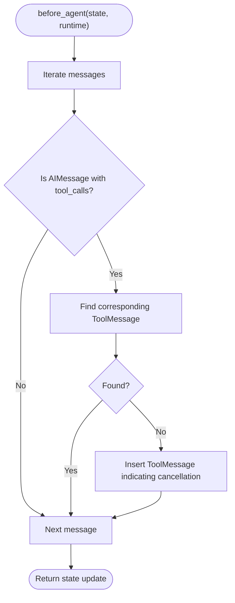

**Diagram sources**
- [middleware/patch_tool_calls.py:14-44](file://libs/deepagents/deepagents/middleware/patch_tool_calls.py#L14-L44)

**Section sources**
- [middleware/patch_tool_calls.py:11-12](file://libs/deepagents/deepagents/middleware/patch_tool_calls.py#L11-L12)

### TodoListMiddleware
Purpose:
- Enforces planning discipline by validating write_todos tool usage and coordinating with HumanInTheLoopMiddleware for approvals.
- Integrates with external systems to auto-approve plan updates when appropriate.

Key behaviors:
- Validates that write_todos is not called multiple times in parallel within a single AIMessage.
- Coordinates with HumanInTheLoopMiddleware to request user approval for plan changes.
- Auto-approves updates to an in-progress plan when write_todos is detected.

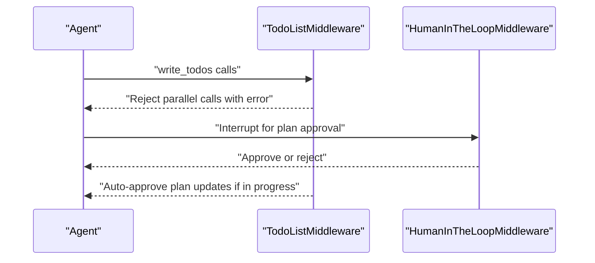

[No sources needed since this diagram shows conceptual workflow, not actual code structure]

**Section sources**
- [middleware/__init__.py:15-30](file://libs/deepagents/deepagents/middleware/__init__.py#L15-L30)

## Dependency Analysis
Middleware modules depend on shared utilities and LangChain/LangGraph abstractions. The central utility function append_to_system_message is used across MemoryMiddleware, SkillsMiddleware, SubAgentMiddleware, and SummarizationMiddleware to inject contextual information into the system prompt.

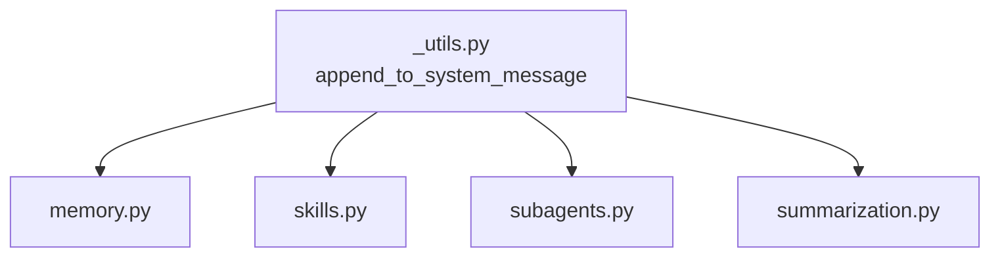

**Diagram sources**
- [middleware/_utils.py:6-23](file://libs/deepagents/deepagents/middleware/_utils.py#L6-L23)
- [middleware/memory.py:318-318](file://libs/deepagents/deepagents/middleware/memory.py#L318-L318)
- [middleware/skills.py:726-726](file://libs/deepagents/deepagents/middleware/skills.py#L726-L726)
- [middleware/subagents.py:679-679](file://libs/deepagents/deepagents/middleware/subagents.py#L679-L679)
- [middleware/summarization.py:457-457](file://libs/deepagents/deepagents/middleware/summarization.py#L457-L457)

**Section sources**
- [middleware/_utils.py:6-23](file://libs/deepagents/deepagents/middleware/_utils.py#L6-L23)

## Performance Considerations
- Token counting and truncation: SummarizationMiddleware and FilesystemMiddleware both rely on token counters to decide when to truncate or evict content. Tune thresholds to balance context retention and cost.
- Backend I/O: MemoryMiddleware and SkillsMiddleware perform backend reads; caching and batching can reduce latency.
- Async operations: AsyncSubAgentMiddleware introduces network latency; use list_async_tasks to poll statuses efficiently and avoid repeated polling.
- Tool call normalization: PatchToolCallsMiddleware prevents malformed histories that could cause downstream processing overhead.

[No sources needed since this section provides general guidance]

## Troubleshooting Guide
Common issues and resolutions:
- Dangling tool calls: Use PatchToolCallsMiddleware to normalize histories with missing ToolMessage entries.
- Tool availability mismatch: FilesystemMiddleware dynamically filters tools based on backend capabilities; ensure the backend supports sandbox execution if execute is required.
- Memory loading failures: MemoryMiddleware raises on non-file-not-found errors; verify backend permissions and file paths.
- Skills parsing errors: SkillsMiddleware logs warnings for invalid YAML or oversized files; validate SKILL.md structure and size.
- Subagent invocation errors: SubAgentMiddleware validates subagent types and requires a tool call ID; confirm subagent_type exists and runtime.tool_call_id is set.
- Async task status staleness: AsyncSubAgentMiddleware caches statuses; use list_async_tasks to refresh live statuses.

**Section sources**
- [middleware/patch_tool_calls.py:14-44](file://libs/deepagents/deepagents/middleware/patch_tool_calls.py#L14-L44)
- [middleware/filesystem.py:257-275](file://libs/deepagents/deepagents/middleware/filesystem.py#L257-L275)
- [middleware/memory.py:262-266](file://libs/deepagents/deepagents/middleware/memory.py#L262-L266)
- [middleware/skills.py:269-271](file://libs/deepagents/deepagents/middleware/skills.py#L269-L271)
- [middleware/subagents.py:438-444](file://libs/deepagents/deepagents/middleware/subagents.py#L438-L444)
- [middleware/async_subagents.py:636-653](file://libs/deepagents/deepagents/middleware/async_subagents.py#L636-L653)

## Conclusion
The DeepAgents middleware system provides a robust, extensible foundation for agent capabilities. By intercepting model requests, injecting context, managing cross-turn state, and normalizing tool interactions, middleware layers enable sophisticated behaviors such as planning, file operations, sub-agent orchestration, memory persistence, skills-based guidance, summarization, and tool call normalization. The modular design allows developers to compose middleware stacks tailored to specific use cases while maintaining consistent patterns for tool injection, state management, and request transformation.