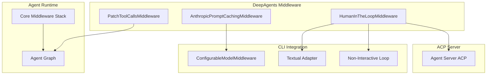
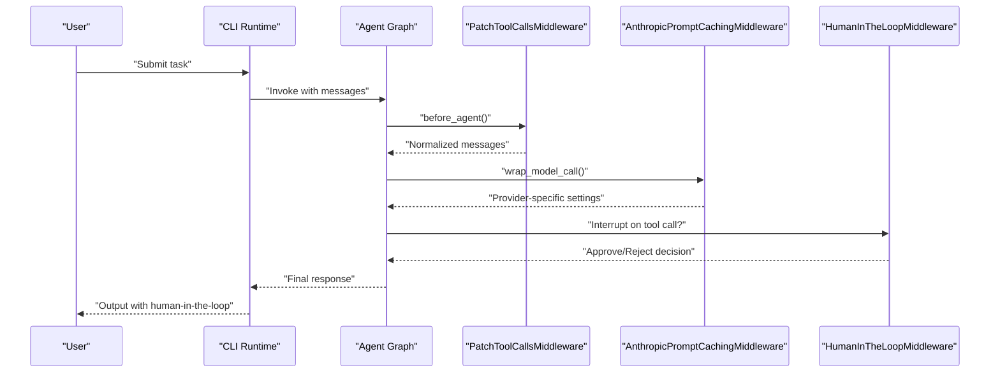
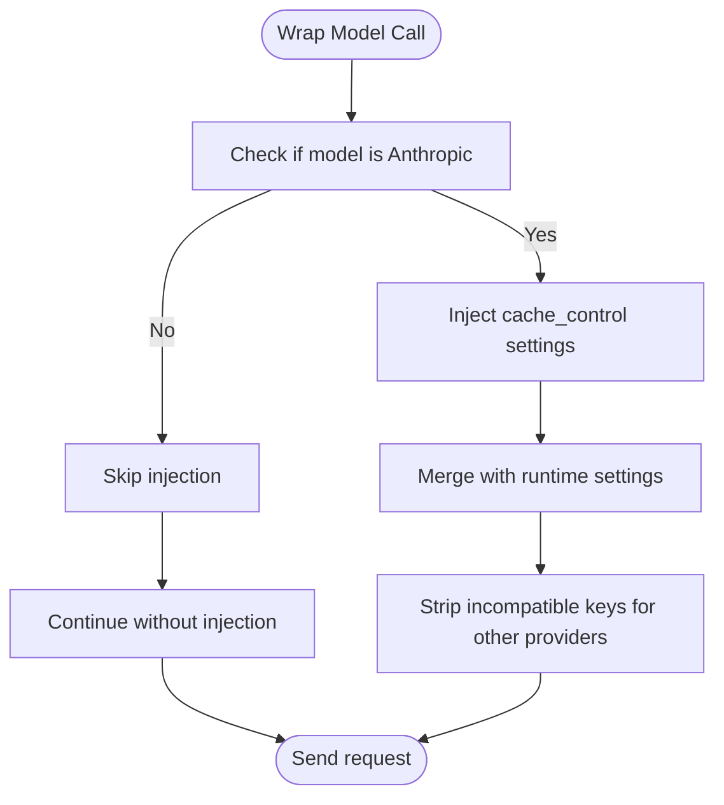
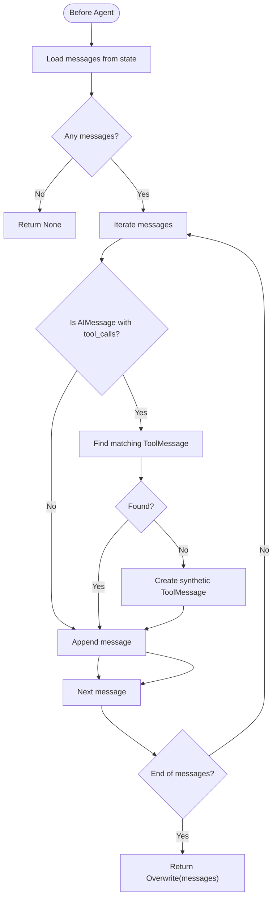
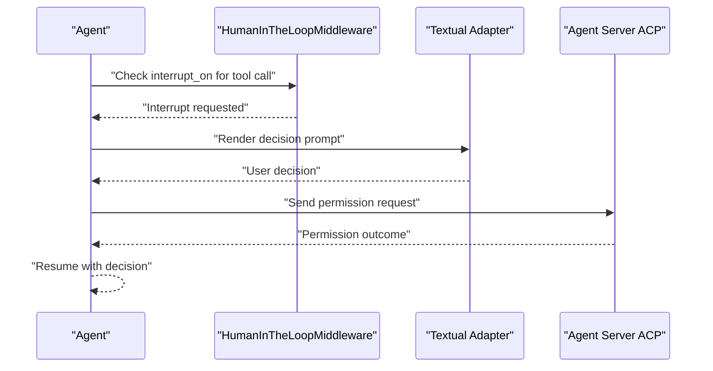
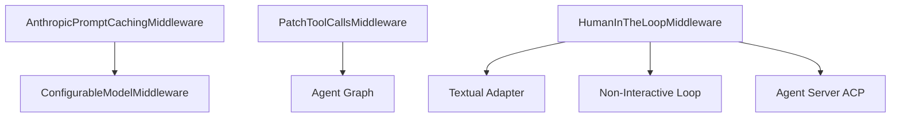

# Specialized Middleware

<cite>
**Referenced Files in This Document**
- [patch_tool_calls.py](file://libs/deepagents/deepagents/middleware/patch_tool_calls.py)
- [test_middleware.py](file://libs/deepagents/tests/unit_tests/test_middleware.py)
- [graph.py](file://libs/deepagents/deepagents/graph.py)
- [configurable_model.py](file://libs/cli/deepagents_cli/configurable_model.py)
- [textual_adapter.py](file://libs/cli/deepagents_cli/textual_adapter.py)
- [non_interactive.py](file://libs/cli/deepagents_cli/non_interactive.py)
- [server.py](file://libs/acp/deepagents_acp/server.py)
- [test_agent.py](file://libs/acp/tests/test_agent.py)
</cite>

## Table of Contents
1. [Introduction](#introduction)
2. [Project Structure](#project-structure)
3. [Core Components](#core-components)
4. [Architecture Overview](#architecture-overview)
5. [Detailed Component Analysis](#detailed-component-analysis)
6. [Dependency Analysis](#dependency-analysis)
7. [Performance Considerations](#performance-considerations)
8. [Troubleshooting Guide](#troubleshooting-guide)
9. [Conclusion](#conclusion)

## Introduction
This document explains three specialized middleware components in DeepAgents that enhance agent behavior and reliability:
- AnthropicPromptCachingMiddleware: Provider-specific middleware for Anthropic models that integrates prompt caching to reduce latency and cost.
- PatchToolCallsMiddleware: Middleware that detects and patches missing tool call responses in the message history to maintain coherent agent reasoning.
- HumanInTheLoopMiddleware: Middleware that enables interactive control and human feedback integration, allowing users to approve or reject tool calls mid-conversation.

These components are designed to be integrated into the middleware stack around the core DeepAgents middleware, with specific placement and configuration requirements to ensure optimal behavior.

## Project Structure
The specialized middleware components are part of the DeepAgents middleware package and integrate with the broader agent runtime and CLI tooling:
- AnthropicPromptCachingMiddleware is recognized by the CLI as a provider-specific middleware that injects cache-control settings and strips incompatible keys when switching providers.
- PatchToolCallsMiddleware is included in the middleware ordering documented in the agent graph creation logic.
- HumanInTheLoopMiddleware integrates with the CLI’s interactive and non-interactive execution loops and the ACP server for permission handling.

**Diagram sources**
- [graph.py:140-164](file://libs/deepagents/deepagents/graph.py#L140-L164)
- [configurable_model.py:44-84](file://libs/cli/deepagents_cli/configurable_model.py#L44-L84)
- [textual_adapter.py:388-423](file://libs/cli/deepagents_cli/textual_adapter.py#L388-L423)
- [non_interactive.py:599-671](file://libs/cli/deepagents_cli/non_interactive.py#L599-L671)
- [server.py:615-642](file://libs/acp/deepagents_acp/server.py#L615-L642)

**Section sources**
- [graph.py:140-164](file://libs/deepagents/deepagents/graph.py#L140-L164)
- [configurable_model.py:44-84](file://libs/cli/deepagents_cli/configurable_model.py#L44-L84)

## Core Components
This section documents each specialized middleware, including purpose, configuration, and integration patterns.

### AnthropicPromptCachingMiddleware
Purpose:
- Provides Anthropic-specific prompt caching behavior by injecting cache-control settings into model requests and ensuring incompatible keys are stripped when switching providers.

Key behaviors:
- Injects cache-control settings for Anthropic models.
- Strips keys not accepted by other providers to avoid errors during cross-provider swaps.
- Works alongside the configurable model middleware to manage model overrides and settings merging.

Configuration requirements:
- Requires an Anthropic model to be active.
- Settings like cache_control are only valid for Anthropic and must be removed when switching to other providers.

Integration patterns:
- Placed before MemoryMiddleware in the middleware stack order.
- Used in conjunction with the configurable model middleware to apply runtime overrides and strip incompatible keys.

Use cases:
- Reduce latency and cost when reusing similar prompts with Anthropic models.
- Maintain compatibility when swapping models across providers.

**Section sources**
- [configurable_model.py:44-84](file://libs/cli/deepagents_cli/configurable_model.py#L44-L84)
- [graph.py:140-164](file://libs/deepagents/deepagents/graph.py#L140-L164)

### PatchToolCallsMiddleware
Purpose:
- Detects dangling tool calls in the message history and ensures a corresponding ToolMessage exists for each AIMessage tool call. If missing, it synthesizes a ToolMessage to preserve reasoning continuity.

Key behaviors:
- Iterates through messages and identifies AIMessage entries with tool calls.
- Checks whether a ToolMessage with the matching tool_call_id exists later in the history.
- If absent, appends a synthetic ToolMessage indicating cancellation or lack of completion.

Configuration requirements:
- No explicit configuration required; operates on existing message history.

Integration patterns:
- Included in the middleware ordering documented in the agent graph creation.
- Works with the core agent runtime to normalize message sequences before agent execution.

Use cases:
- Prevents reasoning breakdown when tool calls are interrupted or messages are reordered.
- Ensures consistent tool call resolution across complex conversational flows.

**Section sources**
- [patch_tool_calls.py:11-45](file://libs/deepagents/deepagents/middleware/patch_tool_calls.py#L11-L45)
- [test_middleware.py:1725-1834](file://libs/deepagents/tests/unit_tests/test_middleware.py#L1725-L1834)
- [graph.py:140-164](file://libs/deepagents/deepagents/graph.py#L140-L164)

### HumanInTheLoopMiddleware
Purpose:
- Enables interactive control by interrupting the agent when tool calls require human approval. It integrates with the CLI’s interactive and non-interactive loops and the ACP server for permission handling.

Key behaviors:
- Triggers interrupts for specific tool calls based on configuration.
- Supports approval or rejection decisions from users or external systems.
- Integrates with the agent runtime to resume execution after receiving decisions.

Configuration requirements:
- Configure interrupt_on to specify which tool calls should trigger interruptions.
- Support for auto-approval policies and iteration limits to prevent runaway retries.

Integration patterns:
- Used in CLI interactive flows via the textual adapter and non-interactive loop.
- Integrated with the ACP server for permission handling and session management.

Use cases:
- Safeguard high-risk tool calls (e.g., file writes, system commands).
- Enable human oversight in automated agents for compliance and safety.

**Section sources**
- [textual_adapter.py:388-423](file://libs/cli/deepagents_cli/textual_adapter.py#L388-L423)
- [non_interactive.py:599-671](file://libs/cli/deepagents_cli/non_interactive.py#L599-L671)
- [server.py:615-642](file://libs/acp/deepagents_acp/server.py#L615-L642)
- [test_agent.py:522-561](file://libs/acp/tests/test_agent.py#L522-L561)

## Architecture Overview
The specialized middleware components fit into the broader agent middleware stack and runtime orchestration:

**Diagram sources**
- [graph.py:140-164](file://libs/deepagents/deepagents/graph.py#L140-L164)
- [configurable_model.py:44-84](file://libs/cli/deepagents_cli/configurable_model.py#L44-L84)
- [textual_adapter.py:388-423](file://libs/cli/deepagents_cli/textual_adapter.py#L388-L423)
- [non_interactive.py:599-671](file://libs/cli/deepagents_cli/non_interactive.py#L599-L671)

## Detailed Component Analysis

### AnthropicPromptCachingMiddleware
Implementation highlights:
- Recognizes Anthropic models and injects cache-control settings.
- Strips incompatible keys during cross-provider swaps to maintain compatibility.

**Diagram sources**
- [configurable_model.py:44-84](file://libs/cli/deepagents_cli/configurable_model.py#L44-L84)

**Section sources**
- [configurable_model.py:44-84](file://libs/cli/deepagents_cli/configurable_model.py#L44-L84)

### PatchToolCallsMiddleware
Processing logic:
- Iterates through messages to detect AIMessage entries with tool calls.
- Validates presence of corresponding ToolMessage entries.
- Synthesizes ToolMessage entries for missing tool call responses.

**Diagram sources**
- [patch_tool_calls.py:14-44](file://libs/deepagents/deepagents/middleware/patch_tool_calls.py#L14-L44)

**Section sources**
- [patch_tool_calls.py:11-45](file://libs/deepagents/deepagents/middleware/patch_tool_calls.py#L11-L45)
- [test_middleware.py:1725-1834](file://libs/deepagents/tests/unit_tests/test_middleware.py#L1725-L1834)

### HumanInTheLoopMiddleware
Execution flow:
- Triggers interrupts for configured tool calls.
- Collects user or external approvals/rejections.
- Resumes agent execution with decisions.

**Diagram sources**
- [textual_adapter.py:388-423](file://libs/cli/deepagents_cli/textual_adapter.py#L388-L423)
- [non_interactive.py:599-671](file://libs/cli/deepagents_cli/non_interactive.py#L599-L671)
- [server.py:615-642](file://libs/acp/deepagents_acp/server.py#L615-L642)
- [test_agent.py:522-561](file://libs/acp/tests/test_agent.py#L522-L561)

**Section sources**
- [textual_adapter.py:388-423](file://libs/cli/deepagents_cli/textual_adapter.py#L388-L423)
- [non_interactive.py:599-671](file://libs/cli/deepagents_cli/non_interactive.py#L599-L671)
- [server.py:615-642](file://libs/acp/deepagents_acp/server.py#L615-L642)
- [test_agent.py:522-561](file://libs/acp/tests/test_agent.py#L522-L561)

## Dependency Analysis
Relationships among specialized middleware and core components:
- AnthropicPromptCachingMiddleware depends on provider detection and model settings merging.
- PatchToolCallsMiddleware relies on message history normalization and agent state updates.
- HumanInTheLoopMiddleware interacts with CLI adapters and ACP servers for permission handling.

**Diagram sources**
- [configurable_model.py:44-84](file://libs/cli/deepagents_cli/configurable_model.py#L44-L84)
- [graph.py:140-164](file://libs/deepagents/deepagents/graph.py#L140-L164)
- [textual_adapter.py:388-423](file://libs/cli/deepagents_cli/textual_adapter.py#L388-L423)
- [non_interactive.py:599-671](file://libs/cli/deepagents_cli/non_interactive.py#L599-L671)
- [server.py:615-642](file://libs/acp/deepagents_acp/server.py#L615-L642)

**Section sources**
- [configurable_model.py:44-84](file://libs/cli/deepagents_cli/configurable_model.py#L44-L84)
- [graph.py:140-164](file://libs/deepagents/deepagents/graph.py#L140-L164)
- [textual_adapter.py:388-423](file://libs/cli/deepagents_cli/textual_adapter.py#L388-L423)
- [non_interactive.py:599-671](file://libs/cli/deepagents_cli/non_interactive.py#L599-L671)
- [server.py:615-642](file://libs/acp/deepagents_acp/server.py#L615-L642)

## Performance Considerations
- AnthropicPromptCachingMiddleware reduces repeated prompt processing costs and latency by leveraging cached results when applicable.
- PatchToolCallsMiddleware adds minimal overhead by scanning message history and appending synthetic ToolMessage entries only when necessary.
- HumanInTheLoopMiddleware introduces interactive pauses; configure interrupt_on carefully to minimize unnecessary interruptions and iteration limits to prevent excessive retries.

## Troubleshooting Guide
Common issues and resolutions:
- Anthropic cache-control stripping: Ensure incompatible keys are stripped when switching providers to avoid runtime errors.
- Dangling tool calls: Verify PatchToolCallsMiddleware is enabled to prevent reasoning breakdowns caused by missing ToolMessage entries.
- HITL iteration limits: Monitor and adjust iteration limits to prevent runaway retries when users reject repeated commands.

**Section sources**
- [configurable_model.py:44-84](file://libs/cli/deepagents_cli/configurable_model.py#L44-L84)
- [test_middleware.py:1725-1834](file://libs/deepagents/tests/unit_tests/test_middleware.py#L1725-L1834)
- [non_interactive.py:599-671](file://libs/cli/deepagents_cli/non_interactive.py#L599-L671)

## Conclusion
AnthropicPromptCachingMiddleware, PatchToolCallsMiddleware, and HumanInTheLoopMiddleware provide targeted enhancements to agent reliability, performance, and safety. Integrate them according to the documented middleware ordering and configuration requirements to achieve robust, interactive, and efficient agent behavior.