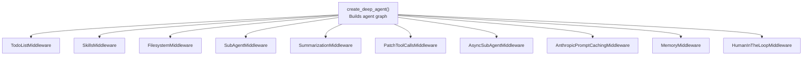
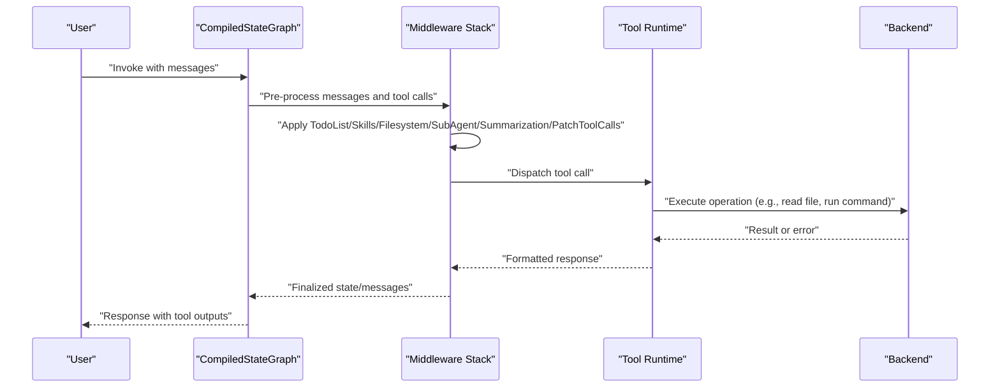
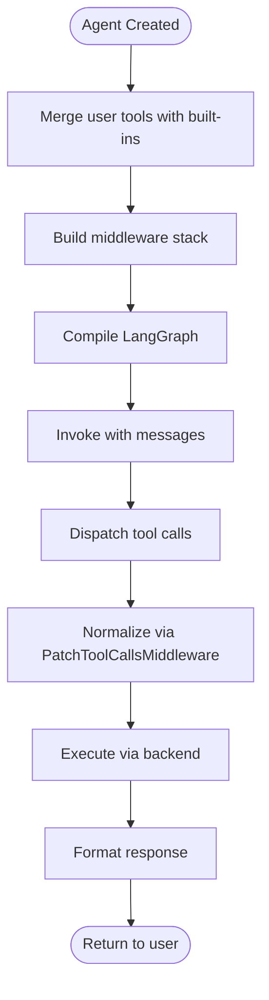
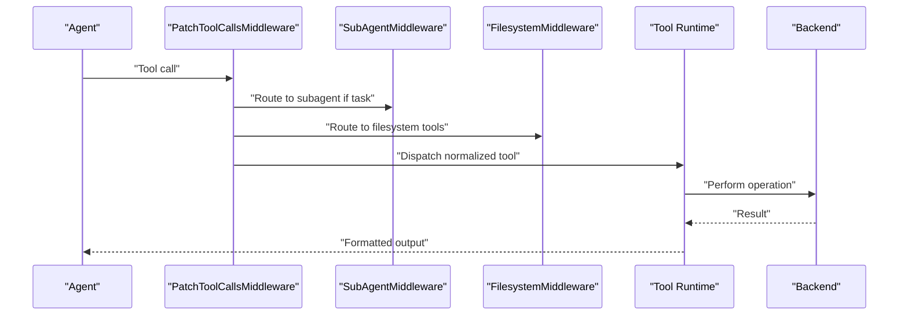
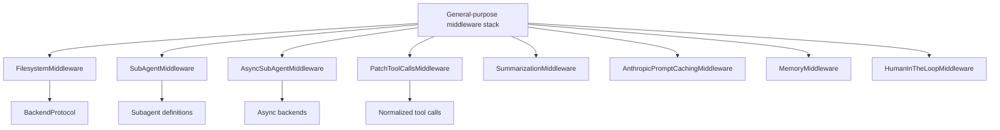

# Tool System & Registry

<cite>
**Referenced Files in This Document**
- [README.md](file://README.md)
- [graph.py](file://libs/deepagents/deepagents/graph.py)
- [__init__.py](file://libs/deepagents/deepagents/__init__.py)
- [filesystem.py](file://libs/deepagents/deepagents/middleware/filesystem.py)
- [subagents.py](file://libs/deepagents/deepagents/middleware/subagents.py)
- [async_subagents.py](file://libs/deepagents/deepagents/middleware/async_subagents.py)
- [patch_tool_calls.py](file://libs/deepagents/deepagents/middleware/patch_tool_calls.py)
- [memory.py](file://libs/deepagents/deepagents/middleware/memory.py)
- [skills.py](file://libs/deepagents/deepagents/middleware/skills.py)
- [summarization.py](file://libs/deepagents/deepagents/middleware/summarization.py)
- [backend_protocol.py](file://libs/deepagents/deepagents/backends/protocol.py)
- [backend_state.py](file://libs/deepagents/deepagents/backends/state.py)
- [backend_filesystem.py](file://libs/deepagents/deepagents/backends/filesystem.py)
- [system_prompt.md](file://libs/cli/deepagents_cli/system_prompt.md)
- [test_deepagent.py](file://libs/deepagents/tests/integration_tests/test_deepagents.py)
- [test_async_subagents.py](file://libs/deepagents/tests/unit_tests/test_async_subagents.py)
</cite>

## Table of Contents
1. [Introduction](#introduction)
2. [Project Structure](#project-structure)
3. [Core Components](#core-components)
4. [Architecture Overview](#architecture-overview)
5. [Detailed Component Analysis](#detailed-component-analysis)
6. [Dependency Analysis](#dependency-analysis)
7. [Performance Considerations](#performance-considerations)
8. [Troubleshooting Guide](#troubleshooting-guide)
9. [Conclusion](#conclusion)
10. [Appendices](#appendices)

## Introduction
This document explains DeepAgents’ tool system and registry, focusing on how tools are registered and invoked within the agent framework. It covers built-in tools (write_todos, file operations, execute, task), the tool calling mechanism, integration with the LangGraph runtime, validation, error handling, response formatting, and security considerations. It also provides guidance for creating custom tools, registering them, and leveraging the tool patching system.

Key capabilities described in the project overview include planning, filesystem operations, shell command execution (with sandboxing), and subagent delegation. The agent integrates seamlessly with LangGraph, enabling streaming, persistence, and checkpointing.

**Section sources**
- [README.md:24-34](file://README.md#L24-L34)
- [README.md:86-88](file://README.md#L86-L88)
- [README.md:123-126](file://README.md#L123-L126)

## Project Structure
The tool system is centered around the agent creation function and a set of middleware that provide tool-related capabilities. The middleware stack composes:
- Planning and todo management
- Filesystem operations
- Subagent orchestration (sync and async)
- Summarization and caching
- Tool call patching
- Human-in-the-loop and memory integrations

**Diagram sources**
- [graph.py:207-302](file://libs/deepagents/deepagents/graph.py#L207-L302)

**Section sources**
- [graph.py:83-333](file://libs/deepagents/deepagents/graph.py#L83-L333)
- [__init__.py:10-21](file://libs/deepagents/deepagents/__init__.py#L10-L21)

## Core Components
- Tool registration: Tools passed to create_deep_agent are combined with built-in tools and middleware-provided capabilities. The resulting tool set is supplied to the underlying agent runtime.
- Tool calling: Tools are invoked via LangGraph’s compiled graph. The PatchToolCallsMiddleware ensures tool calls are normalized and routed appropriately.
- Built-in tools overview:
  - Planning: write_todos
  - Filesystem: ls, read_file, write_file, edit_file, glob, grep
  - Shell: execute (requires sandbox backend)
  - Subagents: task (delegation to sync or async subagents)
- Middleware orchestration: FilesystemMiddleware, SubAgentMiddleware, AsyncSubAgentMiddleware, and PatchToolCallsMiddleware coordinate tool execution and context.

**Section sources**
- [graph.py:106-115](file://libs/deepagents/deepagents/graph.py#L106-L115)
- [graph.py:312-332](file://libs/deepagents/deepagents/graph.py#L312-L332)

## Architecture Overview
The agent graph is constructed with a layered middleware stack. Each middleware augments tool availability, validation, and execution semantics. The PatchToolCallsMiddleware plays a central role in normalizing tool calls before they reach the underlying tool implementations.

**Diagram sources**
- [graph.py:207-302](file://libs/deepagents/deepagents/graph.py#L207-L302)
- [patch_tool_calls.py](file://libs/deepagents/deepagents/middleware/patch_tool_calls.py)

## Detailed Component Analysis

### Tool Registration and Invocation
- Registration: Tools are provided to create_deep_agent via the tools parameter. These are merged with built-in capabilities enabled by middleware (e.g., FilesystemMiddleware adds filesystem tools; SubAgentMiddleware exposes task).
- Invocation: The agent’s compiled graph routes tool calls through the middleware stack. PatchToolCallsMiddleware ensures consistent tool call semantics and routing.
- LangGraph integration: The returned graph supports streaming, persistence, and checkpointing.

**Diagram sources**
- [graph.py:83-333](file://libs/deepagents/deepagents/graph.py#L83-L333)
- [patch_tool_calls.py](file://libs/deepagents/deepagents/middleware/patch_tool_calls.py)

**Section sources**
- [graph.py:83-333](file://libs/deepagents/deepagents/graph.py#L83-L333)

### Built-in Tools: Planning (write_todos)
- Purpose: Manage a todo list for complex objectives, enabling progress tracking and step completion.
- Usage guidance: Prefer write_todos for multi-step tasks; mark items as in_progress before starting and completed immediately after finishing. Avoid batching completions.
- Integration: Provided by TodoListMiddleware and surfaced through the agent’s tool set.

Best practices:
- Use write_todos for tasks with two or more steps.
- Confirm plans with the user before execution begins.
- Keep the list updated as subtasks emerge.

**Section sources**
- [README.md:28](file://README.md#L28)
- [system_prompt.md:224-239](file://libs/cli/deepagents_cli/system_prompt.md#L224-L239)

### Built-in Tools: Filesystem Operations (ls, read_file, write_file, edit_file, glob, grep)
- Purpose: Read, write, and search files; enumerate directories; pattern-based matching.
- Implementation: Provided by FilesystemMiddleware, which binds filesystem operations to the agent’s tool set.
- Backend integration: Uses the configured backend (StateBackend or FilesystemBackend) to perform operations.

Validation and error handling:
- Parameter validation occurs at the middleware boundary.
- Errors propagate as tool call errors to the agent runtime.

Response formatting:
- Results are formatted consistently for downstream consumption.

**Section sources**
- [README.md:29](file://README.md#L29)
- [filesystem.py](file://libs/deepagents/deepagents/middleware/filesystem.py)

### Built-in Tools: Shell Execution (execute)
- Purpose: Run shell commands.
- Security: Only available when the backend implements sandboxing. Non-sandbox backends will return an error for execute.
- Backend requirement: Requires a backend implementing SandboxBackendProtocol.

**Section sources**
- [README.md:30](file://README.md#L30)
- [graph.py:113-114](file://libs/deepagents/deepagents/graph.py#L113-L114)
- [backend_protocol.py](file://libs/deepagents/deepagents/backends/protocol.py)

### Built-in Tools: Subagent Delegation (task)
- Purpose: Delegate work to configured subagents (sync or async).
- Sync subagents: Defined declaratively or pre-compiled; invoked via SubAgentMiddleware.
- Async subagents: Background tasks managed by AsyncSubAgentMiddleware; launched and tracked asynchronously.
- Task lifecycle: Creation, status tracking, cancellation, and listing are handled by the async subagent tools.

Integration points:
- SubAgentMiddleware and AsyncSubAgentMiddleware coordinate task routing and execution.
- Tests demonstrate task tool usage and subagent selection.

**Section sources**
- [README.md:31](file://README.md#L31)
- [subagents.py](file://libs/deepagents/deepagents/middleware/subagents.py)
- [async_subagents.py](file://libs/deepagents/deepagents/middleware/async_subagents.py)
- [test_deepagent.py:59-87](file://libs/deepagents/tests/integration_tests/test_deepagents.py#L59-L87)
- [test_async_subagents.py:47-88](file://libs/deepagents/tests/unit_tests/test_async_subagents.py#L47-L88)

### Tool Calling Mechanism and LangGraph Integration
- Normalization: PatchToolCallsMiddleware ensures tool calls are normalized and routed consistently.
- Middleware ordering: The middleware stack is carefully ordered to ensure proper preprocessing, validation, and postprocessing.
- Graph compilation: The agent is compiled via create_agent and extended with metadata and recursion limits.

**Diagram sources**
- [graph.py:207-302](file://libs/deepagents/deepagents/graph.py#L207-L302)
- [patch_tool_calls.py](file://libs/deepagents/deepagents/middleware/patch_tool_calls.py)

**Section sources**
- [graph.py:207-302](file://libs/deepagents/deepagents/graph.py#L207-L302)

### Tool Parameter Validation, Error Handling, and Response Formatting
- Validation: Middleware enforces parameter validation and sanitization before tool execution.
- Error handling: Errors are propagated back as tool call errors, allowing the agent to recover or escalate.
- Response formatting: Results are normalized for consistent downstream consumption.

**Section sources**
- [filesystem.py](file://libs/deepagents/deepagents/middleware/filesystem.py)
- [patch_tool_calls.py](file://libs/deepagents/deepagents/middleware/patch_tool_calls.py)

### Creating Custom Tools and Registering Them
- Registration: Provide tools to create_deep_agent via the tools parameter. These tools are merged with built-in capabilities.
- Integration: Custom tools integrate seamlessly with the middleware stack and backend.
- Best practices:
  - Validate inputs early.
  - Return structured outputs suitable for the agent’s downstream processing.
  - Consider sandboxing for tools that access the filesystem or execute commands.

**Section sources**
- [graph.py:131-134](file://libs/deepagents/deepagents/graph.py#L131-L134)

### Tool Patching System
- Role: PatchToolCallsMiddleware normalizes tool calls, ensuring consistent semantics across different tool types and middleware.
- Benefits: Simplifies tool invocation, improves reliability, and reduces ambiguity in tool call routing.

**Section sources**
- [patch_tool_calls.py](file://libs/deepagents/deepagents/middleware/patch_tool_calls.py)

### Security Considerations and Sandboxing
- Trust model: Deep Agents follows a “trust the LLM” model. Boundaries should be enforced at the tool and sandbox level.
- Sandboxing: The execute tool requires a sandbox-capable backend. Non-sandbox backends will reject execute calls.
- Recommendations:
  - Restrict execute usage to trusted environments.
  - Use sandbox backends for any tool that executes commands or accesses the filesystem.
  - Apply human-in-the-loop approvals for sensitive tool calls.

**Section sources**
- [README.md:123-126](file://README.md#L123-L126)
- [graph.py:113-114](file://libs/deepagents/deepagents/graph.py#L113-L114)
- [backend_protocol.py](file://libs/deepagents/deepagents/backends/protocol.py)

## Dependency Analysis
The tool system relies on a layered middleware architecture. Dependencies include:
- Middleware dependencies: FilesystemMiddleware depends on the backend protocol; SubAgentMiddleware and AsyncSubAgentMiddleware depend on subagent definitions and optional async backends.
- Tool patching: PatchToolCallsMiddleware depends on tool call normalization logic.
- Summarization and caching: SummarizationMiddleware and AnthropicPromptCachingMiddleware depend on model and backend capabilities.

**Diagram sources**
- [graph.py:207-302](file://libs/deepagents/deepagents/graph.py#L207-L302)
- [backend_protocol.py](file://libs/deepagents/deepagents/backends/protocol.py)

**Section sources**
- [graph.py:207-302](file://libs/deepagents/deepagents/graph.py#L207-L302)

## Performance Considerations
- Middleware ordering: Proper ordering minimizes redundant processing and improves throughput.
- Summarization: SummarizationMiddleware helps manage long contexts, reducing token usage.
- Caching: AnthropicPromptCachingMiddleware leverages caching where supported.
- Async subagents: Offloads long-running tasks to background workers, improving responsiveness.

[No sources needed since this section provides general guidance]

## Troubleshooting Guide
Common issues and resolutions:
- execute tool failing: Ensure the backend implements sandboxing. Non-sandbox backends will reject execute calls.
- Subagent task not found: Verify subagent definitions and names; ensure general-purpose subagent is configured if needed.
- Tool call errors: Inspect middleware logs and backend responses for validation failures or permission issues.
- Async subagent tasks stuck: Check async subagent middleware configuration and task tracking.

**Section sources**
- [graph.py:113-114](file://libs/deepagents/deepagents/graph.py#L113-L114)
- [test_deepagent.py:59-87](file://libs/deepagents/tests/integration_tests/test_deepagents.py#L59-L87)
- [test_async_subagents.py:47-88](file://libs/deepagents/tests/unit_tests/test_async_subagents.py#L47-L88)

## Conclusion
DeepAgents provides a robust, middleware-driven tool system integrated with LangGraph. Built-in tools cover planning, filesystem operations, shell execution (with sandboxing), and subagent delegation. The PatchToolCallsMiddleware ensures consistent tool call semantics, while middleware orchestration handles validation, error handling, and response formatting. Security is enforced at the tool and sandbox level, with human-in-the-loop controls available for sensitive operations.

[No sources needed since this section summarizes without analyzing specific files]

## Appendices

### Appendix A: Tool Categories and Responsibilities
- Planning: write_todos
- Filesystem: ls, read_file, write_file, edit_file, glob, grep
- Shell: execute (sandbox required)
- Subagents: task (sync and async)

**Section sources**
- [README.md:28-31](file://README.md#L28-L31)

### Appendix B: Middleware Reference
- TodoListMiddleware: Planning and todo management
- FilesystemMiddleware: Filesystem operations
- SubAgentMiddleware: Sync subagent orchestration
- AsyncSubAgentMiddleware: Async subagent orchestration
- PatchToolCallsMiddleware: Tool call normalization
- SummarizationMiddleware: Context summarization
- MemoryMiddleware: Persistent memory
- SkillsMiddleware: Skill loading
- HumanInTheLoopMiddleware: Approval gating
- AnthropicPromptCachingMiddleware: Prompt caching

**Section sources**
- [graph.py:207-302](file://libs/deepagents/deepagents/graph.py#L207-L302)