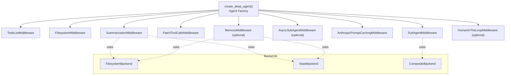
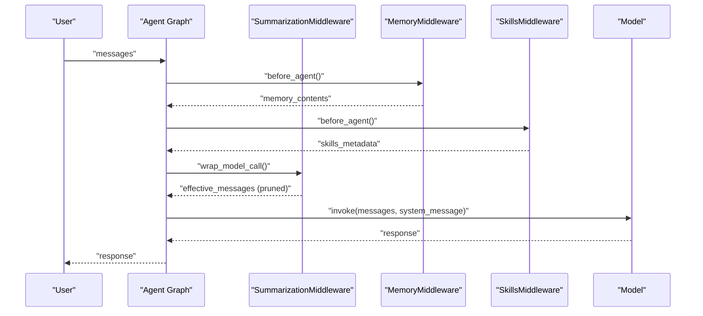
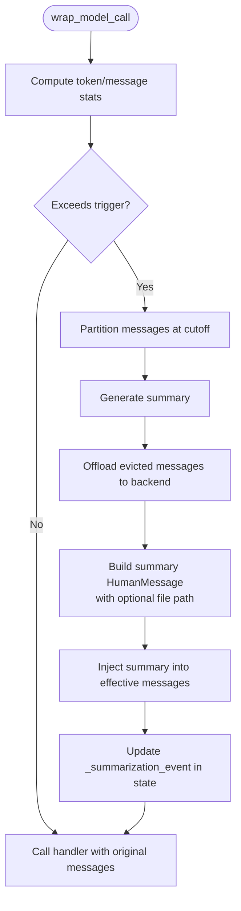
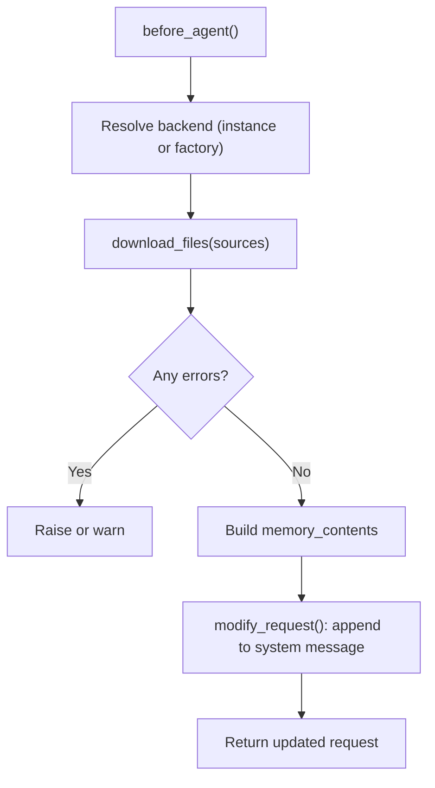
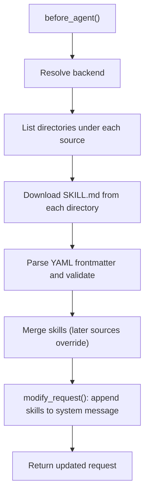
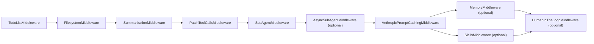

# Context Management & Memory

<cite>
**Referenced Files in This Document**
- [README.md](file://README.md)
- [graph.py](file://libs/deepagents/deepagents/graph.py)
- [summarization.py](file://libs/deepagents/deepagents/middleware/summarization.py)
- [_utils.py](file://libs/deepagents/deepagents/middleware/_utils.py)
- [memory.py](file://libs/deepagents/deepagents/middleware/memory.py)
- [skills.py](file://libs/deepagents/deepagents/middleware/skills.py)
- [__init__.py](file://libs/deepagents/deepagents/backends/__init__.py)
- [test_summarization_middleware.py](file://libs/deepagents/tests/unit_tests/middleware/test_summarization_middleware.py)
</cite>

## Table of Contents
1. [Introduction](#introduction)
2. [Project Structure](#project-structure)
3. [Core Components](#core-components)
4. [Architecture Overview](#architecture-overview)
5. [Detailed Component Analysis](#detailed-component-analysis)
6. [Dependency Analysis](#dependency-analysis)
7. [Performance Considerations](#performance-considerations)
8. [Troubleshooting Guide](#troubleshooting-guide)
9. [Conclusion](#conclusion)
10. [Appendices](#appendices)

## Introduction
This document explains DeepAgents’ context management and memory systems. It covers:
- Intelligent conversation summarization and offloading
- Persistent memory via AGENTS.md files
- Domain skills loading and progressive disclosure
- Automatic context window management, memory compression, and retrieval strategies
- Integration with external memory stores and state management patterns
- Practical examples for long conversations, knowledge bases, and custom memory strategies
- Performance optimization and best practices

## Project Structure
DeepAgents composes a LangGraph-based agent with middleware for planning, filesystem access, subagents, summarization, tool patching, skills, and memory. The agent creation function wires these components into a cohesive runtime.

**Diagram sources**
- [graph.py:83-333](file://libs/deepagents/deepagents/graph.py#L83-L333)
- [__init__.py:1-27](file://libs/deepagents/deepagents/backends/__init__.py#L1-L27)

**Section sources**
- [README.md:24-36](file://README.md#L24-L36)
- [graph.py:83-333](file://libs/deepagents/deepagents/graph.py#L83-L333)

## Core Components
- SummarizationMiddleware: Automatically prunes long histories, generates summaries, and offloads evicted messages to a backend for retrieval.
- MemoryMiddleware: Loads persistent knowledge from AGENTS.md files and injects them into the system prompt.
- SkillsMiddleware: Progressive disclosure of domain skills from backend sources, enabling specialized knowledge without bloating context.
- Backends: Pluggable storage (filesystem, state, composite) used by middleware for persistence and retrieval.

**Section sources**
- [graph.py:26-35](file://libs/deepagents/deepagents/graph.py#L26-L35)
- [graph.py:298-299](file://libs/deepagents/deepagents/graph.py#L298-L299)
- [memory.py:159-355](file://libs/deepagents/deepagents/middleware/memory.py#L159-L355)
- [skills.py:602-800](file://libs/deepagents/deepagents/middleware/skills.py#L602-L800)
- [summarization.py:203-800](file://libs/deepagents/deepagents/middleware/summarization.py#L203-L800)

## Architecture Overview
The agent pipeline integrates middleware in a specific order to ensure context remains manageable and knowledge is consistently available. Summarization runs early to cap context growth; skills and memory are injected into the system prompt to guide behavior without increasing token usage.

**Diagram sources**
- [graph.py:270-301](file://libs/deepagents/deepagents/graph.py#L270-L301)
- [memory.py:238-321](file://libs/deepagents/deepagents/middleware/memory.py#L238-L321)
- [skills.py:708-728](file://libs/deepagents/deepagents/middleware/skills.py#L708-L728)
- [summarization.py:463-517](file://libs/deepagents/deepagents/middleware/summarization.py#L463-L517)

## Detailed Component Analysis

### Summarization Middleware
SummarizationMiddleware maintains a sliding window of conversation history and proactively summarizes older turns when thresholds are exceeded. It:
- Computes thresholds from model profiles or defaults
- Partitions messages around a cutoff index
- Generates a summary and replaces the evicted segment with a concise HumanMessage
- Offloads the evicted messages to a backend file per thread for later retrieval
- Supports argument truncation for large tool-call arguments to reduce token usage before full summarization

**Diagram sources**
- [summarization.py:307-330](file://libs/deepagents/deepagents/middleware/summarization.py#L307-L330)
- [summarization.py:315-326](file://libs/deepagents/deepagents/middleware/summarization.py#L315-L326)
- [summarization.py:327-330](file://libs/deepagents/deepagents/middleware/summarization.py#L327-L330)
- [summarization.py:463-517](file://libs/deepagents/deepagents/middleware/summarization.py#L463-L517)
- [summarization.py:714-787](file://libs/deepagents/deepagents/middleware/summarization.py#L714-L787)

Key behaviors and configuration:
- Thresholds: messages, tokens, or fraction of model’s max input tokens
- Retention: number of recent messages or tokens to keep
- Argument truncation: reduces size of tool-call args in older AIMessages before summarization
- Offload path: per-thread markdown file under a configurable prefix
- State integration: stores the most recent summarization event for reconstructing effective messages

Integration points:
- Uses LangChain’s summarization helper for core logic
- Resolves backend via factory or instance
- Reads thread_id from LangGraph config for per-session persistence

**Section sources**
- [summarization.py:163-201](file://libs/deepagents/deepagents/middleware/summarization.py#L163-L201)
- [summarization.py:203-291](file://libs/deepagents/deepagents/middleware/summarization.py#L203-L291)
- [summarization.py:331-397](file://libs/deepagents/deepagents/middleware/summarization.py#L331-L397)
- [summarization.py:415-462](file://libs/deepagents/deepagents/middleware/summarization.py#L415-L462)
- [summarization.py:518-545](file://libs/deepagents/deepagents/middleware/summarization.py#L518-L545)
- [summarization.py:546-624](file://libs/deepagents/deepagents/middleware/summarization.py#L546-L624)
- [summarization.py:653-713](file://libs/deepagents/deepagents/middleware/summarization.py#L653-L713)
- [summarization.py:714-787](file://libs/deepagents/deepagents/middleware/summarization.py#L714-L787)
- [summarization.py:788-800](file://libs/deepagents/deepagents/middleware/summarization.py#L788-L800)

### Memory Middleware (AGENTS.md)
MemoryMiddleware loads persistent knowledge from AGENTS.md files and injects them into the system prompt. It:
- Loads multiple sources in order, combining content
- Prevents reloading if already present in state
- Formats memory with location headers and wraps with a dedicated section
- Appends guidelines for when and how to update memory

**Diagram sources**
- [memory.py:238-321](file://libs/deepagents/deepagents/middleware/memory.py#L238-L321)
- [memory.py:322-355](file://libs/deepagents/deepagents/middleware/memory.py#L322-L355)

Guidelines and patterns:
- Memory is always loaded and injected; unlike skills, it is not on-demand
- Encourages updating memory via the edit_file tool to evolve knowledge over time
- Supports both sync and async loading

**Section sources**
- [memory.py:159-355](file://libs/deepagents/deepagents/middleware/memory.py#L159-L355)

### Skills Middleware (Progressive Disclosure)
SkillsMiddleware loads domain-specific capabilities from backend sources and progressively reveals their documentation:
- Lists skills from each source, parsing YAML frontmatter from SKILL.md
- Applies last-wins precedence across sources
- Builds a system prompt section with locations, metadata, and full-path references
- Supports both sync and async loading

**Diagram sources**
- [skills.py:708-728](file://libs/deepagents/deepagents/middleware/skills.py#L708-L728)
- [skills.py:730-765](file://libs/deepagents/deepagents/middleware/skills.py#L730-L765)
- [skills.py:766-800](file://libs/deepagents/deepagents/middleware/skills.py#L766-L800)

Constraints and safety:
- Validates skill names and descriptions per specification
- Limits file sizes and sanitizes metadata
- Allows optional allowed-tools hints

**Section sources**
- [skills.py:602-800](file://libs/deepagents/deepagents/middleware/skills.py#L602-L800)

### Backends and Persistence
DeepAgents relies on a pluggable backend abstraction:
- FilesystemBackend: reads/writes from a root directory
- StateBackend: ephemeral in-memory storage
- CompositeBackend: routes paths to different backends
- StoreBackend: structured key-value storage

These backends are used by summarization and memory middleware to persist conversation history and knowledge.

**Section sources**
- [__init__.py:1-27](file://libs/deepagents/deepagents/backends/__init__.py#L1-L27)
- [summarization.py:331-362](file://libs/deepagents/deepagents/middleware/summarization.py#L331-L362)
- [memory.py:194-217](file://libs/deepagents/deepagents/middleware/memory.py#L194-L217)

## Dependency Analysis
The agent middleware stack is assembled with careful ordering to ensure:
- Summarization runs before caching and memory to keep context bounded
- Skills and memory are injected into the system prompt before model invocation
- Backends are resolved lazily via factories when needed

**Diagram sources**
- [graph.py:270-301](file://libs/deepagents/deepagents/graph.py#L270-L301)

**Section sources**
- [graph.py:26-35](file://libs/deepagents/deepagents/graph.py#L26-L35)
- [graph.py:270-301](file://libs/deepagents/deepagents/graph.py#L270-L301)

## Performance Considerations
- Context trimming and summarization:
  - Prefer fraction-based thresholds for provider/model-aware limits
  - Keep recent messages/tokens to preserve grounding
  - Use argument truncation for large tool-call args to reduce token pressure before full summarization
- Memory injection:
  - Skills and memory are injected into the system prompt; keep sources minimal and focused
  - Use progressive disclosure to avoid overwhelming the model with large documents
- Backend I/O:
  - Offload history asynchronously when possible
  - Use CompositeBackend to route large tool results separately from conversation history
- Token counting:
  - Provide accurate token counters that include tools/system message when applicable
- Caching:
  - Anthropic prompt caching middleware is placed after other middleware to avoid invalidating caches on memory updates

[No sources needed since this section provides general guidance]

## Troubleshooting Guide
Common scenarios and mitigations:
- Summarization not triggering:
  - Verify thresholds and token counter; ensure system message is included in token calculation
  - Confirm thread_id is present in LangGraph config for offload path resolution
- Offload failures:
  - Backend write/edit failures are non-fatal; summarization proceeds without a file path reference
  - Inspect backend permissions and path routing (especially in composite setups)
- Memory not injected:
  - Ensure sources exist and are readable; check for file-not-found errors
  - Confirm before_agent runs and state is not already populated
- Skills not visible:
  - Validate SKILL.md YAML frontmatter and directory naming
  - Confirm sources are ordered correctly and later sources override earlier ones as intended

**Section sources**
- [test_summarization_middleware.py:621-650](file://libs/deepagents/tests/unit_tests/middleware/test_summarization_middleware.py#L621-L650)
- [memory.py:256-271](file://libs/deepagents/deepagents/middleware/memory.py#L256-L271)
- [skills.py:250-353](file://libs/deepagents/deepagents/middleware/skills.py#L250-L353)

## Conclusion
DeepAgents’ context management and memory systems combine automatic summarization, persistent memory, and progressive skills disclosure to maintain long-running, context-sensitive agent behavior. By leveraging provider-aware thresholds, backend offloading, and structured knowledge injection, agents remain efficient, grounded, and capable of evolving knowledge over time.

[No sources needed since this section summarizes without analyzing specific files]

## Appendices

### Examples and Patterns
- Maintaining context across long conversations:
  - Configure summarization thresholds and retention; rely on offloaded history for retrieval
  - Use argument truncation for tool-heavy workflows to delay full summarization
- Managing knowledge bases:
  - Store AGENTS.md files in a dedicated backend; load via MemoryMiddleware
  - Update memory via edit_file to encode lessons learned
- Implementing custom memory strategies:
  - Replace MemoryMiddleware with a custom middleware that injects knowledge from vector stores or structured databases
  - Use backend composition to route different content types to appropriate stores
- Best practices:
  - Keep system prompt concise; rely on injected memory and skills
  - Use fractional thresholds for robustness across providers
  - Place caching middleware after memory updates to avoid cache misses

[No sources needed since this section provides general guidance]