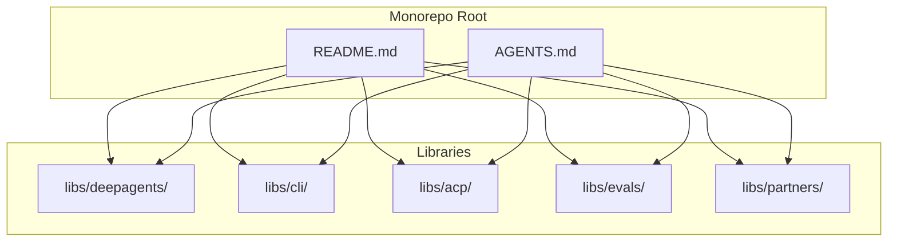
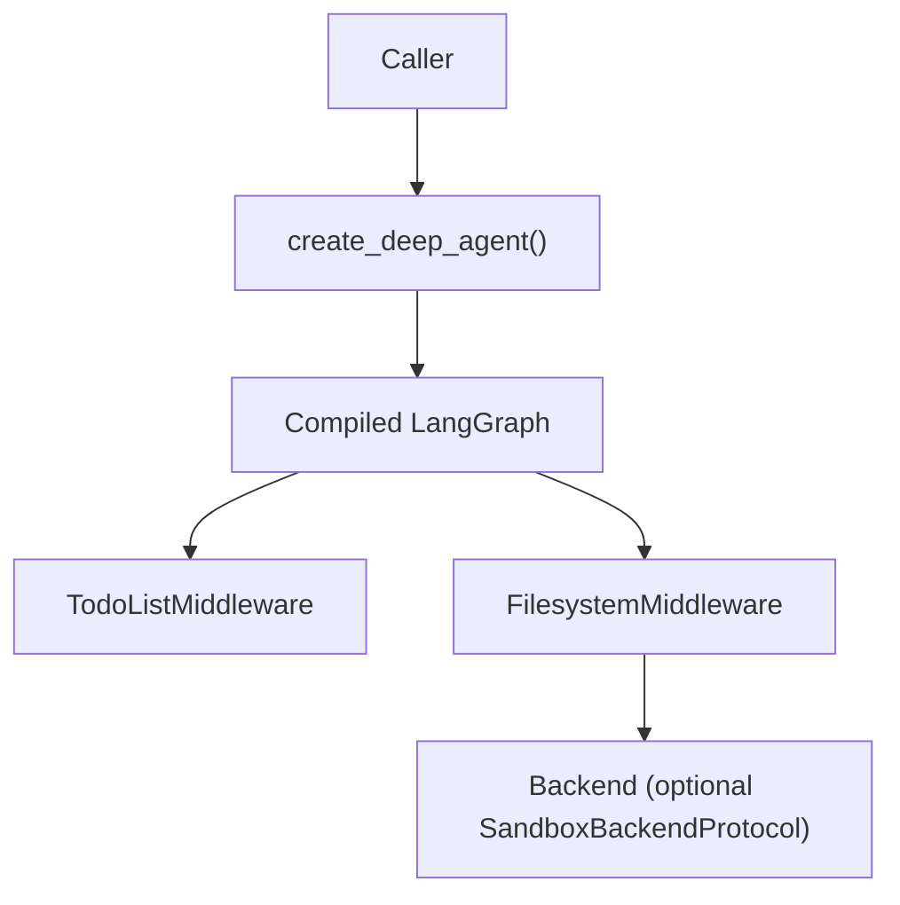
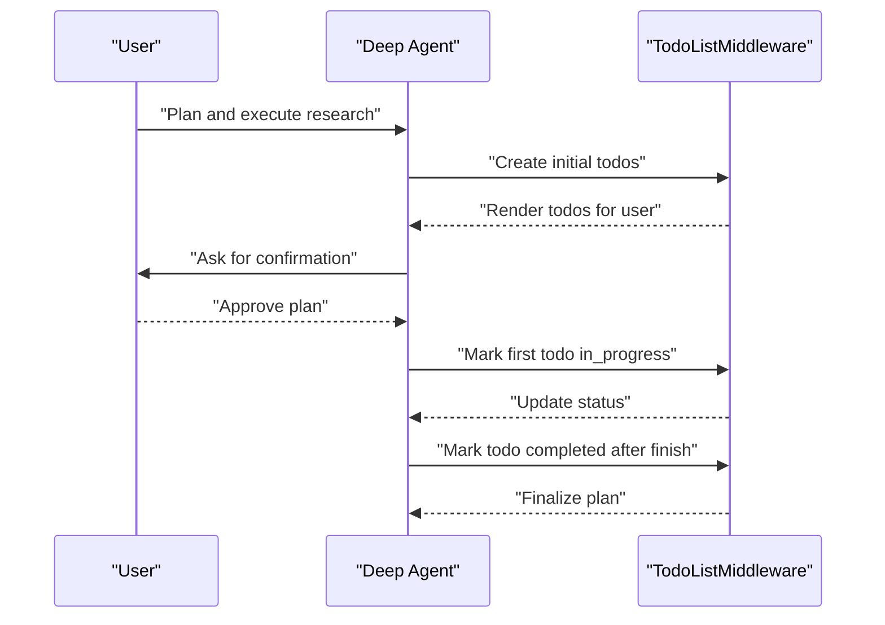
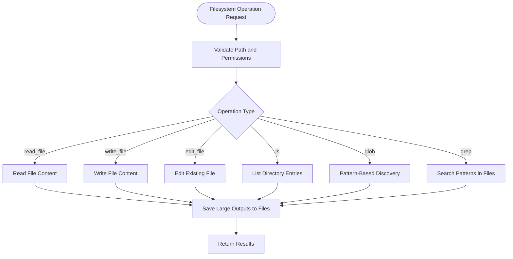
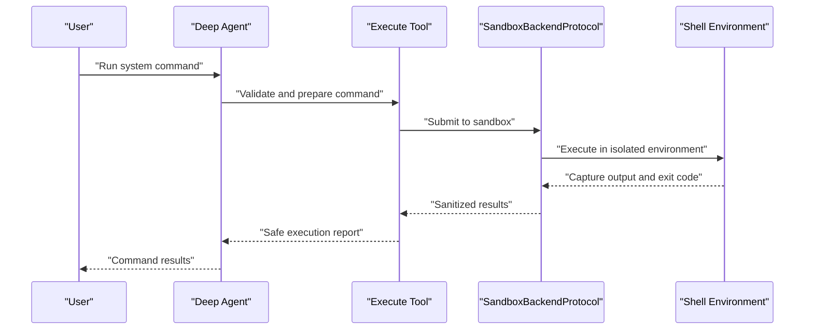
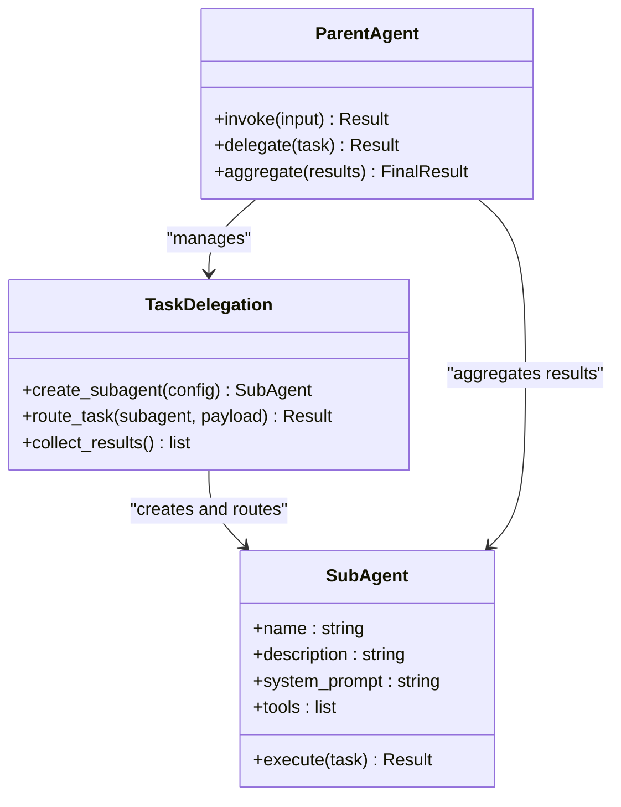
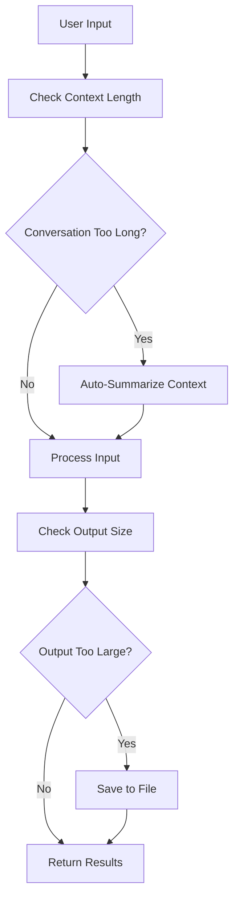
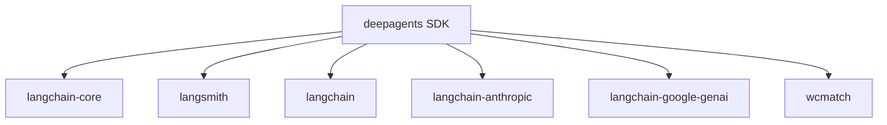

# Features & Capabilities

<cite>
**Referenced Files in This Document**
- [README.md](file://README.md)
- [AGENTS.md](file://AGENTS.md)
- [libs/deepagents/pyproject.toml](file://libs/deepagents/pyproject.toml)
- [libs/cli/deepagents_cli/system_prompt.md](file://libs/cli/deepagents_cli/system_prompt.md)
- [examples/content-builder-agent/content_writer.py](file://examples/content-builder-agent/content_writer.py)
- [examples/deep_research/agent.py](file://examples/deep_research/agent.py)
- [examples/deep_research/research_agent/tools.py](file://examples/deep_research/research_agent/tools.py)
- [examples/deep_research/research_agent/prompts.py](file://examples/deep_research/research_agent/prompts.py)
- [examples/text-to-sql-agent/agent.py](file://examples/text-to-sql-agent/agent.py)
- [examples/nvidia_deep_agent/src/agent.py](file://examples/nvidia_deep_agent/src/agent.py)
- [examples/nvidia_deep_agent/src/tools.py](file://examples/nvidia_deep_agent/src/tools.py)
- [libs/acp/deepagents_acp/server.py](file://libs/acp/deepagents_acp/server.py)
- [libs/deepagents/tests/unit_tests/test_benchmark_create_deep_agent.py](file://libs/deepagents/tests/unit_tests/test_benchmark_create_deep_agent.py)
</cite>

## Table of Contents
1. [Introduction](#introduction)
2. [Project Structure](#project-structure)
3. [Core Components](#core-components)
4. [Architecture Overview](#architecture-overview)
5. [Detailed Component Analysis](#detailed-component-analysis)
6. [Dependency Analysis](#dependency-analysis)
7. [Performance Considerations](#performance-considerations)
8. [Security Implications](#security-implications)
9. [Troubleshooting Guide](#troubleshooting-guide)
10. [Conclusion](#conclusion)
11. [Appendices](#appendices)

## Introduction
DeepAgents is a batteries-included agent harness built on LangGraph that provides a production-ready agent out of the box. It includes planning, filesystem operations, secure shell integration with sandboxing, sub-agent orchestration, intelligent context management with auto-summarization, and smart defaults that teach models how to use tools effectively.

The agent exposes a simple API via create_deep_agent() and returns a compiled LangGraph graph that supports streaming, Studio, checkpointers, and other LangGraph features. It emphasizes ease of use while maintaining extensibility for customization, tool addition, and sub-agent configuration.

**Section sources**
- [README.md:24-53](file://README.md#L24-L53)
- [README.md:86-88](file://README.md#L86-L88)

## Project Structure
The repository is organized as a Python monorepo with multiple independently versioned packages managed by uv. The core SDK resides under libs/deepagents, while supporting libraries include CLI, ACP (Agent Context Protocol), evaluation suites, and partner integrations.

**Diagram sources**
- [AGENTS.md:11-23](file://AGENTS.md#L11-L23)

**Section sources**
- [AGENTS.md:11-23](file://AGENTS.md#L11-L23)

## Core Components
DeepAgents provides the following built-in capabilities:

- Planning with write_todos: Enables structured task breakdown and progress tracking with real-time updates visible to users.
- Filesystem operations: Comprehensive file and directory manipulation including read_file, write_file, edit_file, ls, glob, and grep.
- Secure shell integration: execute tool for running commands with sandboxing to enforce boundaries.
- Sub-agent orchestration: task tool for delegating work to isolated context windows with configurable sub-agents.
- Smart defaults: Prompts and guidance embedded in the system prompt that teach the model how to use tools effectively.
- Intelligent context management: Auto-summarization when conversations become long, with large outputs saved to files to maintain performance.

These capabilities are designed to work together seamlessly, enabling complex workflows with minimal setup.

**Section sources**
- [README.md:26-33](file://README.md#L26-L33)
- [libs/cli/deepagents_cli/system_prompt.md:224-239](file://libs/cli/deepagents_cli/system_prompt.md#L224-L239)

## Architecture Overview
The agent is constructed using a middleware stack that integrates planning, filesystem operations, and optional sandboxed execution. The create_deep_agent function wires together a default middleware configuration that includes TodoListMiddleware and FilesystemMiddleware, with optional backend support for execution and persistent storage.

**Diagram sources**
- [libs/deepagents/tests/unit_tests/test_benchmark_create_deep_agent.py:177-207](file://libs/deepagents/tests/unit_tests/test_benchmark_create_deep_agent.py#L177-L207)

**Section sources**
- [libs/deepagents/tests/unit_tests/test_benchmark_create_deep_agent.py:177-207](file://libs/deepagents/tests/unit_tests/test_benchmark_create_deep_agent.py#L177-L207)

## Detailed Component Analysis

### Planning with write_todos
The write_todos tool enables structured planning and progress tracking. The system prompt provides explicit guidance on how to use write_todos effectively, including best practices for task creation, status updates, and user alignment.

Key behaviors:
- Use todos for tasks with multiple steps to provide visibility
- Mark tasks in_progress before starting and completed immediately after finishing
- Avoid batching completions; update status promptly
- Add sub-tasks as they arise
- For simple single-step tasks, perform directly without creating a todo
- Always ask the user to confirm the plan before execution begins
- Update todo statuses as each item completes

Practical examples from the codebase:
- Research agent notebook demonstrates write_todos tool usage in a Jupyter context, showing how todos are created, rendered, and updated during execution.
- Content builder agent showcases end-to-end planning with write_todos integrated into a content generation workflow.

**Diagram sources**
- [libs/cli/deepagents_cli/system_prompt.md:224-239](file://libs/cli/deepagents_cli/system_prompt.md#L224-L239)
- [examples/deep_research/research_agent.ipynb:1099-1103](file://examples/deep_research/research_agent.ipynb#L1099-L1103)

**Section sources**
- [libs/cli/deepagents_cli/system_prompt.md:224-239](file://libs/cli/deepagents_cli/system_prompt.md#L224-L239)
- [examples/deep_research/research_agent.ipynb:1099-1103](file://examples/deep_research/research_agent.ipynb#L1099-L1103)
- [examples/content-builder-agent/content_writer.py:167-172](file://examples/content-builder-agent/content_writer.py#L167-L172)

### Filesystem Operations
DeepAgents provides comprehensive filesystem capabilities through the FilesystemMiddleware, exposing tools for reading, writing, editing, listing, globbing, and searching files. These operations are designed to be safe and efficient, with automatic context management for large outputs.

Supported operations:
- read_file: Read file contents safely with encoding handling
- write_file: Write content to files with overwrite protection
- edit_file: Perform targeted edits to existing files
- ls: List directory contents with filtering
- glob: Pattern-based file discovery
- grep: Search for patterns within files

Integration patterns:
- Tools are integrated into the agent's tool set via the middleware stack
- File operations are scoped to the agent's working directory and configured paths
- Large outputs are automatically saved to files to prevent context overflow

**Diagram sources**
- [libs/deepagents/tests/unit_tests/test_benchmark_create_deep_agent.py:181-207](file://libs/deepagents/tests/unit_tests/test_benchmark_create_deep_agent.py#L181-L207)

**Section sources**
- [libs/deepagents/tests/unit_tests/test_benchmark_create_deep_agent.py:181-207](file://libs/deepagents/tests/unit_tests/test_benchmark_create_deep_agent.py#L181-L207)

### Secure Shell Integration with Sandboxing
The execute tool enables secure shell command execution with sandboxing to enforce boundaries. The agent follows a "trust the LLM" model where enforcement occurs at the tool/sandbox level rather than expecting the model to self-police.

Key security measures:
- SandboxBackendProtocol enforces execution boundaries
- Commands are executed in isolated environments
- Resource limits and timeouts prevent abuse
- Output capture and sanitization for safe reporting

Best practices:
- Configure sandbox parameters per deployment needs
- Monitor execution logs for suspicious activity
- Use least-privilege execution contexts
- Implement rate limiting for command execution

**Diagram sources**
- [README.md:123-126](file://README.md#L123-L126)

**Section sources**
- [README.md:123-126](file://README.md#L123-L126)

### Sub-Agent Orchestration via Task Delegation
DeepAgents supports sub-agent orchestration through the task tool, enabling delegation of work to isolated context windows. This allows complex workflows to be broken down into specialized agents with their own tools and prompts.

Implementation highlights:
- Subagents are configured with name, description, and system prompts
- Each subagent operates with isolated context windows
- Task delegation enables parallel processing and specialized expertise
- Results are aggregated back to the parent agent

Usage patterns:
- Content generation with specialized subagents for different content types
- Multi-domain research with domain-specific subagents
- Parallel processing of independent tasks

**Diagram sources**
- [examples/content-builder-agent/content_writer.py:138-172](file://examples/content-builder-agent/content_writer.py#L138-L172)
- [examples/nvidia_deep_agent/src/agent.py:89-95](file://examples/nvidia_deep_agent/src/agent.py#L89-L95)

**Section sources**
- [examples/content-builder-agent/content_writer.py:138-172](file://examples/content-builder-agent/content_writer.py#L138-L172)
- [examples/nvidia_deep_agent/src/agent.py:89-95](file://examples/nvidia_deep_agent/src/agent.py#L89-L95)

### Intelligent Context Management with Auto-Summarization
DeepAgents implements intelligent context management that automatically summarizes long conversations and saves large outputs to files. This prevents context overflow and maintains performance for extended interactions.

Key mechanisms:
- Conversation length monitoring triggers summarization
- Large output detection saves content to files
- Summaries replace older context while preserving essential information
- File-based storage ensures outputs remain accessible without bloating memory

Integration points:
- Automatic file saving for large results
- Context window management through summarization
- Persistent storage for retrieved context

**Diagram sources**
- [libs/deepagents/tests/unit_tests/test_benchmark_create_deep_agent.py:177-207](file://libs/deepagents/tests/unit_tests/test_benchmark_create_deep_agent.py#L177-L207)

**Section sources**
- [libs/deepagents/tests/unit_tests/test_benchmark_create_deep_agent.py:177-207](file://libs/deepagents/tests/unit_tests/test_benchmark_create_deep_agent.py#L177-L207)

### Smart Defaults That Teach Models How to Use Tools
DeepAgents embeds smart defaults through carefully crafted system prompts that guide models in effective tool usage. The system prompt provides explicit instructions for each tool, ensuring reliable operation without extensive prompting.

Teaching patterns:
- Step-by-step guidance for complex tools like write_todos
- Best practices for file operations and shell commands
- Context management strategies for long conversations
- Sub-agent coordination protocols

These defaults reduce the learning curve and improve reliability across diverse use cases.

**Section sources**
- [libs/cli/deepagents_cli/system_prompt.md:224-239](file://libs/cli/deepagents_cli/system_prompt.md#L224-L239)

## Dependency Analysis
DeepAgents SDK depends on LangChain ecosystem packages and includes optional dependencies for various providers. The dependency graph reflects the modular architecture supporting different model providers and execution backends.

**Diagram sources**
- [libs/deepagents/pyproject.toml:22-29](file://libs/deepagents/pyproject.toml#L22-L29)

**Section sources**
- [libs/deepagents/pyproject.toml:22-29](file://libs/deepagents/pyproject.toml#L22-L29)

## Performance Considerations
DeepAgents includes several performance optimizations and considerations:

Construction and scaling:
- Construction time scales with tool and subagent counts
- Benchmark tests measure performance impact of adding tools and subagents
- Memory usage grows with context length and output volume

Execution optimizations:
- Filesystem operations are optimized for common patterns
- Context management reduces memory pressure through summarization
- Sandbox execution includes resource limits to prevent abuse

Recommendations:
- Use selective tool registration to minimize overhead
- Configure subagents judiciously to avoid excessive context switching
- Monitor memory usage for long-running sessions
- Implement caching for frequently accessed files

**Section sources**
- [libs/deepagents/tests/unit_tests/test_benchmark_create_deep_agent.py:177-207](file://libs/deepagents/tests/unit_tests/test_benchmark_create_deep_agent.py#L177-L207)

## Security Implications
DeepAgents follows a "trust the LLM" security model with explicit boundaries enforced at the tool and sandbox level:

Key security principles:
- Tool-level enforcement rather than model self-regulation
- Sandboxed execution for shell commands
- Permission scoping for filesystem operations
- Output sanitization and logging

Recommended practices:
- Always use sandboxed execution for shell commands
- Implement least-privilege file system access
- Monitor and audit tool usage
- Configure appropriate timeouts and resource limits
- Use environment-specific configurations for different deployment tiers

**Section sources**
- [README.md:123-126](file://README.md#L123-L126)

## Troubleshooting Guide
Common issues and solutions:

Tool usage problems:
- write_todos not appearing: Verify system prompt inclusion and tool registration
- File operations failing: Check path permissions and working directory configuration
- Shell execution blocked: Confirm sandbox configuration and permissions

Performance issues:
- Slow construction: Reduce tool count or optimize subagent configuration
- Memory bloat: Enable context summarization and monitor output sizes
- Execution timeouts: Adjust sandbox resource limits

Integration challenges:
- Model provider configuration: Ensure proper API keys and provider setup
- LangGraph compatibility: Verify LangGraph version and configuration
- CLI integration: Check deepagents-cli version pinning and dependencies

Diagnostic approaches:
- Enable debug mode for detailed logging
- Use LangSmith for tracing and monitoring
- Implement custom middleware for additional diagnostics
- Review benchmark tests for performance baselines

**Section sources**
- [libs/deepagents/tests/unit_tests/test_benchmark_create_deep_agent.py:151-207](file://libs/deepagents/tests/unit_tests/test_benchmark_create_deep_agent.py#L151-L207)

## Conclusion
DeepAgents provides a comprehensive, production-ready agent framework that balances ease of use with powerful capabilities. Its built-in planning, filesystem operations, secure shell integration, sub-agent orchestration, and intelligent context management enable complex workflows with minimal setup.

The smart defaults and extensive examples demonstrate practical patterns for real-world applications, while the modular architecture supports customization and extension. By following the security and performance recommendations, teams can deploy reliable AI agents that scale with their needs.

## Appendices

### Practical Examples Index
- Research agent: Demonstrates write_todos usage in Jupyter notebooks
- Content builder: Shows end-to-end planning with multiple subagents
- Text-to-SQL: Illustrates specialized tool usage patterns
- NVIDIA agent: Demonstrates GPU-focused workflows with custom tools

### Configuration Reference
- Model selection and resolution
- Tool registration and customization
- Subagent configuration and routing
- Sandbox and security settings
- Context management parameters