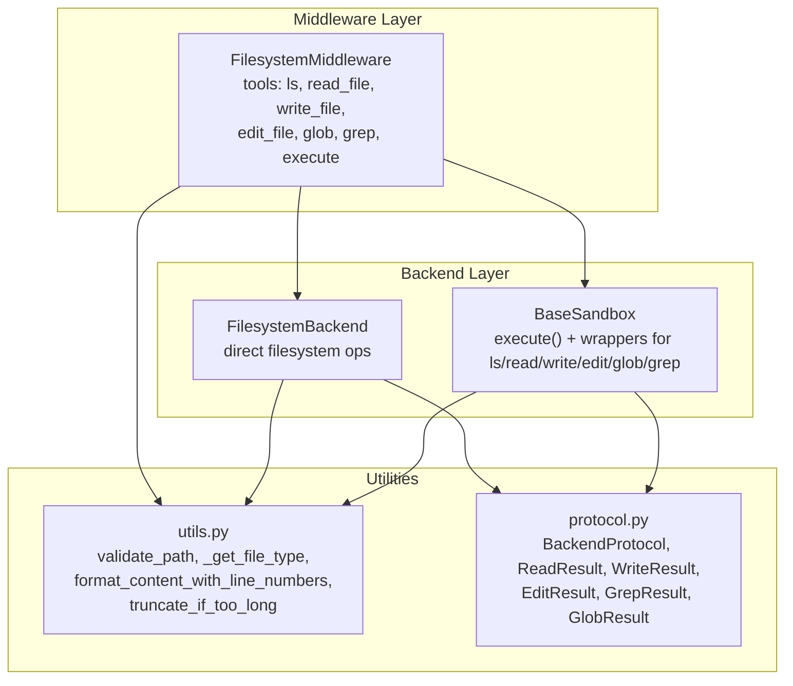
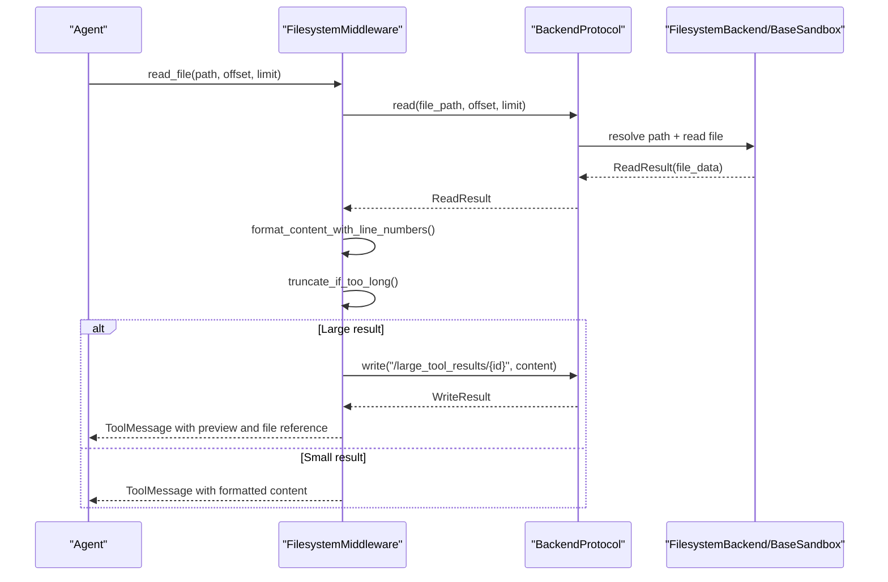
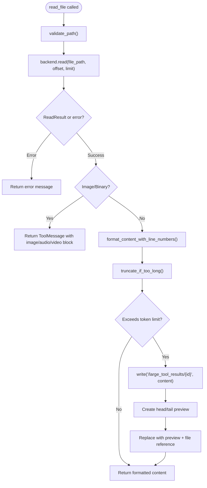
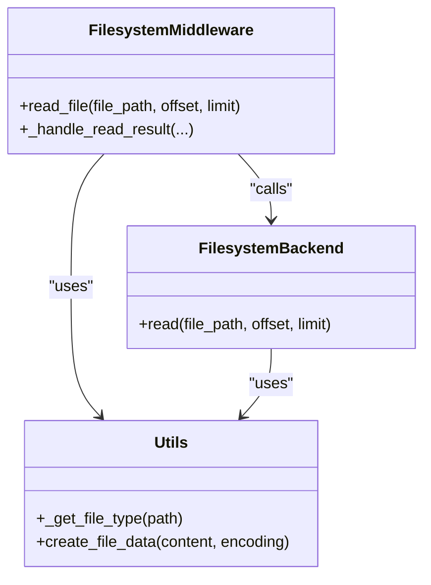
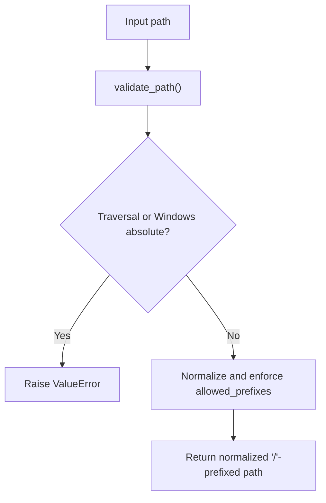
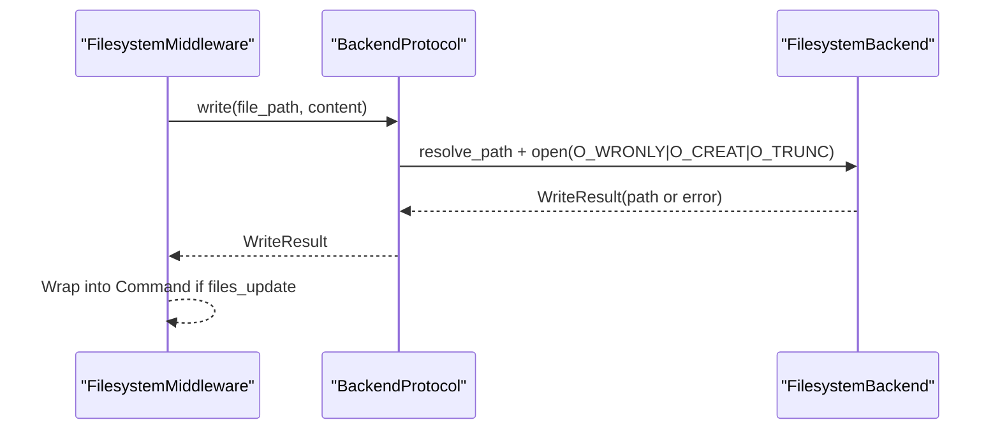
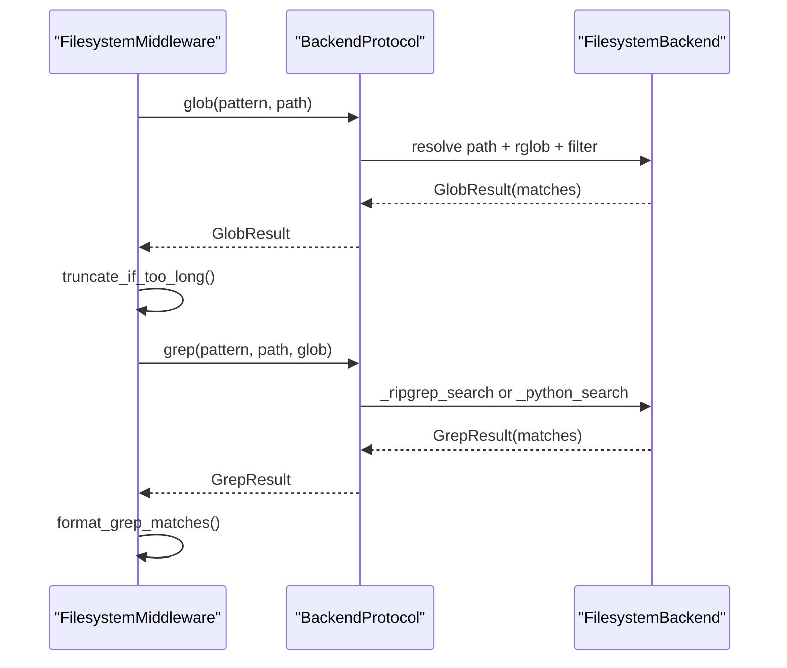
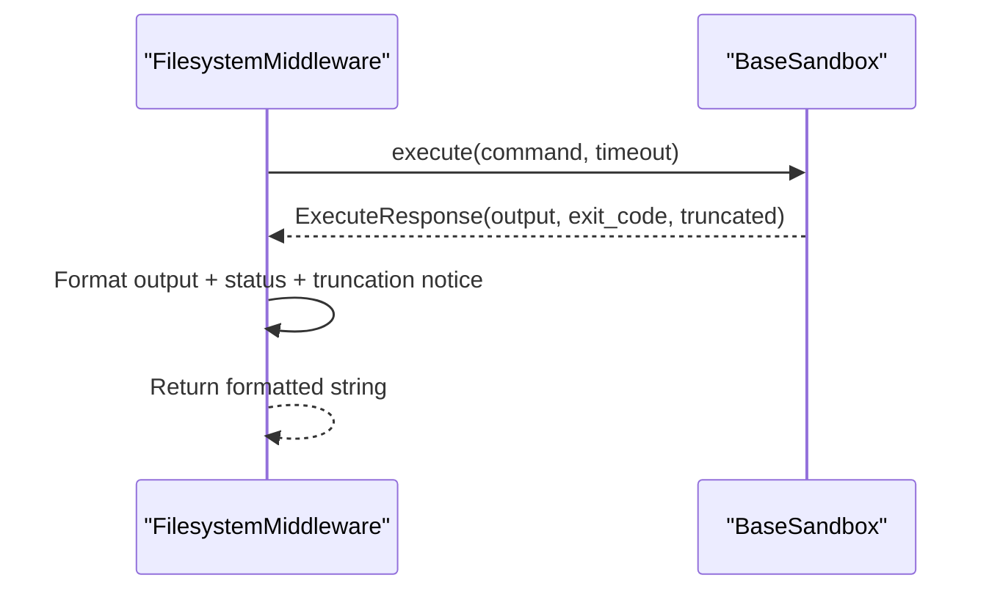
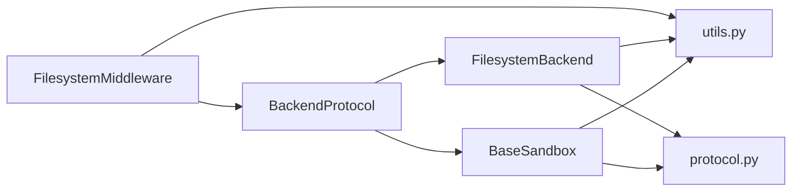

# Filesystem Operations

<cite>
**Referenced Files in This Document**
- [filesystem.py](file://libs/deepagents/deepagents/middleware/filesystem.py)
- [filesystem.py](file://libs/deepagents/deepagents/backends/filesystem.py)
- [utils.py](file://libs/deepagents/deepagents/backends/utils.py)
- [protocol.py](file://libs/deepagents/deepagents/backends/protocol.py)
- [sandbox.py](file://libs/deepagents/deepagents/backends/sandbox.py)
- [test_middleware.py](file://libs/deepagents/tests/unit_tests/test_middleware.py)
- [test_filesystem_backend.py](file://libs/deepagents/tests/unit_tests/backends/test_filesystem_backend.py)
- [test_filesystem_backend_async.py](file://libs/deepagents/tests/unit_tests/backends/test_filesystem_backend_async.py)
</cite>

## Table of Contents
1. [Introduction](#introduction)
2. [Project Structure](#project-structure)
3. [Core Components](#core-components)
4. [Architecture Overview](#architecture-overview)
5. [Detailed Component Analysis](#detailed-component-analysis)
6. [Dependency Analysis](#dependency-analysis)
7. [Performance Considerations](#performance-considerations)
8. [Troubleshooting Guide](#troubleshooting-guide)
9. [Conclusion](#conclusion)

## Introduction
This document explains DeepAgents filesystem operations, focusing on the middleware and backend implementations that power file tools: ls, read_file, write_file, edit_file, glob, and grep. It covers:
- Sophisticated pagination for large files using offset and limit
- Automatic truncation and content previews for large results
- Multimodal support for images and binary files
- Security considerations, path validation, and file type detection
- Practical workflows, error handling patterns, and performance optimization tips

## Project Structure
DeepAgents organizes filesystem operations across three layers:
- Middleware: exposes tools to agents and manages large result eviction and formatting
- Backends: implement the protocol for filesystem, sandbox, and state storage
- Utilities: shared helpers for path validation, type detection, and formatting

**Diagram sources**
- [filesystem.py:388-1446](file://libs/deepagents/deepagents/middleware/filesystem.py#L388-L1446)
- [filesystem.py:38-736](file://libs/deepagents/deepagents/backends/filesystem.py#L38-L736)
- [utils.py:1-711](file://libs/deepagents/deepagents/backends/utils.py#L1-L711)
- [protocol.py:246-709](file://libs/deepagents/deepagents/backends/protocol.py#L246-L709)
- [sandbox.py:217-465](file://libs/deepagents/deepagents/backends/sandbox.py#L217-L465)

**Section sources**
- [filesystem.py:1-1446](file://libs/deepagents/deepagents/middleware/filesystem.py#L1-L1446)
- [filesystem.py:1-736](file://libs/deepagents/deepagents/backends/filesystem.py#L1-L736)
- [utils.py:1-711](file://libs/deepagents/deepagents/backends/utils.py#L1-L711)
- [protocol.py:1-709](file://libs/deepagents/deepagents/backends/protocol.py#L1-L709)
- [sandbox.py:1-465](file://libs/deepagents/deepagents/backends/sandbox.py#L1-L465)

## Core Components
- FilesystemMiddleware: creates tools and orchestrates pagination, formatting, multimodal responses, and large result eviction
- FilesystemBackend: direct filesystem operations with path resolution, security modes, and glob/grep implementations
- BaseSandbox: executes shell commands and wraps them into backend operations
- Shared utilities: path validation, file type detection, line-number formatting, truncation, and result structures

Key responsibilities:
- read_file: paginated text reading with line-number formatting and long-line splitting; binary/images handled as multimodal content
- write_file: creates new files with safety checks
- edit_file: performs exact string replacement with uniqueness validation
- ls: lists directory entries with metadata
- glob: finds files by glob patterns
- grep: searches literal text with ripgrep fallback
- execute: runs commands in sandboxed environments (when available)

**Section sources**
- [filesystem.py:569-804](file://libs/deepagents/deepagents/middleware/filesystem.py#L569-L804)
- [filesystem.py:194-736](file://libs/deepagents/deepagents/backends/filesystem.py#L194-L736)
- [utils.py:166-446](file://libs/deepagents/deepagents/backends/utils.py#L166-L446)
- [protocol.py:104-243](file://libs/deepagents/deepagents/backends/protocol.py#L104-L243)
- [sandbox.py:217-465](file://libs/deepagents/deepagents/backends/sandbox.py#L217-L465)

## Architecture Overview
The middleware layer composes tools around a pluggable backend protocol. For read_file, the middleware:
- Validates path and calls backend.read with offset/limit
- Applies line-number formatting and long-line continuation
- Truncates content if oversized
- Evicts large results to filesystem and replaces with preview and file reference

**Diagram sources**
- [filesystem.py:569-669](file://libs/deepagents/deepagents/middleware/filesystem.py#L569-L669)
- [filesystem.py:299-346](file://libs/deepagents/deepagents/backends/filesystem.py#L299-L346)
- [utils.py:106-149](file://libs/deepagents/deepagents/backends/utils.py#L106-L149)
- [utils.py:369-379](file://libs/deepagents/deepagents/backends/utils.py#L369-L379)
- [protocol.py:141-152](file://libs/deepagents/deepagents/backends/protocol.py#L141-L152)

## Detailed Component Analysis

### Pagination and Large File Handling (read_file)
- Offset and limit: backend splits content into lines and slices by index; middleware applies line-number formatting and continuation markers for long lines
- Long-line handling: lines longer than a threshold are split into numbered continuations (e.g., 5, 5.1, 5.2)
- Oversized content: middleware truncates to a token budget and appends a guidance message; large results are evicted to filesystem with a preview

**Diagram sources**
- [filesystem.py:569-669](file://libs/deepagents/deepagents/middleware/filesystem.py#L569-L669)
- [filesystem.py:299-346](file://libs/deepagents/deepagents/backends/filesystem.py#L299-L346)
- [utils.py:106-149](file://libs/deepagents/deepagents/backends/utils.py#L106-L149)
- [utils.py:369-379](file://libs/deepagents/deepagents/backends/utils.py#L369-L379)
- [utils.py:319-347](file://libs/deepagents/deepagents/backends/utils.py#L319-L347)

**Section sources**
- [filesystem.py:569-669](file://libs/deepagents/deepagents/middleware/filesystem.py#L569-L669)
- [filesystem.py:299-346](file://libs/deepagents/deepagents/backends/filesystem.py#L299-L346)
- [utils.py:106-149](file://libs/deepagents/deepagents/backends/utils.py#L106-L149)
- [utils.py:319-347](file://libs/deepagents/deepagents/backends/utils.py#L319-L347)
- [test_middleware.py:900-930](file://libs/deepagents/tests/unit_tests/test_middleware.py#L900-L930)

### Multimodal File Support (Images and Binary)
- File type detection: extension-based classification for images, video, audio, and PDF/PPT
- Binary handling: non-text files are base64-encoded and returned as multimodal content blocks
- Image-specific guidance: for images, pagination (offset/limit) is text-only; re-read if details were compacted

**Diagram sources**
- [filesystem.py:611-630](file://libs/deepagents/deepagents/middleware/filesystem.py#L611-L630)
- [filesystem.py:321-327](file://libs/deepagents/deepagents/backends/filesystem.py#L321-L327)
- [utils.py:166-176](file://libs/deepagents/deepagents/backends/utils.py#L166-L176)
- [utils.py:214-236](file://libs/deepagents/deepagents/backends/utils.py#L214-L236)

**Section sources**
- [filesystem.py:611-630](file://libs/deepagents/deepagents/middleware/filesystem.py#L611-L630)
- [filesystem.py:321-327](file://libs/deepagents/deepagents/backends/filesystem.py#L321-L327)
- [utils.py:25-62](file://libs/deepagents/deepagents/backends/utils.py#L25-L62)

### Path Validation and Security
- validate_path enforces virtual filesystem semantics: rejects traversal, Windows absolute paths, and optional allowed prefixes
- FilesystemBackend supports virtual_mode to constrain paths under a root and prevent traversal
- Error codes for upload/download are standardized for LLM-friendly diagnostics

**Diagram sources**
- [utils.py:382-446](file://libs/deepagents/deepagents/backends/utils.py#L382-L446)
- [filesystem.py:141-177](file://libs/deepagents/deepagents/backends/filesystem.py#L141-L177)
- [protocol.py:33-47](file://libs/deepagents/deepagents/backends/protocol.py#L33-L47)

**Section sources**
- [utils.py:382-446](file://libs/deepagents/deepagents/backends/utils.py#L382-L446)
- [filesystem.py:141-177](file://libs/deepagents/deepagents/backends/filesystem.py#L141-L177)
- [protocol.py:33-47](file://libs/deepagents/deepagents/backends/protocol.py#L33-L47)

### write_file and edit_file
- write_file: creates new files atomically; prevents overwriting existing files; supports async variant
- edit_file: performs exact string replacement with uniqueness checks; supports replace_all; preserves timestamps

**Diagram sources**
- [filesystem.py:671-738](file://libs/deepagents/deepagents/middleware/filesystem.py#L671-L738)
- [filesystem.py:348-382](file://libs/deepagents/deepagents/backends/filesystem.py#L348-L382)
- [protocol.py:154-177](file://libs/deepagents/deepagents/backends/protocol.py#L154-L177)

**Section sources**
- [filesystem.py:671-738](file://libs/deepagents/deepagents/middleware/filesystem.py#L671-L738)
- [filesystem.py:348-382](file://libs/deepagents/deepagents/backends/filesystem.py#L348-L382)
- [protocol.py:154-177](file://libs/deepagents/deepagents/backends/protocol.py#L154-L177)

### ls, glob, and grep
- ls: lists directory entries with metadata; supports async
- glob: finds files by glob patterns; respects virtual_mode and path constraints
- grep: literal text search with ripgrep fallback; supports filtering by glob and output modes

**Diagram sources**
- [filesystem.py:813-978](file://libs/deepagents/deepagents/middleware/filesystem.py#L813-L978)
- [filesystem.py:589-665](file://libs/deepagents/deepagents/backends/filesystem.py#L589-L665)
- [filesystem.py:435-587](file://libs/deepagents/deepagents/backends/filesystem.py#L435-L587)
- [utils.py:575-601](file://libs/deepagents/deepagents/backends/utils.py#L575-L601)

**Section sources**
- [filesystem.py:813-978](file://libs/deepagents/deepagents/middleware/filesystem.py#L813-L978)
- [filesystem.py:194-297](file://libs/deepagents/deepagents/backends/filesystem.py#L194-L297)
- [filesystem.py:435-587](file://libs/deepagents/deepagents/backends/filesystem.py#L435-L587)
- [filesystem.py:589-665](file://libs/deepagents/deepagents/backends/filesystem.py#L589-L665)
- [utils.py:575-601](file://libs/deepagents/deepagents/backends/utils.py#L575-L601)

### execute (Sandbox)
- When available, execute runs shell commands in a sandbox; supports timeouts and truncation; returns structured output

**Diagram sources**
- [sandbox.py:217-465](file://libs/deepagents/deepagents/backends/sandbox.py#L217-L465)
- [filesystem.py:980-1098](file://libs/deepagents/deepagents/middleware/filesystem.py#L980-L1098)
- [protocol.py:611-625](file://libs/deepagents/deepagents/backends/protocol.py#L611-L625)

**Section sources**
- [sandbox.py:217-465](file://libs/deepagents/deepagents/backends/sandbox.py#L217-L465)
- [filesystem.py:980-1098](file://libs/deepagents/deepagents/middleware/filesystem.py#L980-L1098)
- [protocol.py:611-625](file://libs/deepagents/deepagents/backends/protocol.py#L611-L625)

## Dependency Analysis
- Middleware depends on BackendProtocol implementations and shared utilities
- FilesystemBackend and BaseSandbox implement BackendProtocol and use shared utilities
- Result types (ReadResult, WriteResult, EditResult, GrepResult, GlobResult) unify error and success handling

**Diagram sources**
- [filesystem.py:489-501](file://libs/deepagents/deepagents/middleware/filesystem.py#L489-L501)
- [filesystem.py:38-736](file://libs/deepagents/deepagents/backends/filesystem.py#L38-L736)
- [sandbox.py:217-465](file://libs/deepagents/deepagents/backends/sandbox.py#L217-L465)
- [utils.py:1-711](file://libs/deepagents/deepagents/backends/utils.py#L1-L711)
- [protocol.py:246-709](file://libs/deepagents/deepagents/backends/protocol.py#L246-L709)

**Section sources**
- [filesystem.py:489-501](file://libs/deepagents/deepagents/middleware/filesystem.py#L489-L501)
- [filesystem.py:38-736](file://libs/deepagents/deepagents/backends/filesystem.py#L38-L736)
- [sandbox.py:217-465](file://libs/deepagents/deepagents/backends/sandbox.py#L217-L465)
- [utils.py:1-711](file://libs/deepagents/deepagents/backends/utils.py#L1-L711)
- [protocol.py:246-709](file://libs/deepagents/deepagents/backends/protocol.py#L246-L709)

## Performance Considerations
- Pagination: use offset and limit to avoid loading entire files; start with small limits and expand as needed
- Long lines: expect long lines to generate continuation lines; plan limits accordingly
- Token budget: middleware truncates beyond a configurable token threshold; tune eviction threshold to balance completeness and context limits
- Async operations: leverage async variants (aread, aedit, awrite, agrep, aglob) for concurrency
- Grep efficiency: prefer ripgrep when available; use glob filters to reduce search scope
- Batch downloads/uploads: use batch APIs to minimize round-trips

[No sources needed since this section provides general guidance]

## Troubleshooting Guide
Common issues and resolutions:
- Path errors: validate_path rejects traversal and Windows absolute paths; ensure paths start with "/" and do not contain ".."
- Empty files: read_file returns a reminder message for empty content
- Oversized results: middleware evicts large tool results to "/large_tool_results/{tool_call_id}" and provides a preview; read from there with pagination
- Grep timeouts: glob queries are bounded by a timeout; refine patterns or paths
- Edit failures: replace_all must be True if the target string appears more than once; otherwise, the edit fails

Practical references:
- Path validation and error codes
- Large result eviction and preview creation
- Grep timeout handling
- Edit uniqueness and replace_all behavior

**Section sources**
- [utils.py:382-446](file://libs/deepagents/deepagents/backends/utils.py#L382-L446)
- [filesystem.py:1196-1446](file://libs/deepagents/deepagents/middleware/filesystem.py#L1196-L1446)
- [filesystem.py:828-833](file://libs/deepagents/deepagents/middleware/filesystem.py#L828-L833)
- [filesystem.py:384-433](file://libs/deepagents/deepagents/backends/filesystem.py#L384-L433)
- [test_filesystem_backend.py:349-387](file://libs/deepagents/tests/unit_tests/backends/test_filesystem_backend.py#L349-L387)
- [test_filesystem_backend_async.py:442-471](file://libs/deepagents/tests/unit_tests/backends/test_filesystem_backend_async.py#L442-L471)

## Conclusion
DeepAgents provides a robust, secure, and efficient filesystem toolkit for agents:
- Sophisticated pagination and formatting for large files
- Automatic truncation and preview for large results
- Multimodal support for images and binary files
- Strong path validation and security modes
- Well-defined protocols and utilities for reliable integration

Adopt the recommended workflows and error-handling patterns to build scalable, secure automation across diverse file operations.