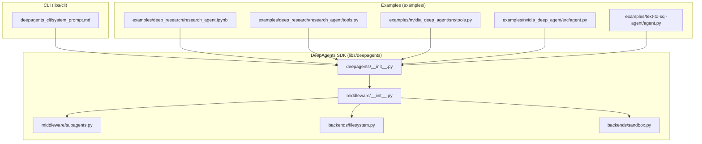
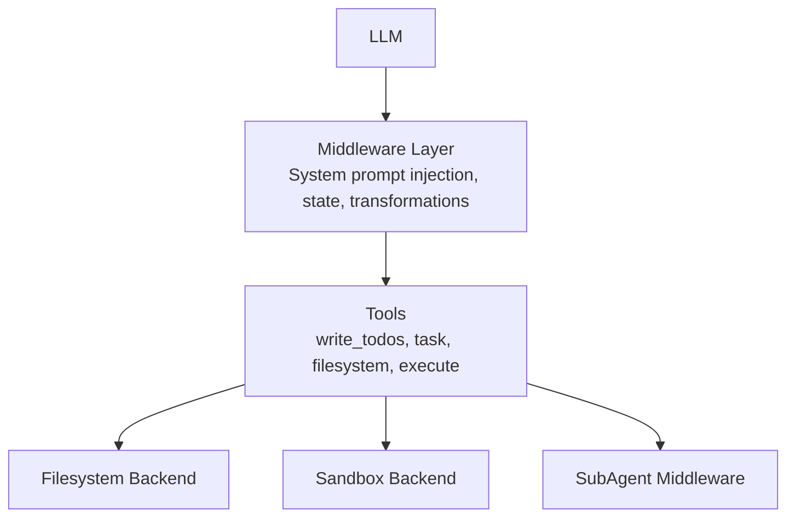
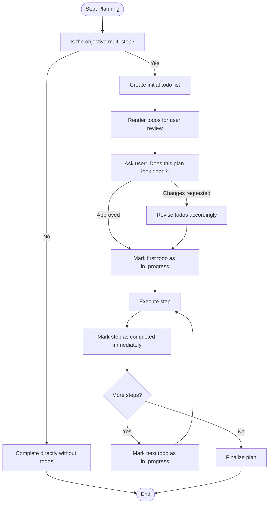
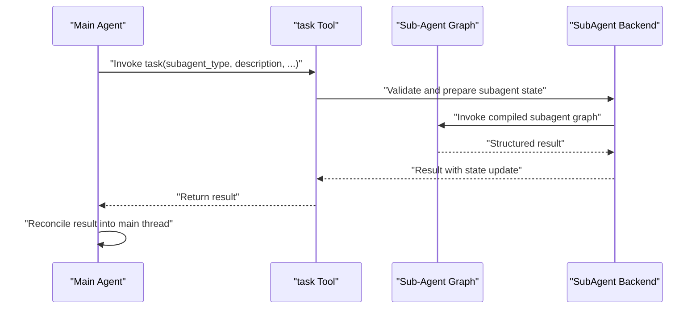
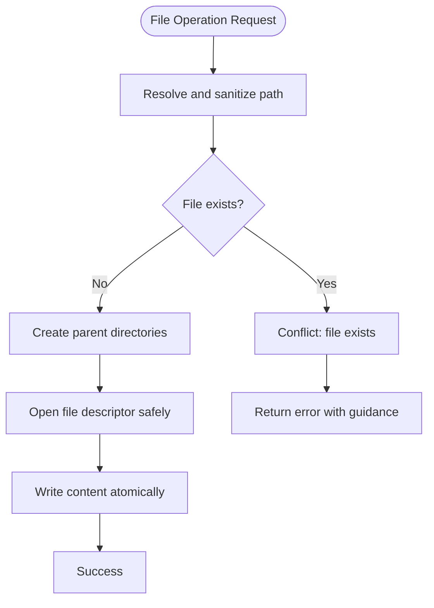
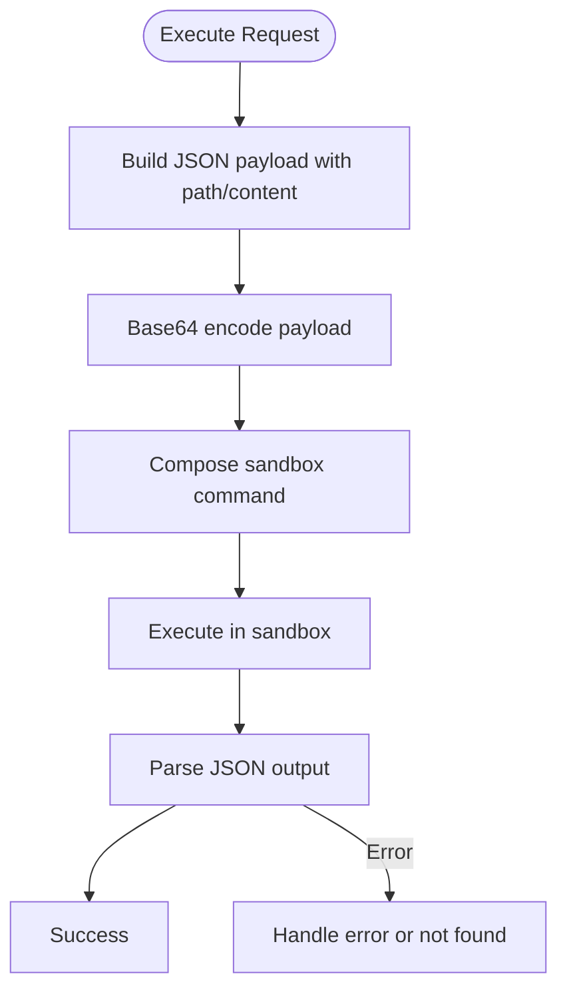
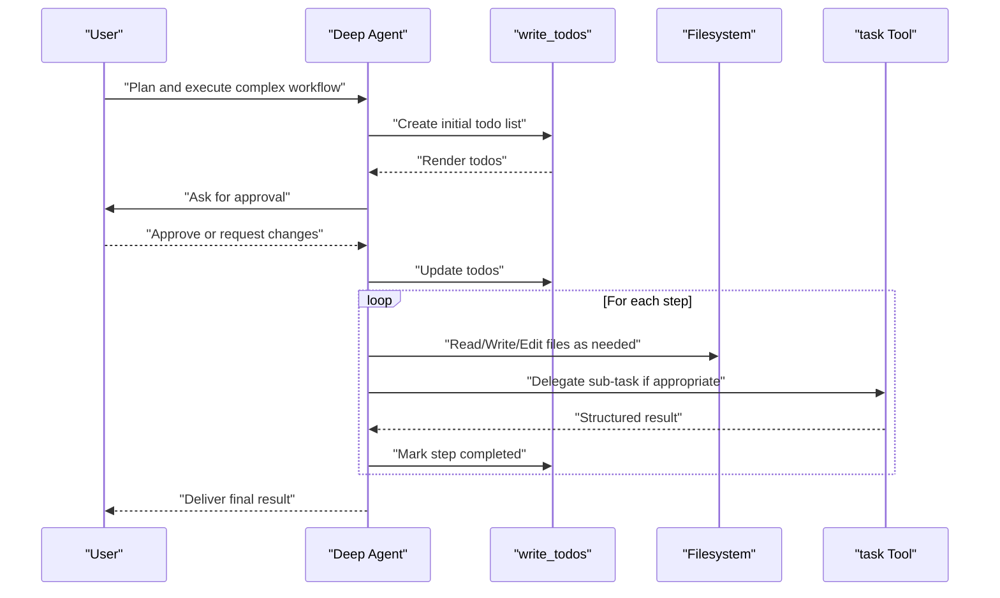
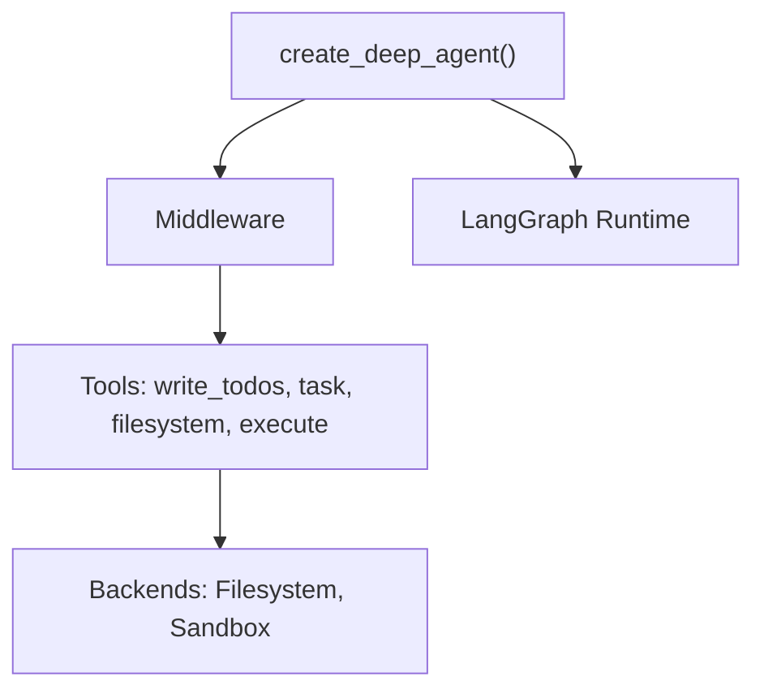

# Planning & Task Management

<cite>
**Referenced Files in This Document**
- [README.md](file://README.md)
- [AGENTS.md](file://AGENTS.md)
- [deepagents/__init__.py](file://libs/deepagents/deepagents/__init__.py)
- [middleware/__init__.py](file://libs/deepagents/deepagents/middleware/__init__.py)
- [subagents.py](file://libs/deepagents/deepagents/middleware/subagents.py)
- [filesystem.py](file://libs/deepagents/deepagents/backends/filesystem.py)
- [sandbox.py](file://libs/deepagents/deepagents/backends/sandbox.py)
- [system_prompt.md](file://libs/cli/deepagents_cli/system_prompt.md)
- [research_agent.ipynb](file://examples/deep_research/research_agent.ipynb)
- [tools.py (deep_research)](file://examples/deep_research/research_agent/tools.py)
- [tools.py (nvidia_deep_agent)](file://examples/nvidia_deep_agent/src/tools.py)
- [agent.py (nvidia_deep_agent)](file://examples/nvidia_deep_agent/src/agent.py)
- [agent.py (text-to-sql-agent)](file://examples/text-to-sql-agent/agent.py)
</cite>

## Table of Contents
1. [Introduction](#introduction)
2. [Project Structure](#project-structure)
3. [Core Components](#core-components)
4. [Architecture Overview](#architecture-overview)
5. [Detailed Component Analysis](#detailed-component-analysis)
6. [Dependency Analysis](#dependency-analysis)
7. [Performance Considerations](#performance-considerations)
8. [Troubleshooting Guide](#troubleshooting-guide)
9. [Conclusion](#conclusion)
10. [Appendices](#appendices)

## Introduction
This document explains DeepAgents planning and task management capabilities with a focus on:
- The write_todos tool for creating todo lists and tracking progress
- How agents plan complex workflows, decompose tasks into subtasks, and manage execution sequences
- The task tool for orchestrating sub-agent execution
- Practical examples of structuring planning workflows, implementing task dependencies, and tracking progress
- Integration with filesystem operations for task persistence and state management
- Best practices for task decomposition and error handling in complex planning scenarios

DeepAgents is an agent harness built on LangGraph that provides batteries-included planning, filesystem operations, shell access, sub-agent orchestration, and context management out of the box.

**Section sources**
- [README.md:24-34](file://README.md#L24-L34)
- [README.md:46-53](file://README.md#L46-L53)

## Project Structure
The repository is a Python monorepo with multiple packages. The planning and task management features live primarily in the deepagents SDK under libs/deepagents, with examples and CLI under examples/ and libs/cli/.

**Diagram sources**
- [deepagents/__init__.py:1-21](file://libs/deepagents/deepagents/__init__.py#L1-L21)
- [middleware/__init__.py:1-74](file://libs/deepagents/deepagents/middleware/__init__.py#L1-L74)
- [subagents.py:454-485](file://libs/deepagents/deepagents/middleware/subagents.py#L454-L485)
- [filesystem.py:342-376](file://libs/deepagents/deepagents/backends/filesystem.py#L342-L376)
- [sandbox.py:292-325](file://libs/deepagents/deepagents/backends/sandbox.py#L292-L325)
- [system_prompt.md:224-239](file://libs/cli/deepagents_cli/system_prompt.md#L224-L239)
- [research_agent.ipynb:672-1103](file://examples/deep_research/research_agent.ipynb#L672-L1103)

**Section sources**
- [AGENTS.md:11-23](file://AGENTS.md#L11-L23)
- [AGENTS.md:55-57](file://AGENTS.md#L55-L57)

## Core Components
- Planning and todo tracking: The write_todos tool enables agents to break down complex objectives into smaller steps and track progress in real time.
- Sub-agent orchestration: The task tool delegates work to isolated sub-agents with controlled context windows and returns a single structured result.
- Filesystem and sandboxing: Filesystem operations and shell execution are provided via backends with robust error handling and safety controls.
- Middleware system: The SDK exposes middleware that intercepts model calls, injects system prompts, transforms messages, and maintains cross-turn state.

Key exports and entry points:
- create_deep_agent returns a compiled LangGraph graph configured with planning, filesystem, and sub-agent capabilities.
- Middleware classes include SubAgentMiddleware, FilesystemMiddleware, MemoryMiddleware, and others.

**Section sources**
- [README.md:28-31](file://README.md#L28-L31)
- [deepagents/__init__.py:3-20](file://libs/deepagents/deepagents/__init__.py#L3-L20)
- [middleware/__init__.py:15-48](file://libs/deepagents/deepagents/middleware/__init__.py#L15-L48)

## Architecture Overview
The agent harness composes capabilities through middleware and backends. The LLM interacts with tools exposed by middleware and consumer-provided tools. Planning and task management are enabled by:
- write_todos for iterative planning and progress tracking
- task for spawning and coordinating sub-agents
- filesystem and sandbox backends for persistence and execution

**Diagram sources**
- [middleware/__init__.py:15-48](file://libs/deepagents/deepagents/middleware/__init__.py#L15-L48)
- [filesystem.py:342-376](file://libs/deepagents/deepagents/backends/filesystem.py#L342-L376)
- [sandbox.py:292-325](file://libs/deepagents/deepagents/backends/sandbox.py#L292-L325)
- [subagents.py:454-485](file://libs/deepagents/deepagents/middleware/subagents.py#L454-L485)

## Detailed Component Analysis

### write_todos: Planning and Progress Tracking
Purpose:
- Enable agents to plan complex objectives by decomposing them into actionable steps
- Provide user visibility into progress by marking steps as in_progress and completed
- Discourage batching completions; mark each item done as it finishes

Usage guidance:
- Use write_todos for tasks requiring multiple steps
- For simple single-step tasks, complete directly without creating a todo list
- Avoid parallel invocations of write_todos
- Revise the todo list as new information emerges

Integration:
- The CLI system prompt documents best practices for using write_todos
- Examples demonstrate write_todos tool calls in notebooks

**Diagram sources**
- [system_prompt.md:224-239](file://libs/cli/deepagents_cli/system_prompt.md#L224-L239)
- [research_agent.ipynb:672-1103](file://examples/deep_research/research_agent.ipynb#L672-L1103)

**Section sources**
- [system_prompt.md:224-239](file://libs/cli/deepagents_cli/system_prompt.md#L224-L239)
- [research_agent.ipynb:672-1103](file://examples/deep_research/research_agent.ipynb#L672-L1103)

### task: Sub-Agent Orchestration
Purpose:
- Delegate complex, independent, or context-heavy tasks to isolated sub-agents
- Hide intermediate reasoning to reduce token usage and context switching
- Return a single structured result for synthesis or reconciliation

Lifecycle:
1. Spawn: Provide clear role, instructions, and expected output
2. Run: Sub-agent completes autonomously
3. Return: Sub-agent provides a single structured result
4. Reconcile: Incorporate or synthesize the result into the main thread

Guidelines:
- Use when the task is complex, multi-step, independent, and can run in isolation
- Avoid when intermediate reasoning is needed or when the task is trivial
- Consider latency trade-offs; splitting should improve rather than degrade performance

**Diagram sources**
- [subagents.py:454-485](file://libs/deepagents/deepagents/middleware/subagents.py#L454-L485)

**Section sources**
- [subagents.py:454-485](file://libs/deepagents/deepagents/middleware/subagents.py#L454-L485)
- [system_prompt.md:77-96](file://libs/cli/deepagents_cli/system_prompt.md#L77-L96)

### Filesystem Operations and Persistence
Capabilities:
- Read, write, edit, list, glob, and grep operations
- Safe file creation with parent directory creation and symlink protection
- Atomic writes and robust error reporting

Patterns:
- Use read_file before edit_file or write_file to understand existing content
- Follow existing style, naming conventions, and patterns when editing files
- Prefer writing to new paths to avoid conflicts

**Diagram sources**
- [filesystem.py:342-376](file://libs/deepagents/deepagents/backends/filesystem.py#L342-L376)

**Section sources**
- [filesystem.py:342-376](file://libs/deepagents/deepagents/backends/filesystem.py#L342-L376)
- [system_prompt.md:51-56](file://libs/cli/deepagents_cli/system_prompt.md#L51-L56)

### Sandbox Execution and Safety
Capabilities:
- Execute shell commands with controlled timeouts and payload encoding
- Read and write files within sandbox constraints
- Base64 encode payloads to avoid shell injection and ARG_MAX limits

Patterns:
- Use execute for commands that require system-level operations
- Combine with filesystem operations for structured output capture
- Configure timeouts to prevent indefinite blocking

**Diagram sources**
- [sandbox.py:292-325](file://libs/deepagents/deepagents/backends/sandbox.py#L292-L325)

**Section sources**
- [sandbox.py:292-325](file://libs/deepagents/deepagents/backends/sandbox.py#L292-L325)

### Practical Examples and Workflows
- Deep Research Agent: Demonstrates write_todos usage in a notebook, showing how the agent creates, updates, and finalizes todo lists as it progresses through multi-step research.
- Content Builder Agent: Uses skills and tools to structure content creation workflows with planning and file persistence.
- NVIDIA Deep Agent: Shows advanced tooling patterns and sub-agent coordination for specialized domains.
- Text-to-SQL Agent: Illustrates planning and tool usage for database-related tasks.

**Diagram sources**
- [research_agent.ipynb:672-1103](file://examples/deep_research/research_agent.ipynb#L672-L1103)
- [tools.py (deep_research):1-50](file://examples/deep_research/research_agent/tools.py#L1-L50)
- [tools.py (nvidia_deep_agent):1-50](file://examples/nvidia_deep_agent/src/tools.py#L1-L50)
- [agent.py (nvidia_deep_agent):1-50](file://examples/nvidia_deep_agent/src/agent.py#L1-L50)
- [agent.py (text-to-sql-agent):1-50](file://examples/text-to-sql-agent/agent.py#L1-L50)

**Section sources**
- [research_agent.ipynb:672-1103](file://examples/deep_research/research_agent.ipynb#L672-L1103)
- [tools.py (deep_research):1-50](file://examples/deep_research/research_agent/tools.py#L1-L50)
- [tools.py (nvidia_deep_agent):1-50](file://examples/nvidia_deep_agent/src/tools.py#L1-L50)
- [agent.py (nvidia_deep_agent):1-50](file://examples/nvidia_deep_agent/src/agent.py#L1-L50)
- [agent.py (text-to-sql-agent):1-50](file://examples/text-to-sql-agent/agent.py#L1-L50)

## Dependency Analysis
The SDK exposes a cohesive set of capabilities through middleware and backends. The middleware layer intercepts model calls and augments them with system prompts, dynamic tool filtering, and state management. Backends provide filesystem and sandbox capabilities with safety and error handling.

**Diagram sources**
- [deepagents/__init__.py:3-20](file://libs/deepagents/deepagents/__init__.py#L3-L20)
- [middleware/__init__.py:15-48](file://libs/deepagents/deepagents/middleware/__init__.py#L15-L48)

**Section sources**
- [deepagents/__init__.py:3-20](file://libs/deepagents/deepagents/__init__.py#L3-L20)
- [middleware/__init__.py:15-48](file://libs/deepagents/deepagents/middleware/__init__.py#L15-L48)

## Performance Considerations
- Use write_todos judiciously: avoid overwhelming users with excessive task tracking for simple tasks.
- Prefer sub-agent delegation for complex, independent tasks to reduce context switching and token usage.
- Batch filesystem operations where possible and avoid redundant reads/writes.
- Configure sandbox timeouts to prevent indefinite blocking during execution.
- Leverage middleware for cross-turn state to minimize repeated computation and context rebuilds.

## Troubleshooting Guide
Common issues and resolutions:
- write_todos parallel invocation errors: Ensure the tool is not called multiple times in parallel; serialize updates to the todo list.
- File conflicts: When writing, use new paths or read-edit workflows to avoid overwrite errors.
- Sub-agent invocation failures: Verify subagent type exists and tool call ID is present; inspect backend logs for sandbox errors.
- Sandbox execution failures: Confirm payload encoding and command composition; check timeouts and permissions.

Best practices:
- Always ask for user approval before marking the first todo as in_progress when creating a new plan.
- Promptly update todo statuses as each step completes.
- Use read_file before edit_file or write_file to understand existing content and follow established patterns.

**Section sources**
- [system_prompt.md:224-239](file://libs/cli/deepagents_cli/system_prompt.md#L224-L239)
- [filesystem.py:342-376](file://libs/deepagents/deepagents/backends/filesystem.py#L342-L376)
- [subagents.py:454-485](file://libs/deepagents/deepagents/middleware/subagents.py#L454-L485)

## Conclusion
DeepAgents provides a robust foundation for planning and task management through the write_todos and task tools, integrated with filesystem and sandbox backends. By following the documented patterns—careful task decomposition, timely status updates, strategic sub-agent delegation, and safe filesystem operations—teams can build reliable, scalable agent workflows that scale from simple tasks to complex multi-step plans.

## Appendices
- Example references:
  - Deep Research Agent notebook demonstrates write_todos usage in practice.
  - Content Builder Agent showcases skills and planning for content creation.
  - NVIDIA Deep Agent illustrates advanced tooling and sub-agent coordination.
  - Text-to-SQL Agent demonstrates planning for database tasks.

**Section sources**
- [research_agent.ipynb:672-1103](file://examples/deep_research/research_agent.ipynb#L672-L1103)
- [tools.py (nvidia_deep_agent):1-50](file://examples/nvidia_deep_agent/src/tools.py#L1-L50)
- [agent.py (nvidia_deep_agent):1-50](file://examples/nvidia_deep_agent/src/agent.py#L1-L50)
- [agent.py (text-to-sql-agent):1-50](file://examples/text-to-sql-agent/agent.py#L1-L50)