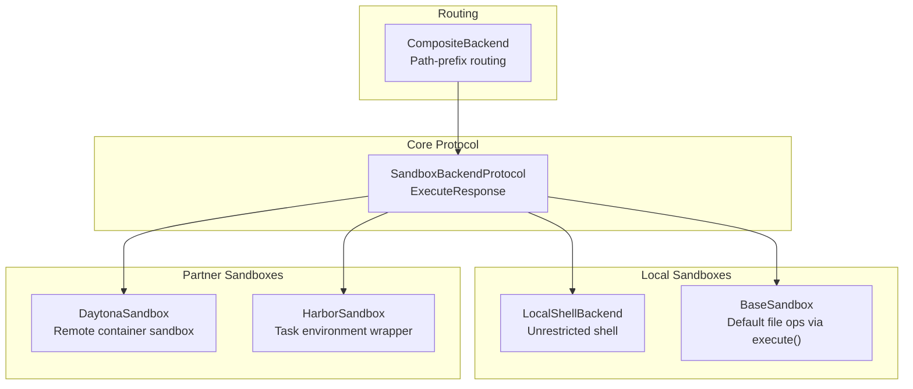
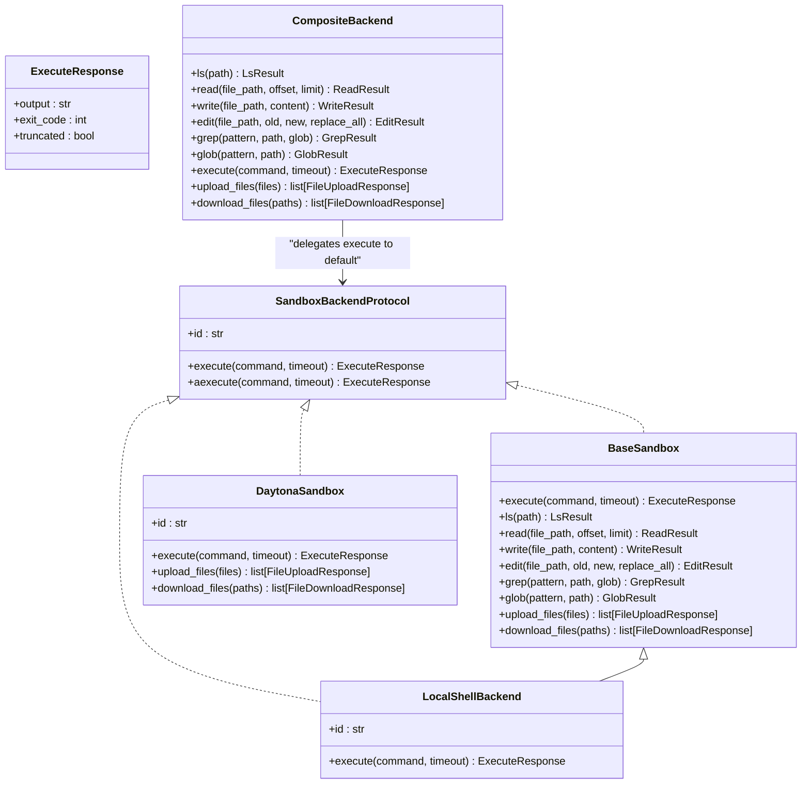
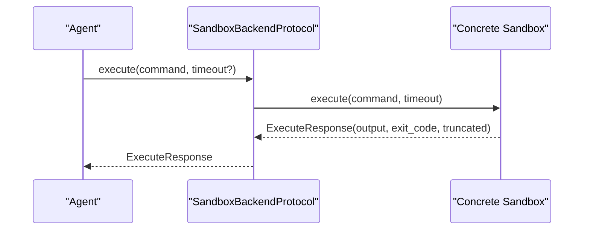
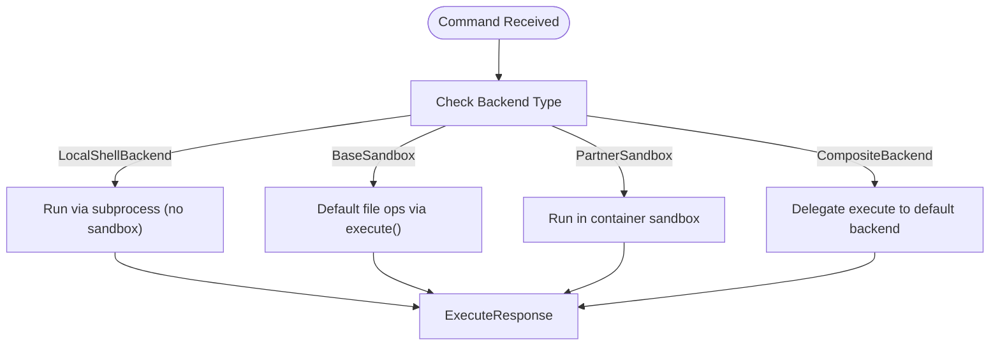
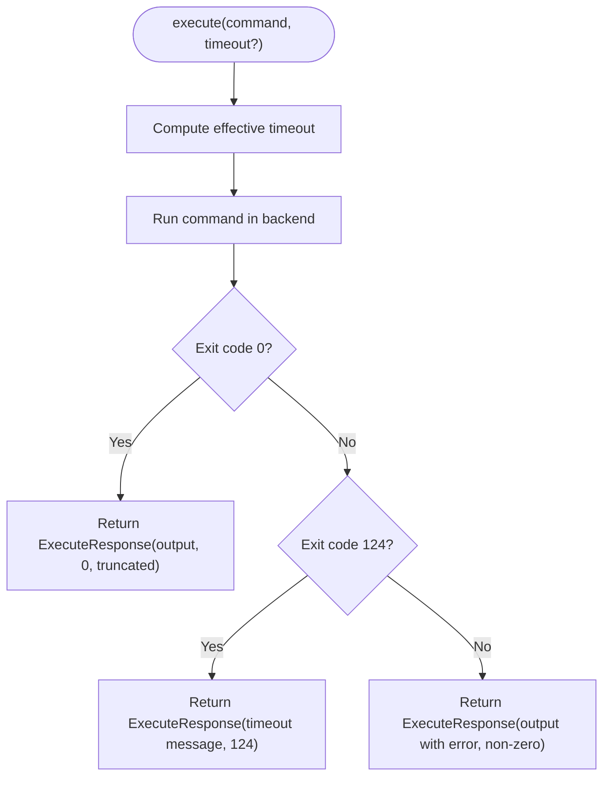
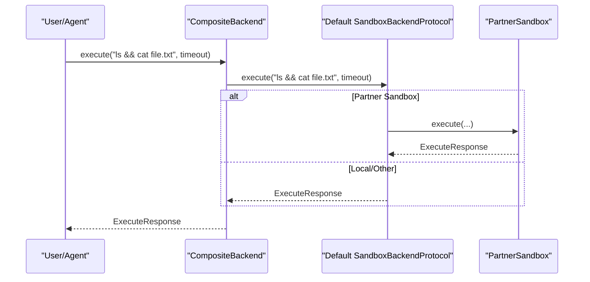
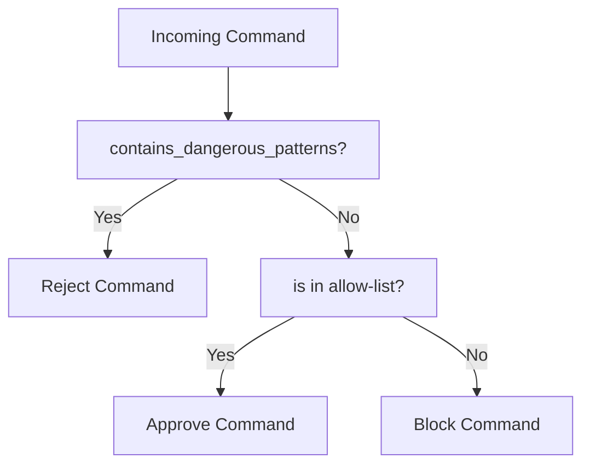
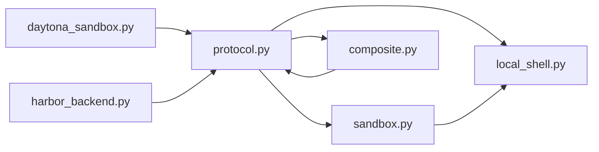

# Shell Integration & Sandbox Execution

<cite>
**Referenced Files in This Document**
- [README.md](file://README.md)
- [local_shell.py](file://libs/deepagents/deepagents/backends/local_shell.py)
- [sandbox.py](file://libs/deepagents/deepagents/backends/sandbox.py)
- [protocol.py](file://libs/deepagents/deepagents/backends/protocol.py)
- [composite.py](file://libs/deepagents/deepagents/backends/composite.py)
- [daytona_sandbox.py](file://libs/partners/daytona/langchain_daytona/sandbox.py)
- [harbor_backend.py](file://libs/evals/deepagents_harbor/backend.py)
- [test_local_sandbox_operations.py](file://libs/deepagents/tests/unit_tests/test_local_sandbox_operations.py)
- [test_sandbox_operations.py](file://libs/cli/tests/integration_tests/test_sandbox_operations.py)
- [shell_allow_list.py](file://libs/cli/tests/unit_tests/test_shell_allow_list.py)
- [cli_config.py](file://libs/cli/deepagents_cli/config.py)
</cite>

## Table of Contents
1. [Introduction](#introduction)
2. [Project Structure](#project-structure)
3. [Core Components](#core-components)
4. [Architecture Overview](#architecture-overview)
5. [Detailed Component Analysis](#detailed-component-analysis)
6. [Dependency Analysis](#dependency-analysis)
7. [Performance Considerations](#performance-considerations)
8. [Troubleshooting Guide](#troubleshooting-guide)
9. [Conclusion](#conclusion)
10. [Appendices](#appendices)

## Introduction
This document explains DeepAgents shell integration and sandbox execution capabilities. It focuses on the execute tool for running shell commands in isolated environments, the sandbox security model and isolation mechanisms, execution constraints, timeout management, command chaining with operators, and quoting practices for paths with spaces. It also covers integration with different backend implementations, including Docker-based sandboxes, and outlines security best practices, command validation, and resource limitation strategies.

## Project Structure
DeepAgents provides a pluggable backend system for file operations and shell execution. The core abstractions define a unified protocol for backends, with multiple implementations supporting local execution, sandboxed environments, and partner integrations.

**Diagram sources**
- [protocol.py:627-709](file://libs/deepagents/deepagents/backends/protocol.py#L627-L709)
- [local_shell.py:27-360](file://libs/deepagents/deepagents/backends/local_shell.py#L27-L360)
- [sandbox.py:217-465](file://libs/deepagents/deepagents/backends/sandbox.py#L217-L465)
- [daytona_sandbox.py:23-202](file://libs/partners/daytona/langchain_daytona/sandbox.py#L23-L202)
- [harbor_backend.py:47-81](file://libs/evals/deepagents_harbor/backend.py#L47-L81)
- [composite.py:120-774](file://libs/deepagents/deepagents/backends/composite.py#L120-L774)

**Section sources**
- [README.md:24-36](file://README.md#L24-L36)
- [protocol.py:627-709](file://libs/deepagents/deepagents/backends/protocol.py#L627-L709)

## Core Components
- SandboxBackendProtocol: Defines the unified interface for backends that support file operations and shell command execution, including ExecuteResponse and async execute/aexecute.
- BaseSandbox: Implements default file operations (ls, read, write, edit, grep, glob) by delegating to execute(), enabling consistent behavior across sandbox implementations.
- LocalShellBackend: Provides unrestricted shell execution on the host system with configurable timeouts and environment variables. It warns against production use and lack of isolation.
- Partner Sandboxes: Implementations like DaytonaSandbox integrate with remote container sandboxes and HarborSandbox wraps task environments with timeouts.
- CompositeBackend: Routes file operations by path prefix while delegating shell execution to a default sandbox backend.

Key behaviors:
- ExecuteResponse encapsulates output, exit_code, and truncation flags.
- BaseSandbox uses shell commands and Python helpers to implement file operations safely.
- LocalShellBackend executes commands directly with subprocess and no sandboxing.
- CompositeBackend ensures execution is always delegated to the default sandbox backend.

**Section sources**
- [protocol.py:610-709](file://libs/deepagents/deepagents/backends/protocol.py#L610-L709)
- [sandbox.py:217-465](file://libs/deepagents/deepagents/backends/sandbox.py#L217-L465)
- [local_shell.py:27-360](file://libs/deepagents/deepagents/backends/local_shell.py#L27-L360)
- [composite.py:573-633](file://libs/deepagents/deepagents/backends/composite.py#L573-L633)

## Architecture Overview
The system separates concerns between protocol, sandbox implementations, and routing. Backends implement the protocol; BaseSandbox provides default file operations; partner backends integrate with remote environments; and CompositeBackend routes operations by path.

**Diagram sources**
- [protocol.py:627-709](file://libs/deepagents/deepagents/backends/protocol.py#L627-L709)
- [sandbox.py:217-465](file://libs/deepagents/deepagents/backends/sandbox.py#L217-L465)
- [local_shell.py:27-360](file://libs/deepagents/deepagents/backends/local_shell.py#L27-L360)
- [daytona_sandbox.py:23-202](file://libs/partners/daytona/langchain_daytona/sandbox.py#L23-L202)
- [composite.py:120-774](file://libs/deepagents/deepagents/backends/composite.py#L120-L774)

## Detailed Component Analysis

### Execute Tool and Sandbox Execution
- ExecuteResponse: Standardized result with output, exit_code, and truncated flag. Used across all sandbox backends.
- BaseSandbox.execute(): Abstract method; concrete implementations provide execution in their environment.
- LocalShellBackend.execute(): Runs commands directly via subprocess with shell=True, combining stdout/stderr, applying timeouts, and handling truncation.
- DaytonaSandbox.execute(): Executes commands in a remote container sandbox with session-based execution and polling for completion.
- HarborSandbox.aexecute(): Wraps environment.exec with timeout handling and returns ExecuteResponse.

**Diagram sources**
- [protocol.py:644-683](file://libs/deepagents/deepagents/backends/protocol.py#L644-L683)
- [local_shell.py:213-357](file://libs/deepagents/deepagents/backends/local_shell.py#L213-L357)
- [daytona_sandbox.py:66-134](file://libs/partners/daytona/langchain_daytona/sandbox.py#L66-L134)
- [harbor_backend.py:58-81](file://libs/evals/deepagents_harbor/backend.py#L58-L81)

**Section sources**
- [protocol.py:610-709](file://libs/deepagents/deepagents/backends/protocol.py#L610-L709)
- [local_shell.py:213-357](file://libs/deepagents/deepagents/backends/local_shell.py#L213-L357)
- [daytona_sandbox.py:66-134](file://libs/partners/daytona/langchain_daytona/sandbox.py#L66-L134)
- [harbor_backend.py:58-81](file://libs/evals/deepagents_harbor/backend.py#L58-L81)

### Security Model and Isolation Mechanisms
- LocalShellBackend: No sandboxing or isolation; commands run with full host privileges. Security warnings emphasize production unsuitability and the need for Human-in-the-Loop.
- BaseSandbox: Provides default file operations implemented via shell commands; not a process/container sandbox.
- Partner sandboxes (e.g., DaytonaSandbox): Execute commands inside isolated container sessions with polling and controlled timeouts.
- CompositeBackend: Routes file operations by path; execution is delegated to the default sandbox backend.

**Diagram sources**
- [local_shell.py:27-360](file://libs/deepagents/deepagents/backends/local_shell.py#L27-L360)
- [sandbox.py:217-465](file://libs/deepagents/deepagents/backends/sandbox.py#L217-L465)
- [daytona_sandbox.py:23-202](file://libs/partners/daytona/langchain_daytona/sandbox.py#L23-L202)
- [composite.py:573-633](file://libs/deepagents/deepagents/backends/composite.py#L573-L633)

**Section sources**
- [local_shell.py:34-82](file://libs/deepagents/deepagents/backends/local_shell.py#L34-L82)
- [daytona_sandbox.py:23-64](file://libs/partners/daytona/langchain_daytona/sandbox.py#L23-L64)

### Timeout Management
- LocalShellBackend: Applies subprocess timeout per command; returns standardized ExecuteResponse with exit_code 124 on timeout.
- DaytonaSandbox: Uses session-based execution with polling and respects timeout; returns ExecuteResponse with exit_code 124 on timeout.
- HarborSandbox: Wraps environment.exec with asyncio.wait_for and handles TimeoutError to produce ExecuteResponse.
- CompositeBackend: Delegates execute to default backend and forwards timeout if supported.

**Diagram sources**
- [local_shell.py:293-357](file://libs/deepagents/deepagents/backends/local_shell.py#L293-L357)
- [daytona_sandbox.py:102-134](file://libs/partners/daytona/langchain_daytona/sandbox.py#L102-L134)
- [harbor_backend.py:74-81](file://libs/evals/deepagents_harbor/backend.py#L74-L81)
- [composite.py:597-608](file://libs/deepagents/deepagents/backends/composite.py#L597-L608)

**Section sources**
- [local_shell.py:293-357](file://libs/deepagents/deepagents/backends/local_shell.py#L293-L357)
- [daytona_sandbox.py:102-134](file://libs/partners/daytona/langchain_daytona/sandbox.py#L102-L134)
- [harbor_backend.py:74-81](file://libs/evals/deepagents_harbor/backend.py#L74-L81)
- [protocol.py:685-704](file://libs/deepagents/deepagents/backends/protocol.py#L685-L704)

### Command Chaining and Operators
- LocalShellBackend.execute passes the entire command string to the system shell with shell=True, enabling use of operators like && and ;.
- BaseSandbox.grep uses shlex.quote for safe pattern and path handling; other operations rely on shell interpretation.
- Tests demonstrate file operations with paths containing spaces and special characters, indicating shell interpretation of paths.

Best practices:
- Prefer shlex.quote for user-provided arguments.
- Use && for conditional chaining and ; for sequential execution.
- Quote paths with spaces using shell quoting to avoid word splitting.

**Section sources**
- [local_shell.py:299-308](file://libs/deepagents/deepagents/backends/local_shell.py#L299-L308)
- [sandbox.py:380-393](file://libs/deepagents/deepagents/backends/sandbox.py#L380-L393)
- [test_local_sandbox_operations.py:278-280](file://libs/deepagents/tests/unit_tests/test_local_sandbox_operations.py#L278-L280)

### Proper Quoting Practices for File Paths with Spaces
- Tests show writing files with spaces in names and verifying content preserves special characters.
- BaseSandbox templates use heredoc and base64 encoding to avoid ARG_MAX and shell injection risks for large payloads.
- CLI config defines dangerous patterns and recommends safe read-only commands to mitigate injection.

Recommendations:
- Always quote paths with spaces in shell commands.
- Use shlex.quote for dynamic arguments.
- Avoid injecting untrusted content directly into command strings.

**Section sources**
- [test_local_sandbox_operations.py:254-280](file://libs/deepagents/tests/unit_tests/test_local_sandbox_operations.py#L254-L280)
- [sandbox.py:62-96](file://libs/deepagents/deepagents/backends/sandbox.py#L62-L96)
- [cli_config.py:1195-1279](file://libs/cli/deepagents_cli/config.py#L1195-L1279)

### Integration with Backend Implementations
- LocalShellBackend: Direct host execution; suitable for development with strict safeguards.
- BaseSandbox: Default file operations via execute(); can be extended for custom sandbox implementations.
- DaytonaSandbox: Remote container sandbox with session-based execution and polling.
- HarborSandbox: Task environment wrapper with timeout handling around environment.exec.
- CompositeBackend: Routes file operations by path; execution delegated to default sandbox backend.

**Diagram sources**
- [composite.py:573-633](file://libs/deepagents/deepagents/backends/composite.py#L573-L633)
- [daytona_sandbox.py:66-134](file://libs/partners/daytona/langchain_daytona/sandbox.py#L66-L134)
- [harbor_backend.py:58-81](file://libs/evals/deepagents_harbor/backend.py#L58-L81)

**Section sources**
- [local_shell.py:27-360](file://libs/deepagents/deepagents/backends/local_shell.py#L27-L360)
- [daytona_sandbox.py:23-202](file://libs/partners/daytona/langchain_daytona/sandbox.py#L23-L202)
- [harbor_backend.py:47-81](file://libs/evals/deepagents_harbor/backend.py#L47-L81)
- [composite.py:573-633](file://libs/deepagents/deepagents/backends/composite.py#L573-L633)

### Security Best Practices and Validation
- Dangerous patterns detection: CLI config blocks redirection, substitution operators, bare variable expansion, and standalone background operator (&).
- Allow-list enforcement: Recommended safe commands include read-only utilities; shells, editors, package managers, and network tools are intentionally excluded.
- Human-in-the-Loop: Strongly recommended when using unrestricted backends like LocalShellBackend.
- Path-based restrictions: virtual_mode does not restrict shell execution; absolute paths and traversal remain possible.

**Diagram sources**
- [cli_config.py:1195-1279](file://libs/cli/deepagents_cli/config.py#L1195-L1279)
- [shell_allow_list.py:296-615](file://libs/cli/tests/unit_tests/test_shell_allow_list.py#L296-L615)

**Section sources**
- [local_shell.py:53-82](file://libs/deepagents/deepagents/backends/local_shell.py#L53-L82)
- [cli_config.py:1195-1279](file://libs/cli/deepagents_cli/config.py#L1195-L1279)
- [shell_allow_list.py:296-615](file://libs/cli/tests/unit_tests/test_shell_allow_list.py#L296-L615)

### Resource Limitation Strategies
- Timeouts: All backends honor timeout semantics; LocalShellBackend uses subprocess timeout; DaytonaSandbox polls with timeout; HarborSandbox uses asyncio.wait_for.
- Output truncation: LocalShellBackend truncates output beyond a configured byte limit.
- Environment controls: LocalShellBackend supports environment variable configuration and inheritance.

Recommendations:
- Set conservative default timeouts for long-running tasks.
- Monitor output sizes and apply truncation where appropriate.
- Configure minimal environment variables for sandboxed execution.

**Section sources**
- [local_shell.py:23-24](file://libs/deepagents/deepagents/backends/local_shell.py#L23-L24)
- [local_shell.py:143-160](file://libs/deepagents/deepagents/backends/local_shell.py#L143-L160)
- [local_shell.py:322-327](file://libs/deepagents/deepagents/backends/local_shell.py#L322-L327)
- [daytona_sandbox.py:83-84](file://libs/partners/daytona/langchain_daytona/sandbox.py#L83-L84)
- [harbor_backend.py:72-81](file://libs/evals/deepagents_harbor/backend.py#L72-L81)

### Examples and Safe Coding Practices
Common operations:
- Running shell commands with && and ; chaining.
- Writing files with special characters and spaces in paths.
- Using grep with literal patterns and glob filters.
- Uploading/downloading files via sandbox APIs.

Safe coding practices:
- Quote all user-provided paths and arguments.
- Use shlex.quote for dynamic content.
- Prefer read-only commands in non-interactive contexts.
- Apply Human-in-the-Loop for unrestricted execution.

**Section sources**
- [test_local_sandbox_operations.py:254-280](file://libs/deepagents/tests/unit_tests/test_local_sandbox_operations.py#L254-L280)
- [test_sandbox_operations.py:68-102](file://libs/cli/tests/integration_tests/test_sandbox_operations.py#L68-L102)
- [sandbox.py:373-414](file://libs/deepagents/deepagents/backends/sandbox.py#L373-L414)
- [cli_config.py:1206-1246](file://libs/cli/deepagents_cli/config.py#L1206-L1246)

## Dependency Analysis
The following diagram shows key dependencies among core components:

**Diagram sources**
- [protocol.py:627-709](file://libs/deepagents/deepagents/backends/protocol.py#L627-L709)
- [local_shell.py:27-360](file://libs/deepagents/deepagents/backends/local_shell.py#L27-L360)
- [sandbox.py:217-465](file://libs/deepagents/deepagents/backends/sandbox.py#L217-L465)
- [composite.py:120-774](file://libs/deepagents/deepagents/backends/composite.py#L120-L774)
- [daytona_sandbox.py:23-202](file://libs/partners/daytona/langchain_daytona/sandbox.py#L23-L202)
- [harbor_backend.py:47-81](file://libs/evals/deepagents_harbor/backend.py#L47-L81)

**Section sources**
- [protocol.py:627-709](file://libs/deepagents/deepagents/backends/protocol.py#L627-L709)
- [composite.py:573-633](file://libs/deepagents/deepagents/backends/composite.py#L573-L633)

## Performance Considerations
- Subprocess overhead: LocalShellBackend spawns processes per command; consider batching or caching where appropriate.
- Output size limits: Truncation prevents excessive memory usage; adjust max_output_bytes as needed.
- Async execution: HarborSandbox and CompositeBackend support async execute to improve throughput.
- Polling intervals: DaytonaSandbox allows configurable polling strategies to balance responsiveness and load.

[No sources needed since this section provides general guidance]

## Troubleshooting Guide
Common issues and resolutions:
- Timeout failures: Increase timeout or optimize command execution; verify backend supports timeout.
- Output truncation: Reduce command scope or increase max_output_bytes; paginate reads.
- Permission errors: Ensure backend has appropriate filesystem permissions; validate path routing in CompositeBackend.
- Command injection attempts: Enforce allow-list and dangerous-pattern checks; avoid shell=True for untrusted input.

Validation references:
- Unit tests for sandbox operations confirm behavior with special characters and paths with spaces.
- CLI allow-list tests validate blocking of command substitution and control characters.

**Section sources**
- [test_local_sandbox_operations.py:254-280](file://libs/deepagents/tests/unit_tests/test_local_sandbox_operations.py#L254-L280)
- [test_sandbox_operations.py:68-102](file://libs/cli/tests/integration_tests/test_sandbox_operations.py#L68-L102)
- [shell_allow_list.py:296-615](file://libs/cli/tests/unit_tests/test_shell_allow_list.py#L296-L615)

## Conclusion
DeepAgents provides a flexible, protocol-driven sandbox execution framework. While LocalShellBackend offers powerful unrestricted execution for development, production use requires sandboxed environments via partner implementations like DaytonaSandbox or custom BaseSandbox extensions. Robust security practices—Human-in-the-Loop, allow-lists, dangerous-pattern detection, and proper quoting—are essential. Timeout management, output truncation, and async execution support help maintain reliability and performance across diverse backends.

[No sources needed since this section summarizes without analyzing specific files]

## Appendices
- Security policy emphasis: Trust the LLM model but enforce boundaries at the tool/sandbox level.
- Recommended safeguards for LocalShellBackend include Human-in-the-Loop, development-only usage, and avoiding untrusted code.

**Section sources**
- [README.md:123-126](file://README.md#L123-L126)