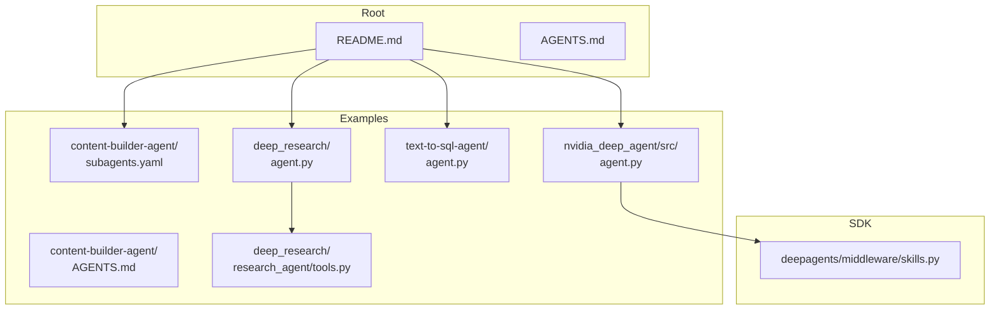
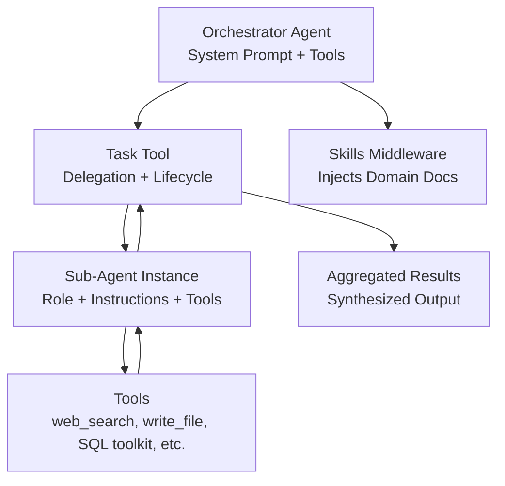
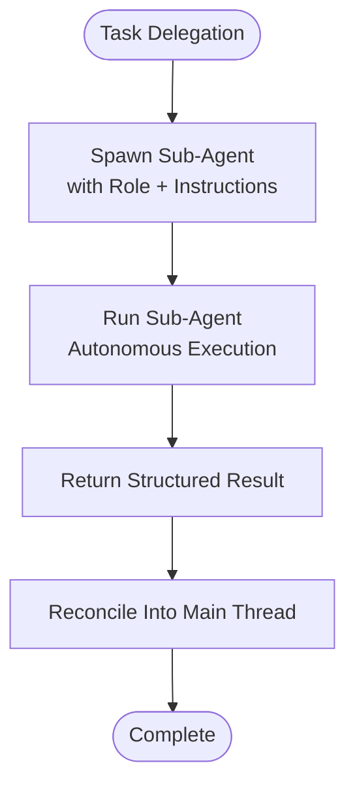
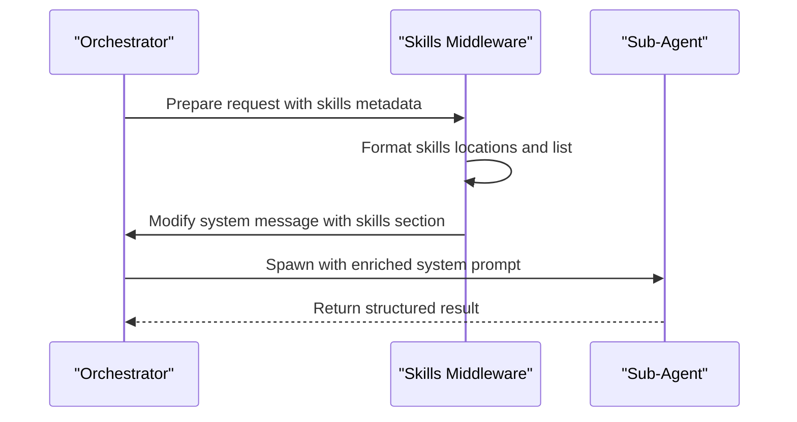
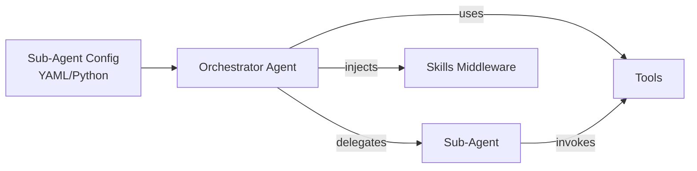

# Sub-Agent Orchestration

<cite>
**Referenced Files in This Document**
- [README.md](file://README.md)
- [AGENTS.md](file://AGENTS.md)
- [examples/content-builder-agent/subagents.yaml](file://examples/content-builder-agent/subagents.yaml)
- [examples/content-builder-agent/AGENTS.md](file://examples/content-builder-agent/AGENTS.md)
- [examples/deep_research/agent.py](file://examples/deep_research/agent.py)
- [examples/deep_research/research_agent/tools.py](file://examples/deep_research/research_agent/tools.py)
- [examples/text-to-sql-agent/agent.py](file://examples/text-to-sql-agent/agent.py)
- [examples/nvidia_deep_agent/src/agent.py](file://examples/nvidia_deep_agent/src/agent.py)
- [libs/deepagents/deepagents/middleware/skills.py](file://libs/deepagents/deepagents/middleware/skills.py)
</cite>

## Table of Contents
1. [Introduction](#introduction)
2. [Project Structure](#project-structure)
3. [Core Components](#core-components)
4. [Architecture Overview](#architecture-overview)
5. [Detailed Component Analysis](#detailed-component-analysis)
6. [Dependency Analysis](#dependency-analysis)
7. [Performance Considerations](#performance-considerations)
8. [Troubleshooting Guide](#troubleshooting-guide)
9. [Conclusion](#conclusion)
10. [Appendices](#appendices)

## Introduction
This document explains the DeepAgents sub-agent orchestration system with a focus on the task tool for delegating work to specialized sub-agents and managing their execution. It covers synchronous and asynchronous execution patterns, sub-agent lifecycle management, result aggregation and error propagation, and the skill system integration for domain-specific capabilities. It also provides examples of multi-agent workflows, parallel execution patterns, coordination strategies, performance considerations, resource management, debugging techniques for distributed agent systems, and guidelines for designing effective sub-agent hierarchies and communication patterns.

## Project Structure
The repository is a monorepo containing:
- libs: Core packages (deepagents SDK, CLI, ACP, evals, partners)
- examples: End-to-end agent demonstrations and patterns
- Root documentation and guidelines

Key areas relevant to sub-agent orchestration:
- SDK and middleware for skills and sub-agent configuration
- Example agents that demonstrate sub-agent usage, tool integration, and skill-based specialization
- YAML-based sub-agent definitions for declarative configuration

**Diagram sources**
- [README.md](file://README.md)
- [AGENTS.md](file://AGENTS.md)
- [examples/content-builder-agent/subagents.yaml](file://examples/content-builder-agent/subagents.yaml)
- [examples/content-builder-agent/AGENTS.md](file://examples/content-builder-agent/AGENTS.md)
- [examples/deep_research/agent.py](file://examples/deep_research/agent.py)
- [examples/deep_research/research_agent/tools.py](file://examples/deep_research/research_agent/tools.py)
- [examples/text-to-sql-agent/agent.py](file://examples/text-to-sql-agent/agent.py)
- [examples/nvidia_deep_agent/src/agent.py](file://examples/nvidia_deep_agent/src/agent.py)
- [libs/deepagents/deepagents/middleware/skills.py](file://libs/deepagents/deepagents/middleware/skills.py)

**Section sources**
- [README.md](file://README.md)
- [AGENTS.md](file://AGENTS.md)

## Core Components
- Sub-agent definition and configuration: Sub-agents are defined as named entities with a description, system prompt, tools, and optional model selection. They can be configured declaratively (YAML) or programmatically (Python dict).
- Task tool: The task tool enables delegation of work to sub-agents with isolated context windows. It supports lifecycle stages: spawn, run, return, and reconcile.
- Skill system: Skills are domain-specific instruction sets injected into the system prompt to specialize sub-agent capabilities.
- Tool integration: Sub-agents use tools (e.g., web search, database operations) to perform specialized tasks.
- Orchestration: The orchestrator coordinates sub-agent spawning, execution, result reconciliation, and error propagation.

**Section sources**
- [examples/content-builder-agent/subagents.yaml](file://examples/content-builder-agent/subagents.yaml)
- [examples/deep_research/agent.py](file://examples/deep_research/agent.py)
- [examples/deep_research/research_agent/tools.py](file://examples/deep_research/research_agent/tools.py)
- [examples/nvidia_deep_agent/src/agent.py](file://examples/nvidia_deep_agent/src/agent.py)
- [libs/deepagents/deepagents/middleware/skills.py](file://libs/deepagents/deepagents/middleware/skills.py)

## Architecture Overview
The sub-agent orchestration architecture centers on a LangGraph-based runtime. The orchestrator composes a system prompt that includes:
- General instructions
- Sub-agent definitions and delegation rules
- Skill-based specializations
- Tool availability

Execution proceeds through the task tool, which spawns sub-agents with isolated context, runs them to completion, aggregates results, and reconciles outcomes into the main thread.

**Diagram sources**
- [examples/deep_research/agent.py](file://examples/deep_research/agent.py)
- [examples/deep_research/research_agent/tools.py](file://examples/deep_research/research_agent/tools.py)
- [examples/nvidia_deep_agent/src/agent.py](file://examples/nvidia_deep_agent/src/agent.py)
- [libs/deepagents/deepagents/middleware/skills.py](file://libs/deepagents/deepagents/middleware/skills.py)

## Detailed Component Analysis

### Sub-Agent Definition and Configuration
- Declarative configuration: YAML-based sub-agent definitions specify description, model, system prompt, and tools. This enables easy composition and reuse across agents.
- Programmatic configuration: Python dicts define sub-agents with name, description, system_prompt, tools, optional model, and optional skills.

Key considerations:
- Clear role and expected output in the system prompt
- Tool availability aligned with sub-agent responsibilities
- Optional model selection for specialized compute needs

**Section sources**
- [examples/content-builder-agent/subagents.yaml](file://examples/content-builder-agent/subagents.yaml)
- [examples/content-builder-agent/AGENTS.md](file://examples/content-builder-agent/AGENTS.md)
- [examples/deep_research/agent.py](file://examples/deep_research/agent.py)
- [examples/nvidia_deep_agent/src/agent.py](file://examples/nvidia_deep_agent/src/agent.py)

### Task Tool and Sub-Agent Lifecycle
Lifecycle stages:
1. Spawn: Provide clear role, instructions, and expected output
2. Run: The sub-agent executes autonomously within its isolated context
3. Return: The sub-agent provides a single structured result
4. Reconcile: The orchestrator incorporates or synthesizes the result into the main thread

Guidance on when to use the task tool:
- Favor delegation for complex, multi-step tasks that can run in isolation
- Parallelize independent tasks to improve throughput
- Use sandboxing to improve reliability for code execution or structured searches
- Delegate when the output alone suffices and intermediate steps are not required

Avoid delegation when:
- Intermediate reasoning or steps are needed
- The task is trivial
- Delegation does not reduce tokens, complexity, or context switching
- Splitting adds latency without benefit

**Diagram sources**
- [libs/deepagents/deepagents/middleware/skills.py](file://libs/deepagents/deepagents/middleware/skills.py)

**Section sources**
- [libs/deepagents/deepagents/middleware/skills.py](file://libs/deepagents/deepagents/middleware/skills.py)

### Synchronous vs Asynchronous Sub-Agent Execution
- Synchronous execution: The orchestrator waits for each sub-agent to complete before proceeding. Use when results must be integrated in order or when downstream steps depend on immediate completion.
- Asynchronous execution: The orchestrator delegates multiple sub-agents concurrently and aggregates results later. Use when tasks are independent and throughput is prioritized.

Patterns:
- Batch parallelism: Launch several sub-agents in parallel, then reconcile results
- Pipeline stages: Use synchronous stages for ordered processing, asynchronous for independent branches

Coordination strategies:
- Use counters or semaphores to limit concurrency
- Employ result queues keyed by task ID
- Apply backpressure when downstream capacity is exceeded

[No sources needed since this section provides general guidance]

### Result Aggregation and Error Propagation
Aggregation:
- Normalize sub-agent outputs into a unified schema
- Merge partial results into a cohesive synthesis
- Apply summarization or filtering when necessary

Error propagation:
- Surface sub-agent errors to the orchestrator
- Implement retries for transient failures
- Use circuit-breaker patterns to prevent cascading failures
- Log and tag errors with sub-agent identity and task context

[No sources needed since this section provides general guidance]

### Skill System Integration
Skills are domain-specific instruction sets that enhance sub-agent capabilities. The skills middleware injects skill documentation into the system prompt, enabling specialized behavior without hardcoding instructions.

Key aspects:
- Skill discovery and loading from configured paths
- Injection of skill locations and summaries into the system prompt
- Per-request modification of the system message to include skills context

**Diagram sources**
- [libs/deepagents/deepagents/middleware/skills.py](file://libs/deepagents/deepagents/middleware/skills.py)

**Section sources**
- [libs/deepagents/deepagents/middleware/skills.py](file://libs/deepagents/deepagents/middleware/skills.py)

### Tool Integration Patterns
- Web search: Used by research sub-agents to gather current information and sources
- Database operations: Integrated via toolkit-generated tools for query-writing and schema exploration
- Custom tools: Implemented as LangChain tools with typed parameters and documentation

Examples:
- Research agent uses a custom search tool and a reflection tool to guide iterative research
- Text-to-SQL agent composes SQL toolkit tools with a filesystem backend for persistent storage

**Section sources**
- [examples/deep_research/research_agent/tools.py](file://examples/deep_research/research_agent/tools.py)
- [examples/text-to-sql-agent/agent.py](file://examples/text-to-sql-agent/agent.py)

### Multi-Agent Workflows and Coordination
- Content builder agent: Orchestrates a research sub-agent before writing content, ensuring high-quality, sourced material
- Deep research agent: Demonstrates structured delegation with limits on concurrent units and iterations
- NVIDIA multi-model agent: Combines a frontier orchestrator with specialized sub-agents (researcher, data processor) and GPU-accelerated skills

Patterns:
- Hierarchical delegation: High-level orchestrator delegates to specialized sub-agents
- Parallel branches: Independent tasks executed concurrently
- Iterative refinement: Sub-agents reflect and refine outputs before final synthesis

**Section sources**
- [examples/content-builder-agent/AGENTS.md](file://examples/content-builder-agent/AGENTS.md)
- [examples/deep_research/agent.py](file://examples/deep_research/agent.py)
- [examples/nvidia_deep_agent/src/agent.py](file://examples/nvidia_deep_agent/src/agent.py)

## Dependency Analysis
The sub-agent orchestration depends on:
- LangGraph runtime for streaming, persistence, and checkpointing
- Tool ecosystem (web search, database toolkit, custom tools)
- Skills middleware for dynamic system prompt augmentation
- YAML/Python configuration for sub-agent definitions

**Diagram sources**
- [examples/deep_research/agent.py](file://examples/deep_research/agent.py)
- [examples/nvidia_deep_agent/src/agent.py](file://examples/nvidia_deep_agent/src/agent.py)
- [libs/deepagents/deepagents/middleware/skills.py](file://libs/deepagents/deepagents/middleware/skills.py)

**Section sources**
- [examples/deep_research/agent.py](file://examples/deep_research/agent.py)
- [examples/nvidia_deep_agent/src/agent.py](file://examples/nvidia_deep_agent/src/agent.py)
- [libs/deepagents/deepagents/middleware/skills.py](file://libs/deepagents/deepagents/middleware/skills.py)

## Performance Considerations
- Concurrency limits: Control the number of simultaneous sub-agents to balance throughput and resource usage
- Token and context management: Prefer delegation for tasks that require focused reasoning or heavy context to reduce orchestrator overhead
- Parallelization: Exploit independent tasks for parallel execution; synchronize only when necessary
- Resource allocation: Select models and backends appropriate to sub-agent workloads (e.g., GPU for data processing)
- Caching and memoization: Reuse results for repeated sub-agent invocations when safe
- Backpressure and throttling: Prevent overload by limiting inflight tasks and applying retry policies

[No sources needed since this section provides general guidance]

## Troubleshooting Guide
Common issues and remedies:
- Sub-agent timeouts: Increase timeouts or split long tasks; monitor execution duration
- Tool misuse: Ensure sub-agent system prompts clearly specify tool usage and constraints
- Result misalignment: Standardize output schemas and normalize results before reconciliation
- Skill conflicts: Verify skill precedence and avoid contradictory instructions
- Debugging distributed agents: Enable logging, attach correlation IDs, and capture snapshots of intermediate states

[No sources needed since this section provides general guidance]

## Conclusion
DeepAgents provides a robust framework for sub-agent orchestration. By leveraging the task tool, structured lifecycle management, skill-based specialization, and flexible execution patterns, developers can build scalable, maintainable multi-agent systems. Effective design balances delegation granularity, parallelism, and resource constraints while ensuring reliable error handling and clear communication between agents.

[No sources needed since this section summarizes without analyzing specific files]

## Appendices

### Best Practices for Sub-Agent Design
- Define clear roles and expected outputs for each sub-agent
- Keep sub-agent prompts concise yet comprehensive
- Align tools with sub-agent responsibilities
- Use skills to modularize domain-specific knowledge
- Apply concurrency controls and backpressure mechanisms
- Instrument logging and observability for distributed debugging

[No sources needed since this section provides general guidance]