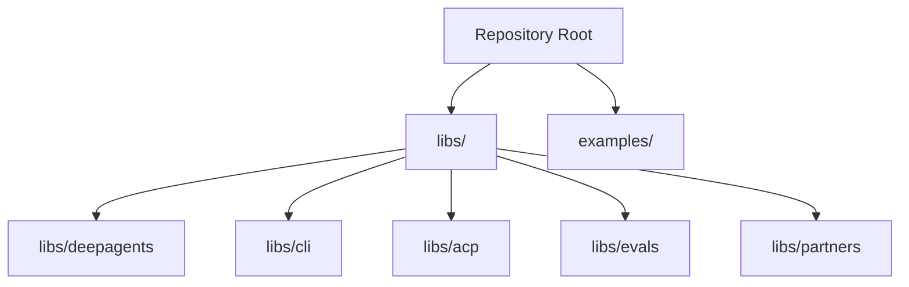
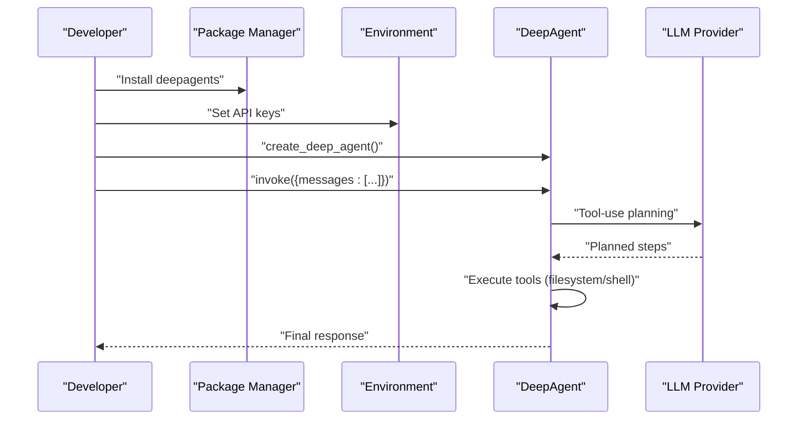
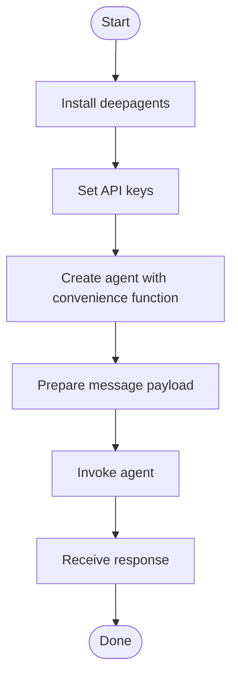

# Getting Started

<cite>
**Referenced Files in This Document**
- [README.md](file://README.md)
- [AGENTS.md](file://AGENTS.md)
- [examples/README.md](file://examples/README.md)
- [examples/deep_research/README.md](file://examples/deep_research/README.md)
- [examples/deep_research/agent.py](file://examples/deep_research/agent.py)
- [examples/text-to-sql-agent/agent.py](file://examples/text-to-sql-agent/agent.py)
- [examples/content-builder-agent/README.md](file://examples/content-builder-agent/README.md)
- [examples/content-builder-agent/content_writer.py](file://examples/content-builder-agent/content_writer.py)
</cite>

## Table of Contents
1. [Introduction](#introduction)
2. [Project Structure](#project-structure)
3. [Core Components](#core-components)
4. [Architecture Overview](#architecture-overview)
5. [Detailed Component Analysis](#detailed-component-analysis)
6. [Dependency Analysis](#dependency-analysis)
7. [Performance Considerations](#performance-considerations)
8. [Troubleshooting Guide](#troubleshooting-guide)
9. [Conclusion](#conclusion)
10. [Appendices](#appendices)

## Introduction
DeepAgents is an agent harness that provides a batteries-included, ready-to-run agent out of the box. It includes planning, filesystem access, shell execution (with sandboxing), sub-agents, smart defaults, and context management. You can install it with pip or uv, create a working agent in seconds, and then customize it by adding tools, swapping models, or tuning prompts.

This guide walks you through installation, environment setup, and a quick start that demonstrates creating and running your first agent using the provided convenience function. It also covers common prerequisites (API keys), basic Python knowledge, and practical examples for file operations and planning.

## Project Structure
At a high level, the repository is a monorepo containing:
- The DeepAgents SDK under libs/deepagents
- A CLI under libs/cli
- Agent Context Protocol support under libs/acp
- Evaluation tools under libs/evals
- Partner integrations under libs/partners
- Examples under examples/

The examples directory showcases real-world agents and patterns you can adapt. Each example includes its own README with setup and usage instructions.

**Section sources**
- [AGENTS.md:7-23](file://AGENTS.md#L7-L23)

## Core Components
- Installation and quick start: The repository’s main README shows how to install with pip or uv and how to create and run a basic agent using the provided convenience function.
- Agent creation: The convenience function returns a compiled LangGraph graph, enabling streaming, Studio, checkpointers, and other LangGraph features.
- Tools and capabilities: The agent includes planning, filesystem operations (read, write, edit, list, glob, grep), shell execution (with sandboxing), and sub-agent delegation.

What you can do right away:
- Install the package
- Set up API keys for your chosen model provider
- Run a minimal agent invocation
- Explore examples for file operations and planning

**Section sources**
- [README.md:38-51](file://README.md#L38-L51)
- [README.md:24-34](file://README.md#L24-L34)

## Architecture Overview
The simplest path to a working agent:
1. Install the package using pip or uv
2. Configure environment variables for your model provider
3. Import the convenience function and create an agent
4. Invoke the agent with a message payload
5. Observe the agent’s planning and tool-use behavior

**Diagram sources**
- [README.md:38-51](file://README.md#L38-L51)

## Detailed Component Analysis

### Installation and Environment Setup
- Install with pip or uv as shown in the repository’s main README.
- For development and examples, uv is recommended and used across the repository.
- Ensure your Python version meets the minimum requirement indicated in the examples.

Practical steps:
- Choose pip or uv and install the package
- Confirm installation by importing the convenience function in a Python session
- Set environment variables for your model provider (see Prerequisites)

**Section sources**
- [README.md:38-44](file://README.md#L38-L44)
- [AGENTS.md:27](file://AGENTS.md#L27)

### Basic Agent Creation and First Run
- Use the convenience function to create an agent
- Prepare a message payload with role and content
- Invoke the agent and observe the response

**Diagram sources**
- [README.md:46-51](file://README.md#L46-L51)

**Section sources**
- [README.md:46-51](file://README.md#L46-L51)

### Practical Examples: File Operations and Planning
- Filesystem operations: The examples demonstrate reading, writing, and organizing content using the agent’s built-in tools.
- Planning tasks: The agent can plan, delegate to sub-agents, and manage context automatically.

Reference examples:
- Content Builder Agent: Shows memory, skills, and subagents wired together with filesystem-backed workflows.
- Deep Research Agent: Demonstrates custom tools, sub-agent delegation, and LangGraph integration.
- Text-to-SQL Agent: Illustrates integrating domain-specific tools (SQL toolkit) with the DeepAgents harness.

**Section sources**
- [examples/content-builder-agent/README.md:14-31](file://examples/content-builder-agent/README.md#L14-L31)
- [examples/deep_research/README.md:3-30](file://examples/deep_research/README.md#L3-L30)
- [examples/text-to-sql-agent/agent.py:38-47](file://examples/text-to-sql-agent/agent.py#L38-L47)

### Running a Minimal Agent Script
While the quick start uses a direct invocation, you can also wrap the agent in a script and run it. The examples show how to:
- Create the agent with desired tools and configuration
- Stream or invoke the agent
- Handle results and errors

**Section sources**
- [examples/deep_research/agent.py:54-59](file://examples/deep_research/agent.py#L54-L59)
- [examples/text-to-sql-agent/agent.py:85-106](file://examples/text-to-sql-agent/agent.py#L85-L106)

## Dependency Analysis
- The examples illustrate typical dependencies:
  - LangChain model integrations (e.g., Anthropic, Google Generative AI)
  - Optional providers (e.g., Tavily for web search)
  - Rich for terminal UI in examples
  - dotenv for environment variable loading in some examples

These dependencies are commonly used in the examples and reflect the provider-agnostic nature of DeepAgents.

**Section sources**
- [examples/deep_research/README.md:23-30](file://examples/deep_research/README.md#L23-L30)
- [examples/text-to-sql-agent/agent.py:1-12](file://examples/text-to-sql-agent/agent.py#L1-L12)

## Performance Considerations
- Use uv for faster dependency resolution and installation compared to pip.
- Keep tool calls scoped to reduce unnecessary network calls.
- Leverage LangGraph features (streaming, Studio, checkpointers) for production-grade performance and observability.

[No sources needed since this section provides general guidance]

## Troubleshooting Guide
Common beginner issues and resolutions:
- Installation failures
  - Ensure you are using a supported Python version
  - Try uv if pip fails; uv is the recommended package manager in the repository
- API key errors
  - Verify environment variables are set before running the agent
  - Confirm the provider-specific API key is configured for your chosen model
- Permission and security
  - The agent has filesystem access; review generated content and avoid running in directories with sensitive data
- Network connectivity
  - Some examples rely on external providers; ensure outbound access is permitted

**Section sources**
- [AGENTS.md:27](file://AGENTS.md#L27)
- [examples/content-builder-agent/README.md:137-147](file://examples/content-builder-agent/README.md#L137-L147)
- [examples/deep_research/README.md:23-30](file://examples/deep_research/README.md#L23-L30)

## Conclusion
You now have everything needed to install DeepAgents, configure your environment, and run your first agent. From there, explore the examples to learn how to add tools, customize prompts, and integrate with various model providers. The agent harness is designed to be both quick to start and highly extensible.

[No sources needed since this section summarizes without analyzing specific files]

## Appendices

### Quick Start Checklist
- Install the package using pip or uv
- Set environment variables for your model provider
- Create an agent with the convenience function
- Run a simple invocation with a user message
- Review the response and explore the examples

**Section sources**
- [README.md:38-51](file://README.md#L38-L51)

### Example Index
- Content Builder Agent: Demonstrates memory, skills, and subagents with filesystem workflows
- Deep Research Agent: Multi-step research with custom tools and LangGraph integration
- Text-to-SQL Agent: Integrates SQL toolkit with the DeepAgents harness

**Section sources**
- [examples/README.md:15-21](file://examples/README.md#L15-L21)