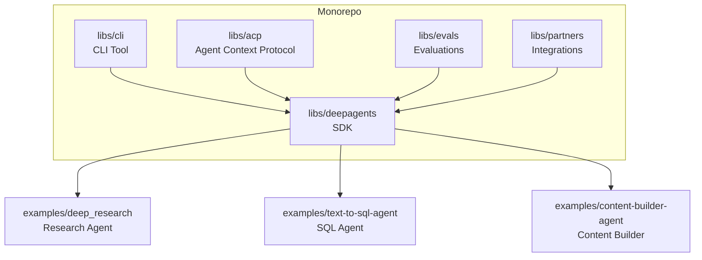
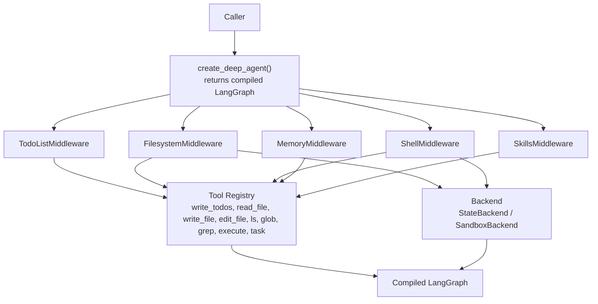
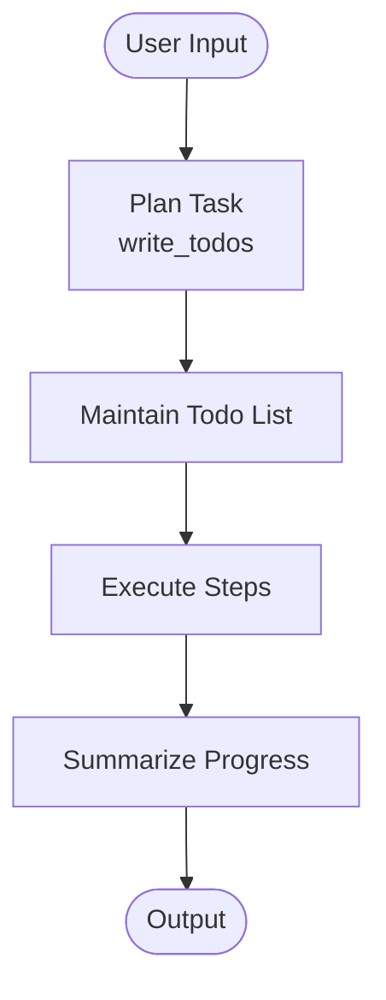
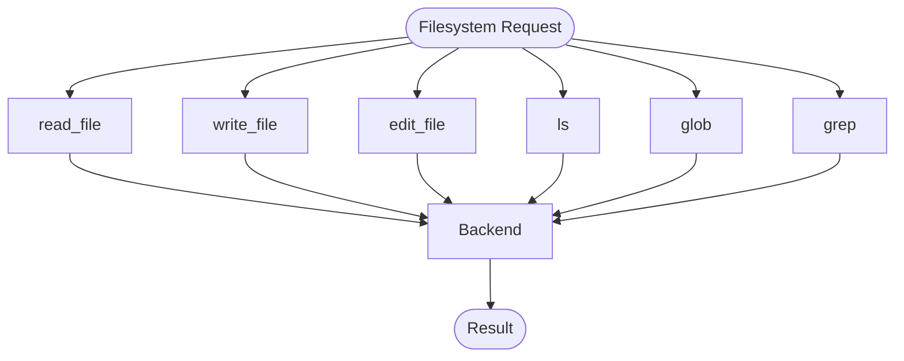
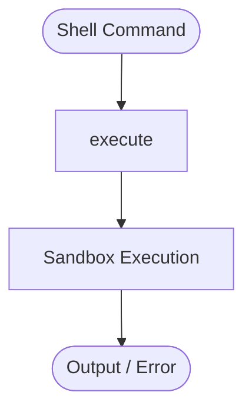
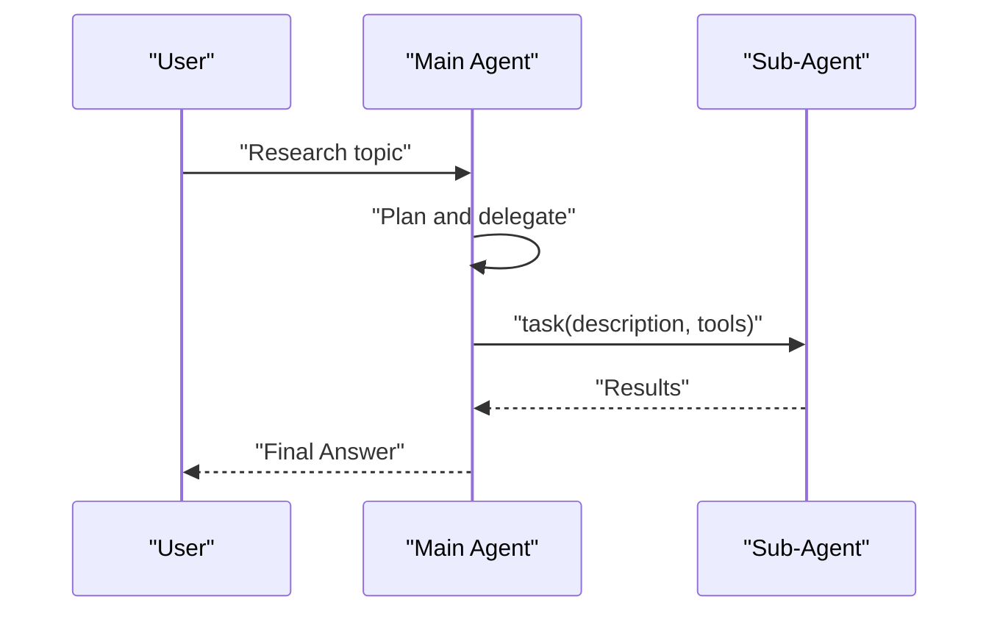
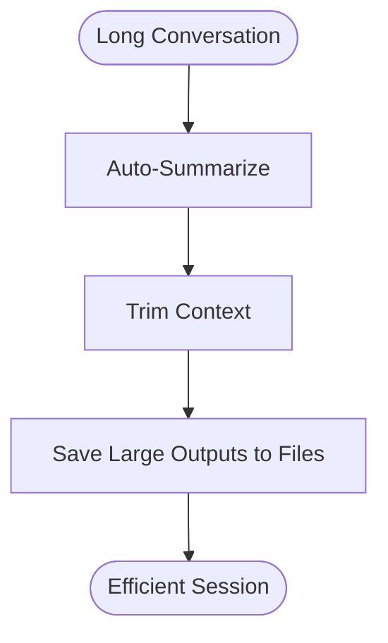
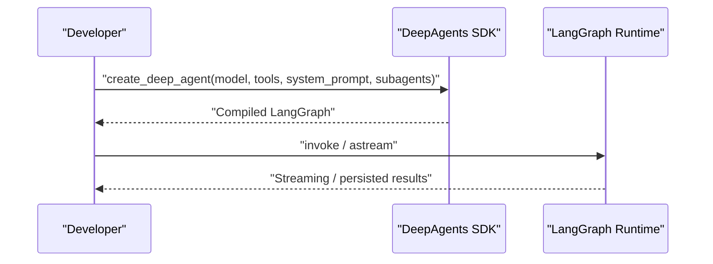
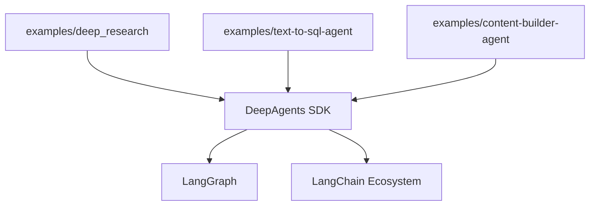

# Project Overview

<cite>
**Referenced Files in This Document**
- [README.md](file://README.md)
- [AGENTS.md](file://AGENTS.md)
- [examples/deep_research/agent.py](file://examples/deep_research/agent.py)
- [examples/text-to-sql-agent/agent.py](file://examples/text-to-sql-agent/agent.py)
- [examples/content-builder-agent/content_writer.py](file://examples/content-builder-agent/content_writer.py)
- [libs/deepagents/deepagents/graph.py](file://libs/deepagents/deepagents/graph.py)
</cite>

## Table of Contents
1. [Introduction](#introduction)
2. [Project Structure](#project-structure)
3. [Core Components](#core-components)
4. [Architecture Overview](#architecture-overview)
5. [Detailed Component Analysis](#detailed-component-analysis)
6. [Dependency Analysis](#dependency-analysis)
7. [Performance Considerations](#performance-considerations)
8. [Troubleshooting Guide](#troubleshooting-guide)
9. [Conclusion](#conclusion)

## Introduction
DeepAgents is a batteries-included agent harness built on top of LangGraph. Its core philosophy is to provide ready-to-use agents with smart defaults so you can get a working system immediately and customize only what you need. It is designed to integrate seamlessly with the broader LangChain ecosystem, leveraging LangGraph’s production-grade runtime (streaming, Studio, checkpointers) while offering powerful capabilities out of the box.

Key value propositions:
- Planning: Built-in task planning and progress tracking to break down complex goals.
- Filesystem operations: Read, write, edit, list, glob, and grep to manage context and artifacts.
- Shell integration: Execute commands with sandboxing for safe, controlled automation.
- Sub-agent orchestration: Delegate work to specialized sub-agents with isolated context windows.
- Context management: Automatic summarization and long-conversation handling to keep sessions efficient.
- Smart defaults: Prompts and tool usage patterns that teach the model how to use tools effectively.

These capabilities are exposed through a single entry point that compiles a LangGraph graph, enabling you to use streaming, persistence, and advanced LangGraph features without additional setup.

**Section sources**
- [README.md:24-53](file://README.md#L24-L53)
- [README.md:86-88](file://README.md#L86-L88)

## Project Structure
DeepAgents is organized as a Python monorepo with multiple independently versioned packages managed by uv. The primary SDK lives under libs/deepagents, while supporting libraries include:
- CLI for interactive and automated workflows
- Agent Context Protocol (ACP) integration
- Evaluation suite and Harbor integration
- Partner integrations and vendor-specific adapters

The repository also includes a rich set of examples demonstrating real-world usage patterns, from research agents to content builders and domain-specific agents like text-to-SQL.

**Section sources**
- [AGENTS.md:7-23](file://AGENTS.md#L7-L23)
- [AGENTS.md:55-57](file://AGENTS.md#L55-L57)

## Core Components
DeepAgents centers around a single creation function that returns a compiled LangGraph graph. Internally, it constructs a general-purpose sub-agent with a default middleware stack that enables planning, filesystem operations, shell execution, and context management. The function accepts parameters to customize model selection, tools, system prompts, sub-agents, and backends.

Practical examples:
- Quickstart: Install and run a working agent in seconds, then iterate with customizations.
- Customization: Swap models, add tools, adjust prompts, and configure sub-agents.
- CLI: Use the dedicated CLI for interactive development, remote sandboxes, persistent memory, and human-in-the-loop workflows.

**Section sources**
- [README.md:38-70](file://README.md#L38-L70)
- [README.md:74-84](file://README.md#L74-L84)

## Architecture Overview
DeepAgents extends LangGraph by composing a default middleware stack and integrating tool registries. At runtime, the agent graph:
- Resolves a model (either provided or default)
- Applies middleware for planning, filesystem, shell, and context management
- Exposes a tool registry for planning, file operations, shell execution, and sub-agent delegation
- Supports backends for persistent storage and sandboxed execution

**Diagram sources**
- [libs/deepagents/deepagents/graph.py:207-210](file://libs/deepagents/deepagents/graph.py#L207-L210)

**Section sources**
- [libs/deepagents/deepagents/graph.py:207-210](file://libs/deepagents/deepagents/graph.py#L207-L210)
- [README.md:86-88](file://README.md#L86-L88)

## Detailed Component Analysis

### Planning Capabilities
Planning is enabled through a dedicated middleware that exposes a planning tool. This allows the agent to decompose tasks, maintain a todo list, and track progress. The planning tool is integrated into the default middleware stack, ensuring that planning is available out of the box.

**Section sources**
- [README.md:28](file://README.md#L28)
- [libs/deepagents/deepagents/graph.py:207-210](file://libs/deepagents/deepagents/graph.py#L207-L210)

### Filesystem Operations
Filesystem operations are provided by a middleware that exposes tools for reading, writing, editing, listing, globbing, and grepping. These tools are backed by a configurable backend, allowing persistent storage and sandboxed execution when needed.

**Section sources**
- [README.md:29](file://README.md#L29)
- [libs/deepagents/deepagents/graph.py:207-210](file://libs/deepagents/deepagents/graph.py#L207-L210)

### Shell Integration
Shell integration is provided by a middleware that exposes an execution tool with sandboxing. This enables safe command execution within controlled environments, useful for automations and system tasks.

**Section sources**
- [README.md:30](file://README.md#L30)
- [libs/deepagents/deepagents/graph.py:207-210](file://libs/deepagents/deepagents/graph.py#L207-L210)

### Sub-Agent Orchestration
Sub-agent orchestration is achieved through a delegation tool that lets the main agent delegate work to specialized sub-agents with isolated context windows. Examples in the repository demonstrate configuring sub-agents with distinct tools and prompts.

**Section sources**
- [README.md:31](file://README.md#L31)
- [examples/deep_research/agent.py:40-59](file://examples/deep_research/agent.py#L40-L59)
- [examples/content-builder-agent/content_writer.py:134-174](file://examples/content-builder-agent/content_writer.py#L134-L174)

### Context Management
Context management ensures long conversations remain efficient by automatically summarizing and managing context windows. This includes saving large outputs to files and maintaining conversational coherence.

**Section sources**
- [README.md:33](file://README.md#L33)

### Practical Examples and Customization
- Quickstart: Install and run a working agent, then iterate with customizations.
- Customization: Swap models, add tools, adjust prompts, and configure sub-agents.
- CLI: Use the dedicated CLI for interactive development, remote sandboxes, persistent memory, and human-in-the-loop workflows.

**Section sources**
- [README.md:38-70](file://README.md#L38-L70)
- [README.md:74-84](file://README.md#L74-L84)
- [examples/text-to-sql-agent/agent.py:20-49](file://examples/text-to-sql-agent/agent.py#L20-L49)
- [examples/content-builder-agent/content_writer.py:166-174](file://examples/content-builder-agent/content_writer.py#L166-L174)

## Dependency Analysis
DeepAgents integrates tightly with LangGraph and LangChain ecosystem packages. The examples illustrate how to combine DeepAgents with domain-specific toolkits (e.g., SQL toolkits) and model providers (e.g., Anthropic, Google). The monorepo structure supports independent versioning and modular development across SDK, CLI, ACP, evaluations, and partner integrations.

**Section sources**
- [AGENTS.md:55-57](file://AGENTS.md#L55-L57)
- [examples/text-to-sql-agent/agent.py:8-11](file://examples/text-to-sql-agent/agent.py#L8-L11)
- [examples/deep_research/agent.py:9-18](file://examples/deep_research/agent.py#L9-L18)

## Performance Considerations
- Construction scaling: Benchmarks show how construction time scales with the number of tools and sub-agents. This helps inform decisions about middleware and tool registration strategies.
- Streaming and persistence: Leverage LangGraph’s streaming and checkpointing to optimize long-running sessions and reduce overhead.
- Backend selection: Choose appropriate backends for filesystem and sandbox operations to balance performance and security.

**Section sources**
- [libs/deepagents/deepagents/graph.py:207-210](file://libs/deepagents/deepagents/graph.py#L207-L210)

## Troubleshooting Guide
- Security model: DeepAgents follows a “trust the LLM” model. Enforce boundaries at the tool/sandbox level, not by expecting the model to self-police.
- Environment setup: Ensure required environment variables are configured for third-party tools (e.g., API keys for web search or image generation).
- CLI installation: Use the provided installer script to set up the CLI for interactive development and deployment workflows.

**Section sources**
- [README.md:123-126](file://README.md#L123-L126)
- [README.md:80-84](file://README.md#L80-L84)

## Conclusion
DeepAgents delivers a production-ready, batteries-included agent harness built on LangGraph. It accelerates development by providing smart defaults for planning, filesystem operations, shell integration, sub-agent orchestration, and context management. With seamless LangChain integration, flexible customization, and a robust CLI, it empowers both beginners and experienced developers to build, iterate, and deploy capable agents quickly and safely.